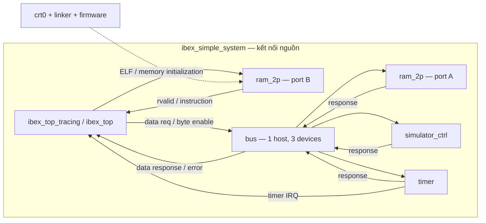
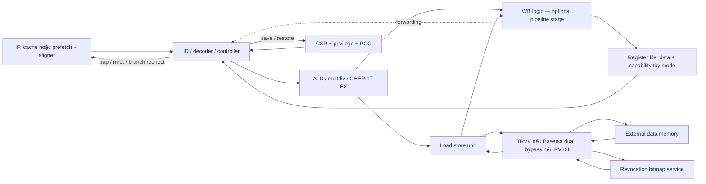

# 04 — Mô hình kiến trúc

BASE-01. Các sơ đồ dưới đây là **kết nối đọc từ nguồn**, không phải hierarchy elaborate. Nguồn chính: [ibex_top](../../rtl/ibex_top.sv), [ibex_core](../../rtl/ibex_core.sv), [Simple System](../../examples/simple_system/rtl/ibex_simple_system.sv).

## Hai ranh giới

Ibex ở đây là CPU RV32 cấu hình được, có đường phần cứng CHERIoT bổ sung. `ibex_core` chứa logic pipeline nhưng RF/cache RAM do `ibex_top` bao quanh. `ibex_top_tracing` thêm tracer. Simple System thêm RAM dùng chung instruction/data, bus MMIO, timer và simulator control; không có MMU, DMA, PLIC hay JTAG debug module được instantiate trong top mẫu đã đọc.

Hai port A/B cùng SRAM primitive; sơ đồ tách port để thấy fetch không đi qua data bus decode. Có thể fetch và data request đồng thời ở boundary; điều này không bảo đảm throughput CPU hoặc hành vi read-during-write của macro vật lý.

## Quyền sở hữu state

| Khối | State chính | Ai dùng/ai recovery |
|---|---|---|
| IF/prefetch/FIFO | PC fetch/head, words/errors valid, outstanding/discard | Controller redirect; response cũ vẫn cần drain |
| ID/controller | Instruction hiện tại, multicycle FSM, debug/nmi mode, pending exception | Điều phối stall/flush và commit boundary |
| RF | Architectural register data; shared metadata ở dual ISA | WB ghi, ID/CHERIoT EX đọc; mode switch cần contract |
| EX/multdiv | Kết quả ALU và intermediate multi-cycle operands | ID giữ instruction/control tới completion |
| LSU | Addr/control response, split state, capability low word/tag/error | WB/controller nhận data hoặc exception |
| WB có tầng | Valid, destination, loại load/store, kết quả/cap/error | Ready trở về ID, forwarding và retirement |
| CSR | Privilege, mie/mstatus, mepc/mcause/mtval, counters, PMP, capability CSR/PCC | Controller lưu trap/khôi phục; software truy cập |
| TRVK | Alignment FIFO, response FIFO, pointer, bitmap outstanding | Join response/tag; không có timeout nội tại |
| Top gate | core_busy register, key handshake; shadow delay khi SecureIbex | Root clock/wakeup; alert ra integrator |
| Bus/timer | Host/device response select; mtime/compare/sticky IRQ | One-cycle response routing; handler ghi compare |

## Các đường quan trọng

Datapath là instruction/data/ALU/register/capability. Control là req/gnt/rvalid, stall/ready, branch/flush và clock enable. Configuration gồm parameter/define, CSR và runtime MuBi. Status/error gồm LSU exceptions, CSR trap cause, ECC/lockstep alerts và crash dump. Debug gồm `debug_req_i`, trap PC sang debug memory, DCSR/DPC; RVFI/tracer là đường quan sát, không phải debug transport.

**FND-ARCH-01:** Khi BaseIsa dual, register file FF chia sẻ storage của upper RV32I registers với metadata capability, và runtime CHERIoT dùng 16 register. **Support:** SUPPORTED [RTL:ESTABLISHED], BASE-01, `ibex_register_file_ff.sv:g_cheriot_rf`, `cheriot_enabled`; không suy ra mode switch bất kỳ cycle nào bảo toàn state. OQ-07.

## Cơ sở định lượng và trade-off

- Pipeline `WritebackStage=0`: IF + ID/EX, WB logic vẫn tồn tại nhưng không thêm tầng. `=1`: thêm state WB và hazard/forwarding; không tự bảo đảm CPI=1. [RTL:ESTABLISHED — ID/WB generate]
- Prefetch không cache: `NUM_REQS=2`; FIFO `DEPTH=NUM_REQS+1=3` words 32-bit. Ba words không đồng nghĩa ba architectural instructions vì instruction có thể 16/32-bit và vắt qua hai words.
- Cache nếu chọn: `IC_SIZE_BYTES=4096`, `IC_NUM_WAYS=2`, line=64 **bits** =8 bytes, 256 lines/way. Không nhầm 64 bits thành cache line 64 bytes. Đây là dung lượng data, chưa cộng tag/ECC.
- LSU có một architectural memory instruction đang chờ, có thể phát hai word transactions cho split/capability. TRVK top dùng hai slot; bitmap chỉ một request outstanding.
- Bitmap 2 KiB chứa 16.384 bit, mỗi bit đại diện 8 bytes: phạm vi heap 131.072 bytes =128 KiB. Tính từ nguồn, không phải dung lượng heap đã được nối trong Simple System.

Lý do cache/prefetch, branch ALU, WB và sharing RF giảm area hoặc giảm stall là **INFERRED** từ cấu trúc và comment thiết kế; chưa đo area/Fmax/power/CPI cho BASE-01. Không tái công bố benchmark README như kết quả phân tích.

## Giới hạn

Simple System buộc capability mode off và memory tag=0; vì vậy không phải môi trường kiểm chứng end-to-end CHERIoT. Cache/lockstep chỉ được đánh giá boundary và cấu hình, không phải proof nội bộ. Các chi tiết mode/physical còn mở tại OQ-01, OQ-04, OQ-06–09.
