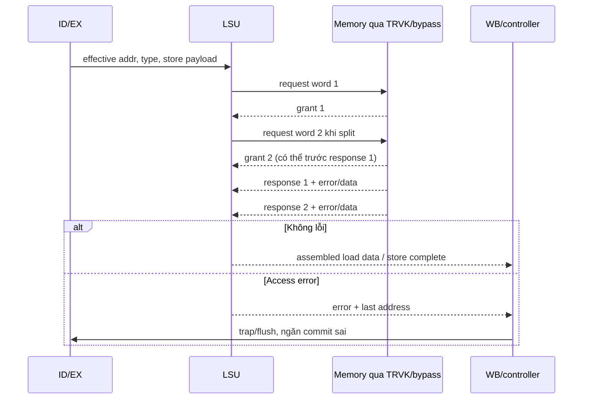

# 09 — Luồng end-to-end

BASE-01; flow là lập luận trên RTL cùng ASM trong Stage 13. Không có waveform hoặc execution latency đo được. Cột completion phân biệt bus, pipeline và architectural event.

## FLOW-BOOT-01 — Reset đến instruction đầu

Preconditions: reset hợp lệ, boot_addr ổn định/aligned, fetch_enable On, memory image đúng ISA (ASM-RST-01, ASM-CFG-01, ASM-BUS-01). Controller reset RESET; valid/outstanding rỗng, RF/RAM payload không mặc định coi zero.

1. Core có clock; controller RESET chọn PC_BOOT, chuyển BOOT_SET. BOOT_SET yêu cầu fetch, IF đặt `{boot_addr[31:8],0x80}`, CSR init mtvec.
2. Prefetch/ICache phát request, memory nhận `req&&gnt`; giữ address nếu chưa grant. Trong Simple portB nhận trực tiếp, RAM index=0x20 cho 0x100080.
3. Memory trả rvalid/data/error. Prefetch nhận hoặc discard theo state; FIFO align instruction, IF latch sang ID khi ready.
4. Decoder/ID/EX/RF thực thi; writeback/RVFI/perf đi theo cấu hình. Hoàn tất luồng khi instruction hợp lệ thực sự tiến qua execution/retirement, không chỉ có instr_gnt.
5. Fetch error hoặc illegal instruction → controller FLUSH/trap; không có timeout nội tại nếu memory không đáp ứng.

Sources: `ibex_controller.sv:582–596`, `ibex_if_stage.sv:243–256`, `ibex_prefetch_buffer.sv`, `crt0.S`, linker. FND-BOOT-01; chốt image và chạy baseline ở OQ-01/02. Không khẳng định đã thấy instruction đầu trong trace.

## FLOW-IF-01 — Stalled fetch, branch và FENCE.I

Trigger: branch/exception redirect hoặc FENCE.I khi request cũ chưa grant/response. Prefetch có `stored_addr_q`, `valid_req_q`, hai outstanding bits và discard bits.

| Giai đoạn | Control/data/state | Completion hoặc recovery |
|---|---|---|
| Request A chưa grant | valid_req_q giữ req và stored_addr=A | Không đổi địa chỉ A vì branch |
| Redirect tới B | fetch_addr cập nhật B; FIFO clear; pending request A bị đánh dấu discard | Chỉ hủy instruction logic, không hủy bus request đã đưa ra |
| A được grant | Outstanding entry nhớ phải bỏ response | Reservation vẫn chiếm chỗ tới khi trả |
| Response A về | Outstanding shift; discard ngăn đưa old-path word vào instruction stream | Return obligation được drain |
| Request/response B | Theo space/outstanding guards | IF nhận đường mới; error đi cùng word phù hợp |

`fifo_clear=branch_i`; comment prefetch nêu FENCE.I dựa vào flushing này. Nếu redirect trùng response, clear có priority xóa FIFO next-state và IF còn squash fetch-valid; không chỉ nhìn một assignment fifo_valid để kết luận old instruction commit.

Completion: instruction từ target mới được phát cho ID; bound phụ thuộc memory và stalls. Concurrency: trả A và grant request khác cùng cycle, instruction compressed dùng nửa word, branch khi FIFO full. Sources: prefetch/FIFO/IF, FND-IF-01; cần directed reset/branch/error/unaligned tests, OQ-01/12.

## FLOW-LSU-01 — Load/store và misalignment

Preconditions: instruction đang executing, operands/privilege hợp lệ; ID giữ control tới req_done. EX tính effective address, LSU type/offset xác định BE/rotate; core PMP hoặc CHERIoT checks có thể chặn external access.

Aligned: IDLE phát req. Nếu grant thấp → WAIT_GNT; khi grant, latch control/address, trở về IDLE nhưng vẫn có response obligation ở pipeline. Memory trả rvalid; LSU sign/zero extend hoặc báo lỗi; WB/ID hoàn tất sau response. `busy_o=0` đơn lẻ không chứng minh không còn response pending.

Misaligned word A+1 (ví dụ store): first aligned A/BE1110, second A+4/BE0001. Sau grant1 → WAIT_RVALID_MIS; có thể issue grant2 trước response1 và đi WAIT_RVALID_MIS_GNTS_DONE. Khi response1 về, giữ low-fragment/error, chờ response2. LSU ghép data hoặc báo load/store error; addr_last hỗ trợ mtval. Hai giao dịch không atomic; lỗi không rollback external write đã xảy ra.

Đây là thứ tự thông điệp của trường hợp hai grants trước response1, không bắt buộc latency đó. No timeout; in-order response bắt buộc. Assertions: state validity, address alignment, top outstanding tracker; chưa activation. FND-LSU-01, module LSU/WB, OQ-01/12.

## FLOW-IRQ-01 — Timer đến handler rồi trở về

Timer root clock tăng mtime. Tại cạnh compare thỏa (hoặc IRQ đã sticky), interrupt_q set trừ compare write clear thắng. Timer IRQ→mip.timer→mie.MTIE→irq_pending; mstatus/privilege/controller quyết định handle_irq. ID hoàn tất/đợi các obligation cần thiết; controller IRQ_TAKEN chọn cause, lưu CSR, IF PC_EXC tới vector. Firmware handler đọc timer high-low-high, ghi compare mới và mret khôi phục trạng thái.

Completion: nguồn được lập lại và execution trở lại PC lưu, không chỉ “mie enabled”. Compare còn quá hạn gây reassert; mip không W1C. Concurrent debug/NMI/fast và memory exception thay priority/entry; Simple không kích các input tie-off. Không có fixed interrupt latency toàn hệ thống khi memory hoặc multicycle operation đang chờ. FND-TMR-01/IRQ-01; OQ-04/10/12.

## FLOW-PWR-01 — WFI, gate và wakeup

WFI được decoder/controller xử lý qua FLUSH→WAIT_SLEEP→SLEEP khi điều kiện cho phép. Controller dừng yêu cầu IF, flush ID và hạ ctrl_busy; top xét busy/root registers trước khi gate. Instruction/data outstanding phải được bảo toàn theo busy và pipeline logic; chưa có test drain.

Timer vẫn chạy root clock. IRQ đã được mie mask hoặc debug/NMI có thể kéo clock_en, latch gate mở ở phase thấp, core nhận clock và controller SLEEP→FIRST_FETCH. Mstatus.MIE=0 có thể làm wake nhưng không trap. Test_en có thể giữ clock mở; core_sleep phản ánh clock_en, không power domain. Completion: fetch tiếp tục hoặc vào trap/debug theo điều kiện, OQ-04/11/12.

## FLOW-CAP-01 — Tagged load và TRVK

Chỉ áp dụng BaseIsa dual, runtime On, tagged memory + bitmap service hợp lệ; **không được exercise bởi Simple tie-offs**. Decoder/CHERIoT EX kiểm capability permissions/bounds/alignment, LSU phát hai word accesses (pointer trước, metadata sau); nếu local access violation thì không phát request và trả lỗi pipeline.

TRVK fork request sang downstream và alignment FIFO chứa addr[2]. Response FIFO giữ data/intg/tag/err. Khi pointer tagged ở aligned word được trả, ptr_storage chốt pointer và valid. Metadata tagged ở word+4 làm decode cap_base. Nếu không sealing và in-range, TRVK phát bitmap request, latch outstanding, giữ metadata response tới bitmap rvalid. Bitmap bit hoặc bitmap error/ECC xóa tag; data payload vẫn đi qua, downstream bus error đi upstream_err; bitmap errors còn ra alert top.

LSU lưu low word/tag/error, nhận high word để `cheriot_mem_to_cap`, trả data + cap cho WB; consumer capability fault không đồng nghĩa lúc nào bitmap revoked cũng tạo bus fault. Completion: final upstream response → register data/cap được commit hợp lệ hoặc error recovery. Reset phải hủy cả FIFO/bitmap epoch; no unsolicited response; không interleave hai word capability với requester khác. OQ-06/07/12.

## FLOW-ERR-01 — Lỗi, suppression và quan sát

Instruction error theo prefetch/cache/aligner vào IF/ID, bao gồm second-half error. Data bus/PMP error theo LSU vào controller với load/store cause/mtval. CHERIoT permission error vào local LSU/ex/controller path, có điều kiện mode và debug. Memory integrity error có load write suppression, internal interrupt và alert riêng. Lockstep/RF/cache errors có alert paths ở top.

Recovery do controller chọn PC/trap, CSR lưu cause, pipeline flush; phần memory store đã commit ở bên ngoài không tự rollback. Simple RAM/instr errors tied0, alerts bỏ ngỏ, do đó environment mẫu không quan sát/kiểm đầy đủ fault responses. Không dùng “simulation tự halt” làm bằng chứng không có lỗi; cần assertion/scoreboard phân biệt success, timeout, trap và pending obligation (Stage 11).

Các flow kể trên bao phủ control/data/metadata/state cả chiều đi và về ở mức nguồn. Không có bằng chứng RTL về timeout/reset-active-transaction/concurrent-fault trong phiên này; tất cả được nối về OQ và kế hoạch EXP-07…10.
