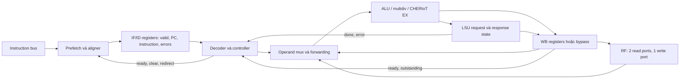

# 02 — Pipeline, state và ranh giới hoàn tất

## Mô hình phần cứng

Ibex có IF và ID/EX; tùy chọn WB thêm một tầng. Tên `ibex_ex_block` là ranh giới
module, **không có nghĩa EX là một pipeline stage riêng**. Decode, đọc RF, mux
operand và ALU nằm trên đường tổ hợp của ID/EX. Instruction nhiều chu kỳ giữ
IF/ID registers và dùng intermediate registers/FSM để tiếp tục tính.



## State ownership và lifecycle

| State | Chủ sở hữu | Update/hold/clear |
|---|---|---|
| Fetch address, held request, outstanding/discard | Prefetch | Advance khi request phát; hold địa chỉ request chưa grant; mark discard khi redirect |
| PC/instruction/error/compressed/expanded | IF stage | Ghi cùng `instr_new_id_d`; giữ khi ID không nhận instruction mới |
| `instr_valid_id_q` | IF stage | Reset 0; giữ đến explicit clear; có thể thay instruction cũ bằng mới cùng edge |
| `id_fsm_q` | ID stage | Reset FIRST_CYCLE; MULTI_CYCLE cho execution nhiều bước |
| `imd_val_q[2]`, mỗi entry 34 bit | ID stage | Reset 0; mỗi entry có write enable riêng từ EX |
| `wb_valid_q` + PC/rd/result/type | WB nếu bật | Reset valid 0; payload reset tùy ResetAll; nhận instruction từ ID |
| Addr/control/partial data/error | LSU | Address phase và response phase có enable khác nhau |
| Architectural registers | RF FF | Ghi trên edge theo write port; x0 đọc 0 ở cấu hình nền |
| CSR, privilege, trap state | CSR/controller | CSR instruction hoặc trap/return; priority riêng |

Payload không reset ở `ResetAll=0` vẫn hợp lệ về thiết kế nếu valid=0; giá trị 0
trong mô phỏng hai trạng thái không chứng minh nó reset vật lý về 0.

## Các phương trình nối stage

SOURCE — [IF](../../../rtl/ibex_if_stage.sv#L568),
[ID](../../../rtl/ibex_id_stage.sv#L983),
[controller](../../../rtl/ibex_controller.sv#L1017),
[WB](../../../rtl/ibex_wb_stage.sv#L106):

```text
new_ID = if_instr_valid & id_in_ready & ~pc_set
valid_ID_next = new_ID | (valid_ID & ~instr_valid_clear)
stall_ID = stall_ld_hz | stall_mem | stall_multdiv | stall_jump | stall_branch | stall_alu
done_ID = ~stall_ID & ~flush_ID & instr_executing
stall = stall_ID | stall_WB
id_in_ready = ~stall & ~halt_IF & ~retain_ID
instr_valid_clear = ~(stall | retain_ID) | flush_ID
WB_valid_next = (en_WB & ready_WB) | (WB_valid & ~WB_done)
ready_WB = ~WB_valid | WB_done
```

Nhận instruction mới và hoàn tất instruction cũ có thể xảy ra cùng edge.
`halt_if` chặn nhận instruction mới; `retain_id` giữ instruction để controller
phân loại special request; `flush_id` cho clear thắng stall/retain.
Không thể thay cả ba bằng một tín hiệu “stall pipeline”.

## Bốn sự kiện cần phân biệt

1. LSU request hoàn tất (`lsu_req_done`): metadata/address phase có thể rời ID.
2. ID instruction hoàn tất (`instr_done`), với WB1 còn cần `ready_wb` để transfer.
3. Memory response hoàn tất (`lsu_resp_valid`), có thể mang lỗi.
4. RF/CSR write và instruction retirement: các side effect và event counters
   không phải cùng một tín hiệu, cũng không mặc nhiên cùng một cycle.

WB0 vẫn instantiate WB module ở nhánh bypass. `instr_done_wb_o=0` ở nhánh này;
không thể dùng nó làm bộ đếm retired instructions cho cả hai cấu hình.
RVFI có các thanh ghi phục vụ quan sát; log `R` có thể trễ hơn log `W`.

## Ví dụ tổ hợp và edge — INFERRED

Giả sử instruction đã có sẵn ở IF, không redirect/memory wait:

| Cycle | WB0 ID/EX | WB1 ID/EX | WB1 WB |
|---|---|---|---|
| t | `addi x1,x0,7`, ghi x1 tại edge | `addi x1,x0,7`, transfer | Trống |
| t+1 | `addi x2,x1,5`, RF đã có 7 | `addi x2,x1,5`, lấy 7 qua forwarding | Ghi x1 |
| t+2 | Instruction kế | Instruction kế | Ghi x2 |

Đây là bảng steady-state có giả định, không phải boot latency đo được. Bảng SIM
đầy đủ được trích riêng tại [timing](10_timing.md).

## Invariants dùng để đọc và review

- Instruction bị giữ phải giữ PC/instruction/error đi cùng nhau; operand sống
  từ RF cần được bảo vệ bằng ordering/forwarding, không giả định tất cả operands
  đã được latch khi vào ID.
- Instruction ID chỉ được transfer khi WB sẵn sàng; old WB exception phải thắng
  side effect của instruction ID trẻ.
- Không suy ra bus transaction đã biến mất chỉ vì valid instruction bị clear.
  Request accepted vẫn thuộc memory protocol và cần response/drain.
- Trace phải có valid đi kèm PC; PC payload của bubble không phải instruction
  đang thực thi.
