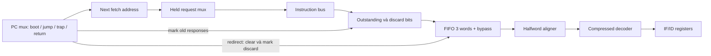

# 03 — Front end: PC, prefetch, alignment và redirect

## Ba địa chỉ khác nhau

[Prefetch](../../../rtl/ibex_prefetch_buffer.sv#L139) giữ `stored_addr_q`
cho request đang chờ grant và `fetch_addr_q` cho request tiếp theo. FIFO giữ
`instr_addr_q` cho instruction tại đầu hàng. CPU có thể đã prefetch xa hơn PC ID;
không dùng `instr_addr_o` ở bus để kết luận instruction nào retire.

PC mux trong [IF](../../../rtl/ibex_if_stage.sv#L240) chọn boot, branch target,
exception/IRQ/debug, mepc/dpc return và các đường CHERIoT tùy cấu hình.
Boot dùng `{boot_addr[31:8],8'h80}`. Bus request word-aligned; instruction PC chỉ
cần halfword-aligned khi có compressed.



## Credits và request lifecycle

SOURCE: `NUM_REQS=2`; FIFO `DEPTH=NUM_REQS+1=3`. Có tối đa hai request đã grant
đang chờ response trong prefetch này. Ba word FIFO không đồng nghĩa ba instructions.

```text
fifo_ready = ~&(fifo_busy | reversed_outstanding)
valid_new_req = req & (fifo_ready | branch) & ~outstanding[1]
valid_req = held_request | valid_new_req
held_request_next = valid_req & ~instr_gnt
fifo_input_valid = instr_rvalid & ~branch_discard[0]
```

`fifo_ready` dự trữ chỗ cho các response đã outstanding. Interface response không
có ready để core backpressure memory, nên chỉ kiểm FIFO occupancy hiện tại là thiếu.
Grant thêm outstanding; response dịch queue về slot 0. Đây là protocol theo thứ tự,
không có transaction ID để ghép response out-of-order.

## Redirect không hủy bus handshake

| Thời điểm redirect | Hành động RTL | Hệ quả |
|---|---|---|
| FIFO có dữ liệu cũ | `clear_i` xóa valid cả dữ liệu vừa push tại edge | Instruction đường cũ không được giữ trong FIFO |
| Request đã grant, chưa response | Đánh dấu discard theo slot outstanding | Drain response khi nó tới |
| Request chưa grant | Giữ địa chỉ bus, latch discard của request đó | Không thay payload sang target giữa lúc req đang chờ |
| Response cũ cùng cycle redirect | FIFO clear và IF `~pc_set` ngăn capture | Không chỉ dựa `branch_discard_q` vừa cập nhật |
| Queue outstanding đầy | Target chờ credit được giải phóng | Redirect không có latency cố định độc lập memory |

`FENCE.I` dựa vào cơ chế flush của branch/prefetch. Đổi cách discard cần review
đường FENCE.I cùng với branch. Với cache, còn phải xét cache invalidation riêng.

## Alignment và error provenance

SOURCE — [fetch FIFO](../../../rtl/ibex_fetch_fifo.sv#L66):

```text
head = valid_q[0] ? rdata_q[0] : incoming_word
unaligned_instruction = {next_word[15:0], head[31:16]}
pop_word = out_ready & out_valid & (~aligned_is_compressed | out_addr[1])
PC_next = PC + (instruction_compressed ? 2 : 4)
```

Khi PC ở nửa trên và instruction dài 32 bit, phải có cả word thứ hai mới valid.
Khi nửa trên chứa compressed instruction, không cần word thứ hai. Error của word
kế không được gán nhầm cho compressed instruction ở word trước.
`err_plus2` phân biệt lỗi đến từ nửa thứ hai của instruction 32 bit; controller
có thể dùng PC+2 cho fault address trong khi trap PC vẫn là đầu instruction.

Ví dụ chương trình test compressed: `0x80:c.nop`, `0x82:addi x1,x0,7`,
`0x86:c.addi x1,1`. Instruction tại `0x82` dùng halfwords ở hai fetch word khác nhau;
SIM kiểm x1=8 và trace PC, với cả D1/D4.

## State/reset và các điểm kiểm

Outstanding/discard/held-valid và FIFO valid reset 0. Các địa chỉ/payload tùy
`ResetAll`, được thiết lập bởi boot redirect trước khi được dùng hợp lệ.
Quy tắc clear thắng push/pop nằm ở `valid_d = valid_popped & ~clear`.

Các core tests `control` kiểm wrong-path writes x20/x21/x22 không xảy ra;
`compressed` kiểm straddling. Chúng không quét mọi tổ hợp redirect/grant/response,
Đợt top bổ sung đã inject instruction bus error cả aligned và straddling,
kiểm reset có outstanding theo memory epoch; xem [13](13_completion_results.md).
Chưa quét exhaustive redirect/grant/response; không suy rộng signature thành proof FIFO.
