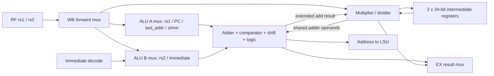
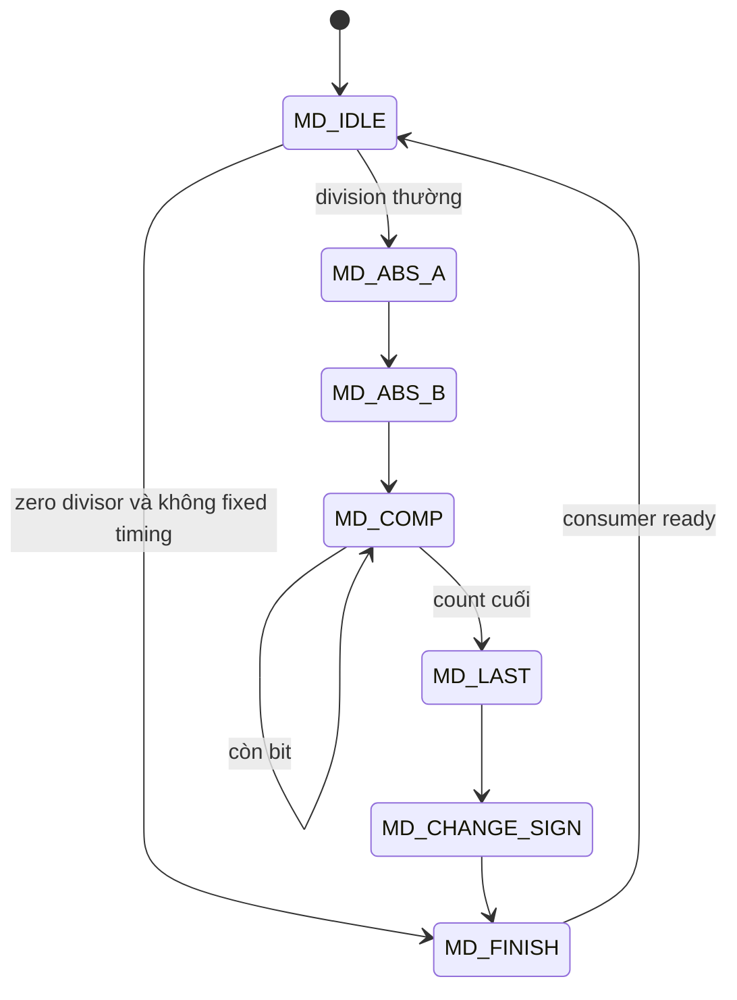

# 04 — Decode, register file và execution datapath

## Decode là control, execution mới tạo side effect

[Decoder](../../../rtl/ibex_decoder.sv) tạo immediate, register indices,
read/write intent, ALU operation, mux selects, memory type, branch và CSR intents.
ID bổ sung valid/legal/executing trước khi enable side effect. Ví dụ:
`rf_ren_a = instr_valid & ~instr_fetch_err & ~illegal_insn & rf_ren_a_dec`;
`rf_we_id = rf_we_raw & instr_executing & ~illegal_csr_insn`.
Không dùng riêng `rf_we_dec` để đếm writes.

| Instruction class | Operand A | Operand B | Đường kết quả/control |
|---|---|---|---|
| ADD/SUB/logic/shift/compare | rs1 | rs2 | ALU→WB/RF |
| OP-IMM | rs1 | Sign-extended immediate | ALU→WB/RF |
| LUI | 0 | U immediate | ALU/result mux→RF |
| AUIPC | PC ID | U immediate | Adder→RF |
| Load/store | rs1 | I/S immediate | Adder→LSU; store data lấy rs2 riêng |
| Conditional branch | rs1 | rs2 | Comparator→decision; PC+offset cần target adder |
| JAL/JALR | PC hoặc rs1 | Offset hoặc PC increment | Target và return address cần hai phép cộng |
| CSR | rs1 hoặc zimm | CSR old value | CSR operation; old CSR value về rd |
| MUL/DIV | rs1 | rs2 | Mult/div→result mux; dùng intermediate storage |

SOURCE: [operand mux](../../../rtl/ibex_id_stage.sv#L348),
[EX result mux](../../../rtl/ibex_ex_block.sv#L81).

## ALU và chia sẻ tài nguyên

[ALU](../../../rtl/ibex_alu.sv) có adder mở rộng để phục vụ subtraction,
comparison và mult/div, cùng đường shift/logic. SUB/compare dùng đảo operand B
và carry-in; signed comparison phải kết hợp dấu thay vì chỉ lấy carry unsigned.
Shift trái có thể tái sử dụng đường shift phải với bit reversal; các generate
RV32B thêm rotate, bit manipulation và operations nhiều chu kỳ.

Misaligned LSU chiếm lại ALU bằng override mux của ID:
`A=lsu_addr_last`, `B=4`. Vì thế ID phải giữ instruction đủ lâu để cấp địa chỉ
transaction thứ hai. Intermediate registers thuộc ID, được EX điều khiển write
enable; chúng không phải architectural RF và không có rd.

## Multiplier: cùng ISA, khác state/tài nguyên

SOURCE — [fast/single](../../../rtl/ibex_multdiv_fast.sv#L138),
[slow](../../../rtl/ibex_multdiv_slow.sv#L185):

| Implementation | Datapath/FSM | Chu kỳ execution khi operands sẵn, WB ready |
|---|---|---|
| Fast | Một signed 17×17 multiply-accumulate; ALBL→ALBH→AHBL→[AHBH] | MUL 3; MULH 4 |
| SingleCycle | Ba signed 17×17 multipliers và tổng partial products; MULL→[MULH] | MUL 1; MULH 2 |
| Slow | Shift/add iterative, count và operand/intermediate state | MUL có early termination; không một con số chung cho mọi toán hạng |

Tách `a = ah·2^16 + al`, `b = bh·2^16 + bl` giải thích vì sao low product không
cần `ah·bh`, còn high product phải tính nó. Các sign bit của high halves phụ
thuộc signed mode. Fast giữ low bits ở intermediate state giữa partial products.
`mult_hold = ~multdiv_ready_id` giữ kết quả cuối khi consumer chưa sẵn sàng.

## Divider lifecycle

FSM ở cả implementation có các state:

Divider chuẩn hóa dấu, tính từng bit quotient/remainder bằng adder/comparator,
rồi sửa dấu ở cuối. `data_ind_timing` loại đường tắt theo toán hạng; không suy ra
toàn CPU có timing hằng vì instruction/data memory vẫn có thể chờ.

SIM `arithmetic` kiểm chuỗi ADDI/ADD phụ thuộc, MUL, DIV, REM, signed MULH,
chia cho 0, `INT_MIN / -1` và remainder tương ứng. Các expected values tính từ
phép toán/chương trình, không gọi hàm RTL để tạo expected result.
Đây là directed corner tests, không phải exhaustive arithmetic proof.

## RF physical structure

RF FF RV32I có hai read combinational và một write synchronous. x0 được mux về
zero, không cần storage ordinary x0. `RV32E` giảm số register; `DummyInstructions`
thay đổi cách dùng x0; dual ISA thay storage layout như chương CHERIoT.
RF FPGA/latch là biến thể implementation, chưa được mô phỏng ở đây.

## Review invariants và timing risk

- Intermediate write enable phải đi cùng operation đang sở hữu nó; đổi mult/div
  latency cần review ID FSM và `ex_valid`, không chỉ module arithmetic.
- Kết quả chỉ được chọn khi decode/static select và dynamic enable khớp.
- Fanout instruction được giảm bằng các bản sao instruction registers trong IF;
  không hiểu nhầm chúng là nhiều instruction slots.
- Đường RF→forward mux→operand mux→ALU→WB là ứng viên timing dài, chưa có STA.
