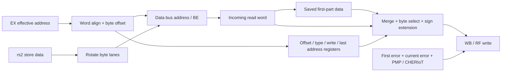

# 06 — LSU: address phase, response phase và split access

## Hai loại completion

`lsu_req_done` cho biết address/control phase đã đủ để ID chuyển đi; còn
`lsu_resp_valid` xác nhận completion cuối của instruction. Một load aligned có thể
grant ngay ở IDLE, LSU vẫn ở IDLE trong lúc chờ response. Vì vậy
`busy_o = (ls_fsm_cs != IDLE)` **không phải bộ đếm tất cả memory accesses pending**.
ID/WB giữ thông tin outstanding bổ sung.

SOURCE — [FSM/completion](../../../rtl/ibex_load_store_unit.sv#L407):

```text
cpu_req_valid = lsu_req & ~(CHERIoT_on & lsu_cheriot_err)
req_done = (lsu_go | state != IDLE) & (next_state == IDLE)
resp_valid = (data_rvalid | pmp_err_q | CHERIoT_synthetic_error) & (state == IDLE)
read_valid = (state == IDLE) & data_rvalid & ~combined_error & ~data_we_q & ~integrity_error
```

## FSM address/split

| State | Hoạt động | Transition đáng chú ý |
|---|---|---|
| IDLE | Nhận instruction mới, phát transaction 1 | Grant aligned→IDLE; chưa grant→WAIT_GNT; split→WAIT_GNT_MIS/WAIT_RVALID_MIS |
| WAIT_GNT_MIS | Giữ transaction 1 | Grant/PMP error→WAIT_RVALID_MIS |
| WAIT_RVALID_MIS | Phát transaction 2, yêu cầu AGU cộng 4 | Response1 + grant2→IDLE; response1 chưa grant2→WAIT_GNT |
| WAIT_RVALID_MIS_GNTS_DONE | Cả hai grant đã có, chờ response1 | Response1 latch data/error→IDLE |
| WAIT_GNT | Giữ request aligned hoặc phần 2 | Grant/PMP error→IDLE |
| CTX_WAIT_GNT1/2, CTX_WAIT_RESP | Capability two-word access | Chi tiết chương CHERIoT |

Request2 có thể được grant trước response1. Việc state quay về IDLE sau response1
cho phép response2 trở thành completion cuối. Không phải mọi state transition
IDLE đều có nghĩa instruction đã retire.

## Datapath và state đi kèm response



`ctrl_update` ghi read offset, access size, sign extension và write/read type.
`rdata_update` giữ phần cần dùng của response đầu. `addr_update` ghi `addr_last`
cho AGU/mtval, có điều kiện tránh đè địa chỉ lỗi đầu. Các enable khác nhau thể
hiện địa chỉ bus hiện tại và response hiện tại có thể thuộc hai transaction khác nhau.

## Byte lanes — ví dụ cụ thể

Word store tại `0x203`, value `0x00000056`:

| Transaction | Address bus | BE | Wdata đã rotate | Byte thực sự ghi |
|---|---|---|---|---|
| 1 | 0x200 | 1000 | 0x56000000 | 0x203=0x56 |
| 2 | 0x204 | 0111 | 0x56000000 | 0x204..206=0 |

Word load cùng địa chỉ ghép byte trên của word đầu và ba byte dưới của word sau.
Halfword chỉ split khi offset=3; word split khi offset khác 0; byte không split.
SOURCE: [byte enable/rotation](../../../rtl/ibex_load_store_unit.sv#L140).

SIM `memory` kiểm cả đúng **7 accepted transactions**, thứ tự, địa chỉ, byte enables,
không có RF write lặp và hai final memory words: `0x200=0x56000055`,
`0x204=0x44000000`. Xem [trace checker](scripts/analyze_traces.py).

## Error và mtval

Error response1 phải được latch (`lsu_err_q`) vì response2 có thể không lỗi.
Write-enable load result bị chặn nếu bất kỳ phần nào lỗi. Controller chọn load
hoặc store access fault dựa control đã giữ của instruction.

SIM — các test `error_split_*` tại effective address `0x203`:

| Inject error ở bus address | mepc | mtval | Young instruction x20 |
|---|---|---|---|
| 0x200, phần đầu | 0x88 | **0x203** | Không ghi |
| 0x204, phần sau | 0x88 | **0x204** | Không ghi |

SOURCE: [addr_last](../../../rtl/ibex_load_store_unit.sv#L254).
Expected ban đầu dùng 0x200 cho fault phần đầu đã được sửa sau khi đọc biểu thức
và đối chiếu simulation. Đây là sửa dự đoán test, không phải sửa RTL.

Store có thể đã ghi một phần trước khi phần khác fault. LSU không cung cấp
transactional rollback, và split access không phải atomic với observer ngoài CPU.
Memory testbench chỉ quyết định có ghi transaction được gán lỗi hay không;
không khẳng định peripheral thật phải có cùng error-side-effect contract.

## Boundaries chưa kiểm chứng động

Data PMP errors, data ECC faults, reset khi transaction pending, response không
được yêu cầu hoặc out-of-order chưa được inject trong core harness. Không có
timeout nội tại bảo đảm memory trả lời; latency vô hạn của môi trường có thể
giữ CPU vô hạn. Các assumptions này cần đặt ở bus boundary khi tích hợp.
