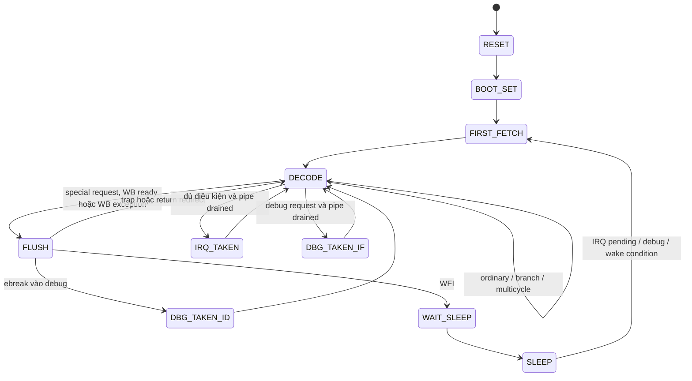

# 07 — Controller, CSR, trap, interrupt và debug

## Controller orchestration

SOURCE — [controller FSM](../../../rtl/ibex_controller.sv#L594):



Đây là các transition chính; FIRST_FETCH và FLUSH còn có ưu tiên debug/IRQ,
không dùng sơ đồ rút gọn thay cho toàn bộ điều kiện RTL.

## Branch/jump và precise exception

Trong DECODE, controller cho phép execution. Branch/jump đặt PC mux sớm để tránh
đưa toàn bộ điều kiện special request vào đường target mux. Với predictor, redirect
còn phụ thuộc instruction đã được predict taken hay chưa.

Khi special request xuất hiện, `retain_id=1` giữ instruction để xử lý tại FLUSH.
WB1 đợi `ready_wb | wb_exception` trước khi chuyển FLUSH: exception từ instruction
cũ ở WB phải được biết trước khi quyết định exception của ID trẻ.

Không có một priority list áp dụng cho mọi state. Trong normal DECODE:
operation đang chạy/exception của nó được giải quyết trước debug, rồi IRQ.
Trong FLUSH, debug request có thể điều hướng tiếp sau khi exception state được
lưu. Priority giữa synchronous faults ở WB0/WB1 cũng khác theo tuổi instruction.

## Trap PC và CSR update

SOURCE — [FLUSH](../../../rtl/ibex_controller.sv#L816),
[CSR save/restore](../../../rtl/ibex_cs_registers.sv#L890):

| Tình huống | PC được dùng | State cập nhật |
|---|---|---|
| Fetch/illegal/ecall/ebreak fault trong ID | PC ID | mepc/mcause/mtval, privilege và mstatus |
| Memory/CHERIoT WB fault khi WB1 | PC WB | Cùng trap state, instruction ID trẻ bị chặn |
| WB0 memory fault | PC ID, là default exception PC trong CSR | Không suy ra `csr_save_id=0` nghĩa không lưu PC |
| IRQ sau pipeline drain | PC IF | Return PC của instruction kế, IRQ cause |
| Debug tại IF/ID | PC tương ứng | dpc/dcsr; debug save không giống ordinary trap save |
| MRET/DRET | mepc/dpc | Restore privilege/status và redirect |

`csr_save_cause` có ưu tiên với các update phần mềm trong logic save/restore.
Ordinary trap lưu MIE→MPIE, privilege→MPP, clear MIE và chuyển M mode. MRET khôi
phục MIE từ MPIE, xử lý MPP/MPRV và NMI stack khi áp dụng. Các CSR được legalize
theo trường, không phải mảng 4096 registers ghi tự do.
CSR read/set/clear/write được chọn riêng; instruction CSR trả old value về rd.

## IRQ và debug eligibility

```text
irq_enabled = mstatus.MIE | (privilege == U)
handle_irq = ~debug_mode & ~single_step & ~nmi_mode
             & (NMI | (irq_pending & irq_enabled))
             & (expanded_state != INSTR_EXPANDED_COMMIT)
id_wb_pending = instr_valid_ID | ~ready_WB
```

Timer/external/software/fast pending còn chịu mie masks từ CSR. Fast IRQ nhỏ ID
có ưu tiên cao hơn trong nhóm fast. NMI không bị regular MIE gate nhưng vẫn chịu
các điều kiện debug/nmi-mode của controller. Không giả định nested NMI vô hạn.
External request phải đáp ứng synchronous/hold contract; core không tự tạo một
queue đảm bảo mọi pulse ngắn ngoài clock domain được bắt.

Nếu IRQ/debug đến lúc memory hoặc divider chưa xong, controller halt IF để drain.
SIM `event1..4` xác nhận operation đang chạy ghi x3 trước marker handler; timer
cause được kiểm bằng CSR read. Không kiểm mọi simultaneous debug+NMI+bus error,
single step, nested trap hoặc DRET trong đợt dynamic này. Test `mret` riêng kiểm
CSR mepc→MRET redirect và bỏ instruction fall-through; chưa kiểm mọi status restore.

## WFI và clock gating

WFI đi qua FLUSH→WAIT_SLEEP→SLEEP; tại SLEEP, fetch request tắt và ID bị clear.
Wake kiểm `irq_pending`, NMI, debug request/mode, single step; không dùng nguyên
điều kiện `handle_irq`. Do đó wake và take interrupt là hai quyết định khác nhau.

[Top](../../../rtl/ibex_top.sv#L303) giữ registered core_busy trên clock gốc,
OR với IRQ/debug wake để tạo `clock_en`, rồi qua `prim_clock_gating`.
Test `wfi_pending` kiểm trường hợp timer đã pending, MTIE bật nhưng global MIE
tắt: WFI tiếp tục mà không vào handler. Core harness dùng clock trực tiếp.
Đợt top bổ sung kiểm ngủ58 root cycles rồi wake qua clock gate thật, DRET,
debug+IRQ và NMI/MRET; xem [13](13_completion_results.md). Chưa đo WFI power
hay clock-tree vật lý.

## Invariants và giới hạn

- Cause, trap PC và fault address phải thuộc cùng instruction/event.
- ISR/debug không được xuất hiện trước side effect cần hoàn tất của operation cũ.
- Không mô tả store đã grant như có thể rollback bởi flush.
- Retirement counters loại faulting memory instructions; phân biệt RF writes,
  perf counters và RVFI metadata, nhất là Zcmp/dummy instructions.
- CSR field audit exhaustive, interrupt priority cross-product và formal liveness
  chưa thực hiện; source analysis ở đây tập trung microarchitectural update paths.
