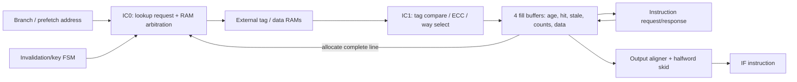

# 08 — Biến thể pipeline, cache, predictor và compressed expansion

## Tách lợi ích cấu trúc khỏi số đo chương trình

WB và BranchTargetALU độc lập về parameter. WB thêm state/forwarding/hazards;
BTALU thêm adder để tính target song song với compare hoặc link address.
SingleCycle multiplier thay số partial-product units; không làm DIV thành một cycle.
Các số đo tương ứng nằm ở [timing](10_timing.md).

Trong chương trình memory D1, WB giảm cycle ghi signature từ 18 xuống 15; D4 cả
hai đều 50. Đây là bằng chứng ví dụ rằng bottleneck ngoài execution có thể che
lợi ích pipeline; không phải kết luận mọi workload bus chậm không được lợi từ WB.

## I-cache là một front end khác

SOURCE — [geometry](../../../rtl/ibex_pkg.sv#L400),
[cache](../../../rtl/ibex_icache.sv#L71). Geometry hiện tại: 4096 data bytes,
2 ways, line 64 **bits** = 8 bytes, 256 indices/way, 2 bus beats/line.
Tag/ECC và fill buffers không nằm trong 4096 data bytes.



IC0 là request phase; `lookup_valid_ic1` được đăng ký cho kết quả RAM/compare ở
IC1. Các “IC0/IC1” là pipeline nội bộ cache; không làm CPU thành pipeline năm tầng.
RAM latency phải khớp interface; không tùy tiện thay bằng asynchronous RAM.

Lookup được ưu tiên hơn normal fill write. Fill grant còn bị invalidation/ECC
write chặn. Khi miss, chọn invalid way thấp nhất nếu có, nếu không dùng round-robin;
đây không phải LRU. Lookup throttle dựa fill level để tránh nghẽn tài nguyên.

## Mỗi fill buffer theo dõi ba tiến trình

| State nhóm | Ý nghĩa |
|---|---|
| busy, older mask, address/way | Ownership và arbitration theo tuổi |
| ext_count, ext_hold, ext_done | Requests đã grant; giữ request chưa grant |
| received_count, data, per-beat error | Responses đã nhận; gán vào buffer cũ nhất đang chờ |
| output_count, stale | Dữ liệu đã chuyển cho IF; branch làm đường cũ stale |
| cache/hit, ram_done | Có cần allocate vào RAM và allocation đã xong chưa |

SOURCE — [fill lifecycle](../../../rtl/ibex_icache.sv#L722):

```text
fill_done = (ram_done | hit | ~cacheable | any_error)
          & (output_done | stale | branch)
          & received_done
received_done = ext_done & ~ext_hold & (received_count == ext_count)
```

Đã stale chưa đủ để free buffer: response cho requests accepted vẫn phải drain.
Output có thể dùng hit data, buffered beat hoặc incoming beat trước khi toàn line
được ghi RAM. Refill completion, IF delivery và cache allocation là ba mốc khác nhau.

Halfword skid giữ phần instruction khi instruction 32 bit vượt word; branch clear
skid valid. Error của phần đầu có thể cho output fault mà không đợi phần sau ở
đường cache; không áp một latency/error shortcut chung cho cả cache và prefetch FIFO.

## Invalidation và ECC

SOURCE — [invalidation FSM](../../../rtl/ibex_icache.sv#L1200):

```text
OUT_OF_RESET → AWAIT_SCRAMBLE_KEY → INVAL_CACHE → INVAL_IDLE
INVAL_CACHE: quét tag indices; request mới có thể quay lại đợi key
```

256 indices cần được invalidate với geometry hiện tại, cộng overhead state/key;
đây là số bước write từ source, chưa đo boot latency. Trạng thái block cache
không mặc nhiên có nghĩa chặn toàn bộ uncached bus fetching.
Tag/data ECC error tham gia hit qualification, squash data và invalidation;
không suy ra “ECC bật thì luôn sửa data rồi trả CPU”. Backend scrambling/key/tweak
cần được xem cùng `ibex_top`, không chỉ module cache.

Cache runtime enable và compile-time ICache là hai lựa chọn khác: compile cache
off chọn prefetch module khác; compile cache on nhưng runtime disable vẫn dùng
front end có fill-buffer tracking.

## Branch predictor

[Predictor](../../../rtl/ibex_branch_predict.sv#L68) là combinational static
predictor: JAL/compressed immediate jumps predict taken; conditional branches
predict taken khi immediate âm. **Không có BTB/BHT/history counters, không dự đoán
JALR từ register**. Comment tổng quát “jumps” cần đọc cùng opcode decode thực tế.

IF bổ sung skid chứa predicted instruction khi ID chưa ready; controller tránh
redirect lại khi đã predict đúng và dùng `nt_branch_mispredict` khi predict taken
nhưng thực tế not-taken. State correctness nằm ở IF/controller mặc dù predictor
module không có state học lịch sử.

## Zcb và Zcmp

Zca chủ yếu đổi compressed encoding thành instruction tương đương; Zcb mở rộng
nhóm decode/operations cần xét cùng RV32B. Zcmp thay front end thành sequencer:

| Sequence | State/operation chính | Commit boundary |
|---|---|---|
| cm.push | CmIdle→CmPushStoreReg→CmPushDecrSp | Stores trước, SP update cuối |
| cm.pop | CmIdle→CmPopLoadReg→CmPopIncrSp | Loads rồi update SP |
| cm.popretz | Pop→SP increment→zero a0→ret ra | COMMIT bảo vệ đoạn cuối |
| cm.popret | Pop→SP increment→ret ra | COMMIT bảo vệ đoạn cuối |

SOURCE: [expansion](../../../rtl/ibex_compressed_decoder.sv#L616).
State chỉ advance khi instruction/micro-op được consumer nhận (`id_in_ready`),
không phải cứ clock tick. Pipeline mang expanded flags và original compressed
instruction để xử lý interrupt, fault và retirement đúng ranh giới.
Controller chặn IRQ trong `INSTR_EXPANDED_COMMIT`, và chặn debug entry trong
các phần expanded mà source chỉ định. Không coi toàn sequence là một memory
transaction atomic: partial loads/stores và restart behavior cần xem riêng.

Local decoder đánh dấu Zcmp illegal khi CHERIoT runtime On: scalar lw/sw và SP
addi không bảo toàn capability semantics. Không áp timing Zcmp ở RV32I sang
CHERIoT chỉ vì cùng parameter RV32ZC.

## Bằng chứng và giới hạn validation

WB/BTALU/multiplier đã SIM trong ma trận core. Đợt top bổ sung đã chạy
cache hit/miss/FENCE.I, predictor taken/not-taken recovery, Zcb zext.b và Zcmp
push/pop; xem [13](13_completion_results.md). Secure cache ECC/scramble và fault
recovery ở [chuyên đề Secure](../secure_ibex/05_cache_and_integration.md).
Interrupt ở mọi micro-op boundary và toàn bộ fill-buffer race vẫn chưa quét
exhaustive; phần state/priority của chúng được phân tích từ SOURCE ở trên.
