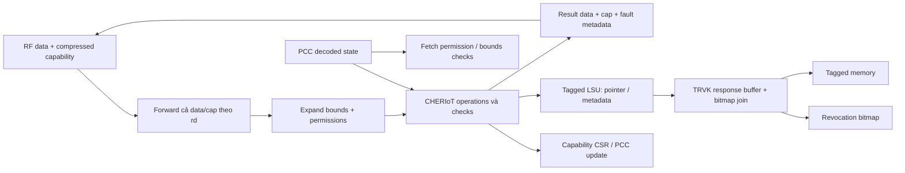

# 09 — CHERIoT, revocation và các đường bảo vệ

## Representation và architectural state

SOURCE — [capability package](../../../rtl/ibex_cheriot_pkg.sv#L69):

| Dạng | Thành phần | Nơi dùng |
|---|---|---|
| Memory capability | Pointer word + metadata word + tags ngoài data | Tagged memory/LSU |
| `cap_t` 35 bit | 33 bit metadata/tag + 2 correction bits | RF, WB, capability CSR |
| `decoded_cap_t` 112 bit | cap_t + 32-bit base + 33-bit top + 12 expanded permissions | EX và PCC |

Data address 32 bit đi riêng với `cap_t`; một RF entry capability không phải chỉ
35 bit. Correction bits lưu thêm để giảm recomputation; không được ghi nguyên
35 bit vào word metadata 32 bit. `top33` giữ được upper bound 2^32.

[RF FF dual](../../../rtl/ibex_register_file_ff.sv#L91) chia sẻ physical storage:
x0..15 data bank, upper RV32I bank dùng lại cho capability metadata khi mode On.
Read/write decoder phải xét mode, register index và dummy instruction.
Đổi runtime mode không tự migrate state hoặc drain pipeline; chưa có evidence
protocol cho phép đổi tùy cycle. Thí nghiệm không thay đổi mode đang chạy.



## EX operation families và datapath

| Nhóm | Phần cứng chủ yếu | Metadata/side effect |
|---|---|---|
| Get field, move, clear tag, compare/subset | Field mux, compare, capability selection | Trả scalar hoặc cap; clear tag có chủ đích |
| Set/increment address, AUIPCC/AUICGP | Address adder + representability/correction | Address mới phải khớp compressed bounds representation |
| Set bounds/exact/round-down, CRAM/CRRL | Length analysis, exponent candidates, masks, rounding | Bounds/tag hoặc alignment/length scalar |
| And permissions, seal/unseal | Permission encode/decode, object-type checks | Có thể clear validity khi không đáp ứng điều kiện |
| CJAL/CJALR | Target calculation + execute/sealing checks | PCC, link capability, sentry MIE effects |
| Capability load/store | Address+8 bounds, alignment, permission vectors | Hai transactions, tag/clear-permission controls |
| Special CSR | Address legalization, SR permission, CSR mux | Capability CSR read/write và fault info |

SOURCE: [EX operation mux](../../../rtl/ibex_cheriot_ex.sv#L293),
[bounds preparation](../../../rtl/ibex_cheriot_pkg.sv#L492).
Set-bounds chuẩn bị `addr+length` ở 33 bit, chọn hai exponent candidates, round
base/top và kiểm parent bounds. Exact request clear valid khi bounds không biểu
diễn chính xác. Các đường này là logic tổ hợp và register boundary của ID/WB,
không phải gọi một phần mềm runtime dù được viết bằng SV functions.

Forwarding capability dùng cả data và cap ở cùng rd; nếu chỉ forward data mới
với metadata cũ, expand bounds sẽ sai. Các chức năng arithmetic capability ngoài
directed load checks chưa được đối chiếu exhaustive với ISA model.

## Permission/bounds có thể fault hoặc clear tag

Scalar RV32 load/store khi CHERIoT On vẫn kiểm capability của base register:
valid, unsealed, LD/SD, address range tính cả kích thước access.
Capability load/store còn kiểm alignment 8 byte và các permission đặc thù.
CLC thiếu MC có thể trả capability bị clear tag qua CTAG; CSC store-local
violation có thể clear tag, hoặc fault khi debug escalation CSR bật. Không gộp
tất cả permission failure thành bus error hoặc exception giống nhau.

EX có đường bounds check tối ưu cho request gate và đường đầy đủ cho fault
priority/mtval, ví dụ `addr+8` ở 33 bit để bounds thắng alignment khi cần.
LSU nhận `lsu_cheriot_err`, không phát external request cho access bị chặn và
có thể trả synthetic completion/error. Debug mode có những bypass được viết rõ
trong EX; không dùng test debug để chứng minh ordinary-mode permission checks.

SIM [cap_ex](evidence/cap_ex.log): root load, null tag, thiếu LD, word cuối hợp
lệ, word vượt top, aligned/misaligned capability load và capability tại top.
Đây là module EX với control được drive trực tiếp, chưa phải decoder-to-trap test.

## Capability LSU: hai FSM

Address FSM: CTX_WAIT_GNT1→CTX_WAIT_GNT2→[CTX_WAIT_RESP]→IDLE.
Response FSM: CRX_IDLE→CRX_WAIT_RESP1→CRX_WAIT_RESP2→CRX_IDLE, có transition
trực tiếp sang WAIT_RESP1 nếu response cuối và request mới cùng cycle.

Word đầu lưu pointer, tag và error. Word sau có metadata; completion/read-valid
chỉ ở cuối. Conversion tính `valid = low_tag & high_tag & ~CTAG`, rebuild correction
bits và áp các quyền phải clear. Capability store gửi pointer trước, metadata sau;
cả hai word full BE, cap tag đi trên cổng riêng.

SOURCE — [cap response assembly](../../../rtl/ibex_load_store_unit.sv#L612),
[memory conversion](../../../rtl/ibex_cheriot_pkg.sv#L763).
SIM [cap_lsu](evidence/cap_lsu.log) xác nhận đúng hai grant 0x200/0x204,
không completion ở word đầu, ghép pointer đúng, tag cả hai halves/CTAG và error
của từng response. Test đặt hai grants trước response1, có khoảng chờ giữa responses.

## TRVK: fork request, buffer response, join bitmap

SOURCE — [TRVK](../../../rtl/ibex_trvk.sv#L165).
Mỗi accepted request cần cả downstream acceptance và slot chứa address bit[2].
`stream_fork` theo dõi từng nhánh đã handshake, tránh phát lặp khi hai nhánh
không sẵn sàng cùng cycle. FIFO alignment depth=NumOutstanding giữ bit[2] đi
cùng mỗi transaction. Response FIFO cùng depth chứa data/tag/error; bus response
không có ready nên capacity accounting ở request side là bắt buộc.

Khi word có tag và bit[2]=0 được chuyển upstream, TRVK latch pointer. Word
metadata kế tiếp bit[2]=1 được dùng để expand capability **base**, rồi tính:

```text
offset = capability_base - heap_base
bit_index = offset >> 3
bitmap_word_address = bitmap_base + 4 * (bit_index >> 5)
bit_select = bit_index[4:0]
lookup_required = tagged_pointer_stored & tagged_metadata_valid
                & metadata_alignment_valid & ~sealing_cap & ~out_of_range
bitmap_req = lookup_required & ~bitmap_outstanding
```

Bitmap dựa capability base, không dùng nguyên pointer cursor hay địa chỉ nơi
capability được load. Default bitmap 2 KiB ứng với 16384 bits × 8 bytes =128 KiB
phạm vi heap. Module default NumOutstanding=4; top dùng 2, cần phân biệt.

Khi cần lookup, dynamic join giữ metadata response đến khi bitmap rvalid.
Một bitmap request outstanding; không phát lại sau grant. Bitmap bit=1 hoặc
bitmap device/ECC error làm clear returned tag. Bitmap error có alert riêng;
`upstream_err` vẫn là error của downstream response, không tự OR bitmap error vào đó.

| Tình huống | Lookup | Tag metadata upstream |
|---|---|---|
| Capability trong heap, live | Có | Giữ |
| Revoked | Có | Clear |
| Bitmap device error | Có | Clear + device error output |
| Pointer không tag | Không | TRVK có thể giữ tag word metadata; LSU AND cả hai tags |
| Sealing capability / ngoài heap | Không | Giữ theo downstream tag |

SIM [trvk](evidence/trvk.log) kiểm cả sáu trường hợp, giữ metadata trong lúc grant
bitmap chậm và response bitmap chậm, kiểm không request lặp. EX/LSU/TRVK là ba
test độc lập của đợt đầu. Đợt bổ sung có full-top CHERIoT program qua tagged
memory+TRVK, live/revoked tag và capability trap: [13](13_completion_results.md).
Các helpers package dùng trong DUT vẫn là phần RTL đang kiểm, không phải model
ISA độc lập. Dynamic mode switch và nhiều capability back-to-back chưa được quét.

## PCC, PMP và fault containment

PCC được reset root executable, cập nhật khi capability control transfer và
trap/return. IF dùng bounds/permission PCC để kiểm fetch; CSR lưu capability của
exception PC, không chỉ scalar mepc. Priority save/return/branch được đặt ở
[CSR capability state](../../../rtl/ibex_cs_registers.sv#L2058).

PMP có ba channels: fetch PC, fetch PC+increment cho instruction spanning word,
data address; privilege fetch và LSU có đường riêng. Trong local dual ISA khi
CHERIoT On, [core](../../../rtl/ibex_core.sv#L1626) mask PMP errors về 0.
Vì vậy PMPEnable không bảo đảm PMP là một lớp check bổ sung đang hoạt động trong
capability mode. Đây là source behavior, không phải đánh giá policy nền tảng.

SecureIbex thêm timing controls, dummy instructions, RF/memory integrity và top
lockstep theo generate/parameters. RF ECC errors, PC mismatch, CSR shadow error,
CHERIoT fatal/mode encoding error vào major-internal alert. Memory integrity errors
vào major-bus alert; load integrity còn có internal NMI path. I-cache ECC đi vào
minor alert. Lỗi bus thường và lỗi integrity có đường timing/recovery khác nhau.

[Lockstep](../../../rtl/ibex_lockstep.sv#L269) delay inputs và matching outputs
để so main/shadow cores theo LockstepOffset; compare cần đúng phase reset/enable.
`outputs_mismatch = (enable_cmp != IbexMuBiOff) & (shadow_outputs != delayed_main)`.
Đây là detection, không phải majority voting hay tự sửa architectural state.
Core harness ban đầu không instantiate lockstep. Chuyên đề [Secure Ibex](../secure_ibex/README.md)
đã bổ sung top lockstep/ECC và fault injection; chưa đo side-channel, PPA hay CDC/RDC.
