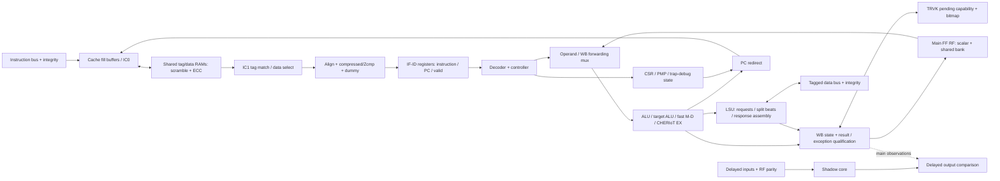

# 03 — Datapath thực tế và ownership của state

Mô hình hữu ích là một CPU in-order có frontend/cache, ID/EX và WB, kèm các máy
trạng thái giữ lệnh lâu hơn một cycle. Sơ đồ “ba stage” chỉ là lớp ngoài; cache
IC0/IC1, divider, Zcmp, LSU, TRVK và delayed checker tạo ra các ranh giới register
khác phải theo dõi khi debug một waveform.

Đường chấm main→compare trong sơ đồ biểu diễn nhóm output được chọn ở top,
không khẳng định WB scalar write tuple được so trực tiếp. Chi tiết bundle và
các giới hạn detection được tách trong [06_security](06_security.md).

## State được cập nhật bởi ai?

| Owner | State/ràng buộc | Update / hold | Redirect, exception, reset |
|---|---|---|---|
| Cache | Prefetch address, IC1 lookup, 4 fill buffers, invalidate FSM | Lookup/fill grant và response valid điều khiển từng nhóm | Redirect bỏ đường instruction cũ nhưng request đã grant vẫn phải drain; invalidate quét indices |
| IF | PC/instruction/length/error, `instr_valid_id_q`, new-instruction pulse | Payload ghi khi `if_id_pipe_reg_we = instr_new_id_d`; valid quản lý riêng | `instr_valid_clear`/PC change điều khiển lệnh đang giữ; ResetAll reset payload |
| Compressed decoder | `cm_state_q`, register-list/stack-offset | Chỉ tiến micro-operation khi downstream ready | Flush trả về idle; COMMIT/LAST phân biệt độ nguyên tử |
| ID/EX | First/multicycle FSM, operands/intermediate values | Stall giữ instruction; mult/div/branch/B có handshake riêng | Controller đợi điểm có thể hoàn tất/flush hợp lệ |
| Main RF | 16×32 scalar + 16×35 shared | Một write address; shared-bank interpretation theo mode | x0 thật đọc zero; dummy dùng entry riêng; dual-mode RF flops reset |
| WB | Valid, loại lệnh, RD, result, PC, capability metadata | `wb_valid_d = en_wb & ready_wb OR wb_valid_q & !wb_done` | Faulty load không được RF write; không tự rollback external store |
| LSU | Request state, split address/data, remembered error | Request giữ tới grant; response hoàn tất/ghép beat | Error từng beat cần quy đúng instruction/address |
| TRVK | Pending capability, bitmap request/response association | Không công bố tagged result trước qualification | Revoke/ECC có thể clear tag; không đồng nhất với ordinary data trap |
| CSR/controller | Privilege, exception PC/cause, debug/NMI state, interrupt pending | CSR writes hoặc trap/debug transitions với priority cụ thể | Lưu đúng PC của instruction/event, chọn mtvec/debug/NMI target |
| Lockstep | Input delay, reset shadow, delayed main outputs, compare enable | Chạy theo offset và pha reset riêng | Compare chỉ được mở sau alignment; phát alert khi bất đồng |

Nguồn: [IF register update](../../../rtl/ibex_if_stage.sv#L560),
[Zcmp state machine](../../../rtl/ibex_compressed_decoder.sv#L184),
[ID execution/ready](../../../rtl/ibex_id_stage.sv#L885),
[WB state](../../../rtl/ibex_wb_stage.sv#L107),
[LSU](../../../rtl/ibex_load_store_unit.sv),
[TRVK](../../../rtl/ibex_trvk.sv),
[lockstep](../../../rtl/ibex_lockstep.sv).

## Forwarding không có nghĩa issue quanh một load đang pending

WB làm giảm ràng buộc trên execution result và cung cấp forwarding cho kết quả
không phải load. Nhưng ID có điều kiện outstanding memory ở WB và load hazard
riêng. `outstanding_memory_access` xét load/store chưa có `lsu_resp_valid`; nó
chặn cả lệnh trẻ độc lập, không chỉ lệnh đọc RD của load. Response cycle và
load-use hazard cần đọc cùng `ready_wb`, `stall_mem`, `stall_ld_hz`.

Ca `lw x2; addi x3,zero,9; addi x4,x2,1` ở D4 cho write x2=19, x3=20, x4=21.
Khi cùng load bị access error, không có write x2/x3/x4; handler nhận MEPC `0x84`.
Đó là bằng chứng cụ thể cho precision và in-order blocking, không phải mô tả
theo pipeline RISC-V tổng quát. [ID memory blocking](../../../rtl/ibex_id_stage.sv#L1000),
[trace thành công](evidence/rv.independent_d4.log),
[trace lỗi](evidence/rv.error_young.log).

## Những ranh giới phải đánh dấu trên waveform

Với một instruction, ghi riêng: lần đầu valid ở ID; cycle được phép tiến;
request grant nếu có; từng response; write RF; RVFI observation; trap/debug
entry; alert. Các mốc này không trùng nhau. Zcmp có nhiều expanded operations
cùng PC; một dòng R không luôn tương ứng một instruction nén nguồn. Dòng R của
một faulting instruction cũng không có nghĩa nó đã viết destination thành công.

Trace T dùng root time `$time/10` tại cạnh gated clock trước NBA; W/R/D dùng
cycle counter của harness. Không trộn hai convention để suy detection latency
một cycle. Trong bảng occupancy chỉ trừ T với T; trong bảng grant/write/debug
chỉ đối chiếu các record cùng counter. Kết quả stored ở
[timing.json](evidence/timing.json) và [analysis checks](evidence/analysis_checks.json).
