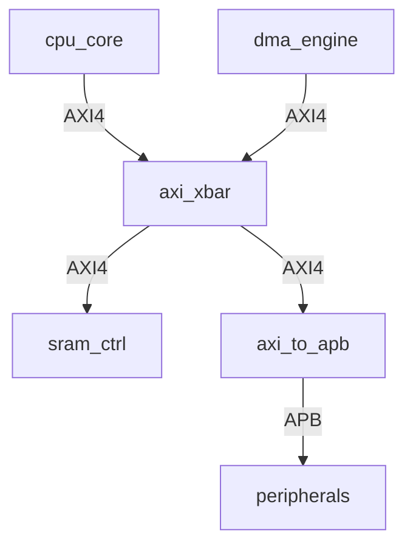
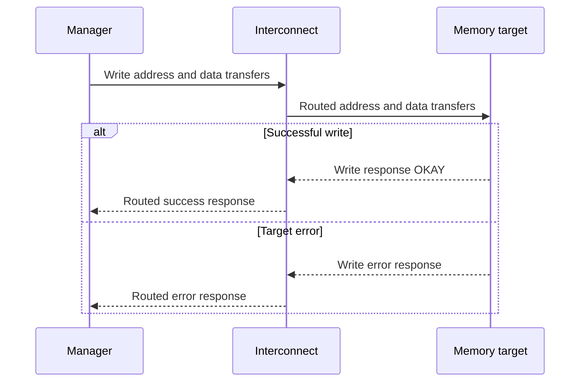

# RTL and SoC Source Analysis Guide

**Revision:** 3.1  
**Updated:** 2026-09-07  
**Purpose:** Build a reproducible, evidence-backed understanding of an RTL/IP/SoC implementation within an explicitly selected engineering scope.

### Revision 3.1 changes

Revision 3.1 keeps every technical rule of revision 3 unchanged. It addresses usability only.

| Change | Why | Where applied |
|---|---|---|
| One-page quick reference | The full guide is reference material; daily work needs a short card | Quick Reference |
| Single inline label form `KIND:RESULT`, plus a revision 2 migration table | Revision 3 mixed three label styles that did not derive from the dimension model | §3.3 |
| Minimal finding record beside the full record | The full record is right for decision-blocking findings and too heavy for routine ones | §3.4 |
| Illustrative example rows restored in template tables | A placeholder row specifies fields but does not show expected granularity | Stages 0–16, re-baselining |
| Compound template headings split | Five-noun headings resist scanning and produce unusable anchors | Stage templates |
| Stage applicability recorded in the entry-point status table | Revision 3 defined `REQUIRED`/`CONDITIONAL`/`NOT-APPLICABLE` but gave it no home | Entry-point template |
| Appendix A execution evidence recorded | The supplied example was compiled and run; the result is now evidence rather than prediction | Appendix A |

### Revision 3 changes and rationale

| Change | Why it is needed | Where applied |
|---|---|---|
| Separate evidence kind, result, claim support, and freshness | A simulation observation, a formal proof, and a timing exception establish different things | Evidence rules; Stages 6, 11, 12 |
| Distinguish CDC structure, constraints, protocol conditions, and physical evidence | A synchronizer plus a false-path declaration does not establish crossing safety | Tool table; Stage 6 |
| Correct tool limits and ambiguous examples | Text search is not elaboration; ID count is not transaction capacity | Tool table; Stages 3, 5, 9 |
| Add formal assumptions, bounded results, vacuity, and checker effectiveness | A pass can be uninformative or apply only under a restricted model | Stages 10–12 |
| Tailor stage selection and completion to the objective | Building one target and changing an IP need different deliverables | Scope; completion matrix |
| Track transitive dependencies while preserving historical findings | Unchanged RTL can behave differently after configuration or dependency changes | Baseline; re-baselining |
| Add quantitative reasoning and a worked FIFO analysis | Templates need an example connecting source, prediction, checking, and change impact | Stages 4, 10; Appendix A |
| Add authoritative references and explicit limits | Separate this guide's workflow choices from protocol rules and published methodology | Inline citations; References |

This revision retains the original emphasis on active configuration, end-to-end flows, owned state, registers, interrupts, reproducible experiments, and change impact. It is an analysis guide, not a universal tapeout-signoff standard. Project-specific acceptance gates remain authoritative for their project.

## Quick Reference

Everything needed for a routine session fits on this page. The rest of the guide is reference material to consult when a stage is actually selected.

**Session loop.** State the question and the decision it affects → locate active source and configuration → predict a specific outcome → check it → record result, scope, and remaining uncertainty → update open questions.

**Evidence label.** Tag decision-relevant claims `[KIND:RESULT]`, optionally with a finding ID.

| Kind | Result |
|---|---|
| `SPEC` specification states it | `DECLARED` document asserts it |
| `RTL` source or elaboration establishes it | `ESTABLISHED` implementation fact shown |
| `SIM` a named run observed it | `OBSERVED` seen in a recorded run |
| `FORMAL` a property was checked | `PROVED` complete proof under stated assumptions |
| `STATIC` a lint/CDC/STA report gives it | `BOUNDED-PASS` no counterexample to a stated depth |
| `SILICON` a measurement records it | `REFUTED` / `INCONCLUSIVE` / `NOT-RUN` |

Claim support is separate: `SUPPORTED`, `INFERRED`, `ASSUMED`, `UNKNOWN`, `DISPUTED`. An unsupported decision-critical claim is `UNKNOWN` and needs an open question.

**Minimal finding.** Three lines are enough unless the finding blocks a decision:

```markdown
**FND-<AREA>-<nn>:** <one testable claim>
**Support:** <SUPPORTED | INFERRED | ASSUMED | UNKNOWN | DISPUTED>
**Scope and evidence:** <baseline, configuration, mode> — <artifact, command, or reasoning>
```

**Identifiers.** `BASE`/`CFG`, `REQ`, `FND`, `EVD`, `ASM`, `INV`/`PROP`, `FLOW`/`EXP`, `OQ`/`WVR`/`CHG`. Never reused. Allocate only what the task needs.

**Five rules that prevent most errors.**

1. A specification states intent; only active source and runs establish implementation and behavior.
2. Elaborate before concluding which files, parameters, and instances are active.
3. A synchronizer plus a timing exception is a structural fact, not a crossing guarantee.
4. A passing assertion may be vacuous; check that its trigger occurred.
5. A missing tool is a limitation, never a reason to mark a subject `NOT-APPLICABLE`.

**Stage picker.** Stages 0, 1, 13, 15, 16 always apply. For the rest, see the objective-to-stage mapping below.

## How to Use This Guide

1. Select one primary objective and the relevant subsystem, transaction, or proposed change in Stage 0.
2. Establish a source baseline and, when tools are available, an execution baseline in Stages 1 and 3.
3. Follow the selected stages at the required depth. Revisit earlier conclusions when new evidence changes them.
4. Maintain open questions and terminology throughout the work.
5. Close against the objective-specific criteria in [Sufficient Understanding](#sufficient-understanding).

For a practical demonstration, read [Appendix A — Worked FIFO Analysis](#appendix-a--worked-fifo-analysis) after the evidence rules.

**Illustrative rows.** Template tables carry *italicised* example rows. They show the intended granularity of an entry, which a bare `<placeholder>` cannot. All example designs, names, frequencies, addresses, owners, commands, and findings in templates are illustrative unless explicitly identified as measured evidence. Delete them and replace with project data; anything left italicised in a real analysis document is unreplaced template text.

### Objective-to-stage mapping

Stages 0, 1, 13, 15, and 16 apply to every objective; keep their records proportionate to the scope. The table lists the additional stages. A stage can be a concise subsection of an existing document for a small task.

| Objective | Additional core stages | Stages activated by scope or risk | Minimum outcome |
|---|---|---|---|
| Build and simulate an existing target | 3 | 2 for source/build ambiguity; 11–12 if validating behavior | Reproducible build/run and an accurately interpreted baseline result |
| Basic architectural understanding | 2, 3, 4, 5, 9 | 6–8 for relevant domains/software contracts; 10–12 for uncertain behavior | Explain the active architecture and trace selected critical flows |
| IP integration | 2, 3, 4, 5, 6, 9, 11 | 7–8 for addressable resources; 10, 12 for integration risks; 14 if RTL changes | Define boundary contracts, integration assumptions, and validation gaps |
| Verification development | 2, 3, 4, 5, 9, 10, 11, 12 | 6 for domain/reset/power risks; 7–8 for memory/CSR features; 14 if RTL changes | Reviewed requirement-to-check mapping and evidence of implemented checks |
| Debugging and root-cause analysis | 3, 5, 9, 10, 11, 12 | 2, 4, 6–8 as the failing flow requires; 14 before a fix | Reproduce or precisely bound the failure and explain its causal chain |
| RTL modification | 2, 3, 4, 5, 9, 10, 11, 12, 14 | 6–8 according to affected domains, memories, and software contracts | Predict impact, validate changed behavior, and assess regression risk |
| Porting to a new platform or technology | 2, 3, 4, 5, 6, 11, 12, 14 | 7–10 for affected memory maps, firmware, primitives, and datapaths | Compare source/target assumptions and validate applicable platform gates |

**Depth, not file count, determines completeness.** For example, Stage 10 may cover one FIFO in a local fix or many state-owning modules in an unfamiliar subsystem. Stage 6 still requires an applicability decision even for a single-clock block; single-clock does not automatically eliminate reset or clock-gating concerns.

For each selected stage, record `REQUIRED`, `CONDITIONAL`, or `NOT-APPLICABLE` with a reason. `NOT-APPLICABLE` means a feature does not exist in the selected scope. A missing tool, missing specification, or unperformed check is a limitation, not a reason to mark the subject inapplicable.

### Effort and stopping rule

Estimate effort after checking the build state, configuration count, external IP dependencies, critical flows, and evidence required. Use a project-specific budget and review date rather than a generic number of days. At the review point, close the agreed objective, reduce the scope explicitly, or record why more work is needed. Unanswered questions outside the agreed scope do not automatically block completion.

## 1. Purpose

Understanding RTL is a structured engineering investigation. Its output is a mental model that another engineer can reconstruct, challenge, reproduce, and update. Read enough implementation to explain observable behavior and relevant state; use tools to strengthen specific claims within their documented limits.

The desired chain is: explain the design, predict behavior under stated conditions, check the prediction, and assess a change before implementing it. Analysis completion and design correctness are separate judgments. A completed analysis can establish that a design has a bug or that a critical property remains unverified.

## 2. Analysis Directory

Keep the analysis with the source or in a companion repository, under version control. For a companion repository, record both the source revision and the analysis revision. Do not place generated evidence only in an untracked location that other readers cannot access.

| Path under `source-analysis/` | Contents |
|---|---|
| `README.md` | Entry point, scope, baseline, status, reading order, blockers |
| `00_scope.md` | Objective, boundaries, applicability, completion gates |
| `01_repository_baseline.md` | Source/execution snapshots and reproduction commands |
| `02_source_inventory.md` | Relevant sources, origins, targets, priorities |
| `03_build_and_configuration.md` | Active build, parameters, defines, generators |
| `04_architecture.md` | Blocks, state ownership, paths, architectural rationale |
| `05_interfaces.md` | Transaction contracts and environmental assumptions |
| `06_clock_reset_and_power.md` | Domains, CDC/RDC, timing treatment, power/test modes |
| `07_memory_and_address_map.md` | Memory attributes, decode, boot, software consistency |
| `08_registers_and_interrupts.md` | Field semantics, side effects, IRQ paths and races |
| `09_system_flows.md` | Selected end-to-end request, response, and recovery flows |
| `10_module_analysis/README.md` | Index of prioritized module analyses |
| `10_module_analysis/<module_name>.md` | State, datapath, contract, invariants, evidence |
| `11_verification_analysis.md` | Requirements, checkers, coverage, formal results, gaps |
| `12_experiments.md` | Predictions, commands, artifacts, observations, limitations |
| `13_open_questions.md` | Unresolved assumptions, conflicts, blockers, decisions |
| `14_change_impact.md` | Proposed changes and required validation |
| `15_glossary.md` | Project-specific terminology and identifier namespaces |
| `16_final_summary.md` | Objective-specific conclusions and remaining limits |
| `evidence/` or a durable artifact index | Logs, reports, manifests, waveform links, checksums |

Stage exit criteria below apply to selected scope and depth. If required evidence is unavailable, record a LIMITED or NOT-MET gate and its consequence rather than treating it as satisfied.

Do not create empty placeholders. A small task may combine sections into one Markdown file while retaining headings and stable identifiers. Large logs and waveforms can live in a durable artifact store; record the exact artifact identity and retention/access expectations.

### Entry-point template

```markdown
# Source Analysis: <design name>

## Objective and scope
<primary objective; link to scope and completion gates>

## Analyzed baseline
<source revision; dirty-tree patch digest if applicable; configuration ID>
<dependency/generator/firmware snapshot; analysis revision>

## Document status
| Document or section | Purpose | Applicability | Work status | Valid for baseline | Limitations |
|---|---|---|---|---|---|
| *03_build_and_configuration.md* | *Active target and parameters* | *REQUIRED* | *COMPLETE* | *BASE-01* | *none* |
| *06_clock_reset_and_power.md* | *Domains and crossings* | *CONDITIONAL — two clocks present* | *IN-PROGRESS* | *BASE-01* | *No CDC tool available* |
| *08_registers_and_interrupts.md* | *CSR and IRQ contracts* | *NOT-APPLICABLE — no addressable resources in scope* | *NOT-STARTED* | *—* | *—* |

## Reading order
<links for a new reader>

## Open blockers and accepted limitations
<OQ links and impact on this objective>

## Evidence index
<artifact IDs, locations, and reproduction commands>
```

Applicability carries the `REQUIRED` / `CONDITIONAL` / `NOT-APPLICABLE` decision from the stage-selection rule above, with its reason; this table is where that decision is recorded and reviewed. Use document work status `NOT-STARTED`, `IN-PROGRESS`, `COMPLETE`, or `COMPLETE-WITH-LIMITATIONS`. These describe the analysis work, not whether the hardware is correct. The module index adds instance/configuration, prioritization reason, and relevant flows.

## 3. Evidence and Confidence Rules

### 3.1 Separate the dimensions

Do not compress evidence source, test outcome, confidence, conflict, and freshness into one field.

| Dimension | Values or required content | Meaning |
|---|---|---|
| Claim support | `SUPPORTED`, `INFERRED`, `ASSUMED`, `UNKNOWN`, `DISPUTED` | Current support for the precise statement |
| Evidence kind | `SPEC`, `RTL`, `SIM`, `FORMAL`, `STATIC`, `SILICON` | How the information was obtained; multiple kinds may coexist |
| Evidence result | `DECLARED`, `ESTABLISHED`, `OBSERVED`, `PROVED`, `BOUNDED-PASS`, `REFUTED`, `INCONCLUSIVE`, `NOT-RUN` | What a particular evidence item establishes |
| Scope | Revision/snapshot, configuration, instance, mode, reset/clock conditions, relevant assumptions | Where the claim applies |
| Freshness | `CURRENT`, `NEEDS-RECHECK`, `SUPERSEDED` | Applicability to the baseline being reviewed |
| Issue type | For example, `CONFLICT`, `BUG`, `MISSING-EVIDENCE`, `TOOL-LIMITATION` | Classification of a finding/open question; not an evidence kind |

`SUPPORTED` means the evidence supports the stated scope; it does not mean the implementation meets every requirement. A source-level defect can be a supported finding. `PROVED` applies only to the checked formal property in the recorded model and assumptions.

### 3.2 Evidence kinds and limits

| Kind | Appropriate use | Limit that must remain visible |
|---|---|---|
| `SPEC` | An identified specification states an intended requirement | Does not establish implementation or test behavior; record document version and authority |
| `RTL` | Source semantics or elaboration establish an implementation fact | Distinguish source-only reasoning from elaborated target evidence; behavioral claims need the relevant logic and assumptions |
| `SIM` | A named execution produced an observed trace/check result | Limited to the run, model, stimulus, configuration, checking enabled, and observation window |
| `FORMAL` | A property is proved, refuted, bounded-checked, or unresolved | Record assumptions, abstraction, initialization, engines, bounds, and proof completeness |
| `STATIC` | A lint, CDC/RDC, synthesis, STA, or related report gives a specific result | Name the analysis, rule set, waivers, model, constraints, and supported constructs; a clean report covers only its checks |
| `SILICON` | A board/device measurement records physical behavior | Record device/bitstream or silicon revision, firmware, instrumentation, voltage/temperature, workload, and sample scope |

Constraint text declares analysis intent; a report can show which constraints actually matched and took effect. Neither is interchangeable with a functional proof or a physical measurement. A report about a netlist also needs that netlist's provenance.

An assertion may pass vacuously when its trigger never occurs or cannot occur. Record assertion activation, reset disabling, trigger/antecedent coverage, and completed obligations before using a pass to support a behavioral claim. Vacuity and meaningful witnesses are established topics in model checking. [Beer et al., 2001](https://link.springer.com/article/10.1023/A:1008779610539)

### 3.3 Inline convention and migration from revision 2

Use finding IDs on claims that influence an engineering decision. Inline labels are short views of the detailed record and take exactly one form: **`KIND:RESULT`**, drawn from the two vocabularies in §3.1 and §3.2. When a claim rests on reasoning rather than an evidence item, use the claim-support value alone.

```markdown
- The spec requires in-order responses within this read ID. [SPEC:DECLARED; FND-AXI-01]
- The selected instance has two queue entries. [RTL:ESTABLISHED; FND-FIFO-01]
- EXP-14 observed the predicted full-buffer stall. [SIM:OBSERVED; FND-FIFO-02]
- No counterexample was found through 32 steps under ASM-ENV-01. [FORMAL:BOUNDED-PASS; FND-FIFO-03]
- The CDC report classified the crossing as a two-flop synchronizer. [STATIC:ESTABLISHED; FND-CDC-03]
- The latency rationale is inferred from the surrounding pipeline. [INFERRED; FND-PIPE-01]
- The sink eventually accepts data. [ASSUMED; ASM-ENV-01; OQ-07]
```

`SPEC:DECLARED` means the document contains the requirement, not that the design complies. `RTL:ESTABLISHED` means the scoped implementation claim has been established from active source or elaboration. Do not invent a compound label outside these two vocabularies; if no pair fits, the claim is `INFERRED`, `ASSUMED`, or `UNKNOWN`.

#### Migration from revision 2

| Revision 2 label | Revision 3.1 inline label | Record fields | Check before migrating |
|---|---|---|---|
| `SPEC-CONFIRMED` | `[SPEC:DECLARED]` | support `SUPPORTED`, kind `SPEC` | Document version and authority are identified |
| `RTL-CONFIRMED` | `[RTL:ESTABLISHED]` | support `SUPPORTED`, kind `RTL` | Distinguish source-only reasoning from elaborated evidence |
| `SIM-CONFIRMED` | `[SIM:OBSERVED]` | support `SUPPORTED`, kind `SIM` | A named run, configuration, and enabled checks exist |
| `INFERRED` | `[INFERRED]` | support `INFERRED` | Unchanged |
| `ASSUMED` | `[ASSUMED]` | support `ASSUMED` | An `ASM` ID and open-question entry exist |
| `UNKNOWN` | `[UNKNOWN]` | support `UNKNOWN` | Open-question entry exists if decision-critical |
| `CONFLICT` | issue type `CONFLICT` | not an inline label | Scopes were aligned before calling it a conflict |

A physical measurement becomes `[SILICON:OBSERVED]`. `CONFLICT` moves out of the label vocabulary entirely: it is an issue type on a finding or open question, not a statement of evidence. Migrate a label only after checking the underlying evidence still exists; do not mechanically invent missing evidence during migration.

An inline ID can carry status through its linked finding; do not duplicate long metadata after every sentence. Explanatory prose, headings, examples, and repeated links are not new findings. An unsupported decision-critical claim is `UNKNOWN` and needs an open-question entry. Centralize consequential unknowns; group related low-impact questions rather than creating an entry for every unfamiliar word.

### 3.4 Finding and evidence record

Two record forms exist. Use the minimal form by default.

**Minimal record.** Sufficient for routine findings — anything that documents an implementation fact without blocking a decision:

```markdown
**FND-<AREA>-<nn>:** <one precise, testable claim>
**Support:** <SUPPORTED / INFERRED / ASSUMED / UNKNOWN / DISPUTED>
**Scope and evidence:** <baseline; configuration; mode> — <artifact, command, or reasoning; EVD ID if one exists>
```

**Full record.** Use it when at least one of these holds: the finding blocks or justifies an engineering decision; a named reviewer or decision owner must sign off; the finding will be carried across a re-baseline; or other findings depend on it. The `Depends on` and `Freshness` fields are what make transitive re-baselining possible, so a finding that will outlive one snapshot needs the full form.

```markdown
## FND-<AREA>-<nn>

**Statement:** <one precise, testable claim>
**Claim support:** <SUPPORTED / INFERRED / ASSUMED / UNKNOWN / DISPUTED>
**Applies to:** <baseline; configuration; instance; mode; observation/analysis boundary>
**Assumptions:** <ASM IDs, or none>
**Depends on:** <findings, sources, packages, generators, models, firmware, constraints>
**Freshness for current baseline:** <CURRENT / NEEDS-RECHECK / SUPERSEDED>
**Impact:** <engineering consequence and severity>

| Evidence ID | Kind | Result | Source/artifact and immutable identity | Method/run | Scope and limits |
|---|---|---|---|---|---|
| EVD-<nn> | <kind> | <result> | <path/hash/commit/report ID> | <command or reasoning> | <limits> |

**Remaining uncertainty / open questions:**
**Reviewer / review date:** <if review is required; otherwise not reviewed>
**Supersedes / superseded by:**
```

Promote a minimal record to the full form when its role changes; keep the ID. Do not create the full form pre-emptively for every observation — an unfilled field is indistinguishable from an unexamined one, and a register of half-completed records is harder to trust than a register of short complete ones.

Do not use a commit alone to identify a modified working tree. Preserve the relevant patch, untracked inputs, submodule state, and content hashes. For standalone source outside Git, a content digest plus the archived source can define the baseline.

### 3.5 Conflicts and missing evidence

Use `CONFLICT` when two scoped claims contradict each other. First align revision, configuration, protocol version, abstraction, reset epoch, and measurement boundary. Different scopes can explain an apparent disagreement.

Preserve both claims and their evidence; record an owner, impact, required resolution, and affected conclusions. Potential causes include RTL bugs, specification errors, testbench/reference-model bugs, tool limitations, or incorrect assumptions. Missing constraints or an unrun test alone are `MISSING-EVIDENCE`, not automatically a conflict. Resolve decision-blocking conflicts or explicitly accept their impact as a limitation.

### 3.6 Identifier conventions

| Object | Format | Example |
|---|---|---|
| Baseline/configuration | `BASE-<nn>` / `CFG-<name>` | `BASE-01`, `CFG-sim-1core` |
| Requirement | `REQ-<AREA>-<nn>` | `REQ-FIFO-01` |
| Finding | `FND-<AREA>-<nn>` | `FND-CDC-03` |
| Evidence | `EVD-<nn>` | `EVD-14` |
| Assumption | `ASM-<AREA>-<nn>` | `ASM-ENV-01` |
| Invariant/property | `INV-<module>-<nn>` / `PROP-<AREA>-<nn>` | `INV-axi_wbuf-02` |
| Flow/experiment | `FLOW-<AREA>-<nn>` / `EXP-<nn>` | `FLOW-BOOT-01`, `EXP-14` |
| Open question/waiver/change | `OQ-<nn>` / `WVR-<nn>` / `CHG-<nn>` | `OQ-07`, `WVR-02`, `CHG-02` |

IDs are stable and never reused. Define area tags in the glossary. Allocate only the identifiers needed by the task; a small investigation does not need a separate file for each object.

### 3.7 Source references

Use file paths, module/instance names, signals, states, parameters, and specification clauses with immutable revisions. Line numbers are useful when revision-pinned, for example `core/rtl/axi_wbuf.sv:214 @ <commit>`. Prefer commit permalinks where available. A mutable branch URL or bare line number is insufficient by itself.

## 4. Tool-Assisted Evidence Extraction

Ask a precise question before selecting a tool. Tools can reduce manual work, but their evidence is only as applicable as the selected inputs, front-end support, configuration, rules, and models.

| Question | Useful evidence | What it does not establish |
|---|---|---|
| Which top and instances are active? | Successful elaboration log and instance/parameter dump for the actual target | Text-search matches alone do not resolve inactive `ifdef`/`generate` branches |
| Which files contributed to this build? | Actual compile/dependency log, expanded include/file lists, library resolution | `make -n` describes planned commands; a manifest alone does not prove successful compilation |
| Which macros/parameters were used? | Preprocessed source, compile options, elaboration parameter values | Source defaults and build-script intent may differ from the run |
| Is there a latch, width, signedness, or driver issue? | Semantic lint/elaboration or synthesis diagnostics with rule configuration | A style-lint pass or absence of warnings does not prove absence of all such defects |
| What CDC/RDC structure is present? | Domain setup, structural report, endpoint/topology inspection | Does not alone establish pulse capture, coherent data transfer, reset recovery, or MTBF |
| How are timing paths analyzed? | Loaded constraints, exception coverage, STA reports, unconstrained-path checks | Constraint text alone does not show matched objects, precedence, or timing closure |
| Was a scenario exercised and checked? | Functional/code/assertion coverage plus checker/run evidence | Executed code is not necessarily checked behavior; a property may pass vacuously |
| Does a formal property hold? | Property/harness, assumptions, engine result, bounded depth or complete proof | A bounded pass or unreachable trigger does not establish an unrestricted behavioral claim |
| Why was this written this way? | Reviewed design notes, author discussion, version-control history | Historical intent does not establish current behavior |

Use `rg` to locate definitions, instantiations, and consumers. Confirm the active instance with elaboration when available. Verible's linter primarily enforces style rules; distinguish it from semantic lint and synthesis checks. [CHIPS Alliance — Verible](https://github.com/chipsalliance/verible#style-linter)

Select commands supported by the installed tool version and language subset. An alternative frontend is useful corroboration; do not assume it elaborates a project identically to the production flow, especially with black boxes, vendor primitives, interfaces, or unsupported constructs. Record errors, ignored constructs, waivers, and command exit status.

Prefer elaboration early. If it is unavailable, continue with an explicitly bounded source-only analysis and keep active-configuration claims unresolved. Do not manufacture a successful baseline.

## 5. Analysis Flow

The normal dependency order is scope and baseline; inventory and active configuration; architecture and boundary contracts; relevant domains, memory, and software interfaces; critical system flows and state-owning modules; verification review and targeted experiments; change impact where applicable; final assessment. Iterate instead of treating stages as a one-way checklist.

Stage 13 records consequential assumptions, unknowns, and conflicts throughout. Stage 15 records non-obvious project vocabulary. Stage 14 begins as soon as a change is proposed and is completed before implementation. Stage 16 summarizes the selected objective, including evidence that remains unavailable.

## Stage 0 — Define the Analysis Scope

Create `00_scope.md` or an equivalent section.

```markdown
# Analysis Scope

## Primary objective
## Intended decision
## Repository and revision
## Configuration and subsystem
## In scope
## Out of scope
## Critical flows and interfaces
## Risk priorities
## Selected stages and applicability
## Required depth per stage
## Required evidence
## Available tools
## Source-only limitations
## Deliverables
## Completion gates
## Reviewer or decision owner
## Effort budget and review date
```

Choose priorities by impact, uncertainty, change likelihood, and observability. A small module that handles reset, transaction ownership, or an error boundary can deserve more attention than a large arithmetic datapath. Record the rationale rather than inventing a numeric risk score without project data.

Objectives in the mapping table are task profiles, not a linear ranking of engineering skill. Integration, debugging, porting, and verification require different kinds of depth.

### Exit criteria

- The objective identifies a decision or capability that can be checked.
- Revision/configuration and analysis boundaries are specified, or their uncertainty is recorded.
- Stage applicability and deliverables are explicit.
- Completion gates and an effort review point are agreed for this task.

## Stage 1 — Establish a Repository Baseline

Create `01_repository_baseline.md`.

```markdown
# Repository Baseline: BASE-<nn>

## Source repository and revision
## Dependency and submodule revisions
## Local modifications
## Untracked inputs and preserved patch digests
## Generated sources
## Generator version and commands
## Configuration identity
## Selected target
## Host and container
## Tool versions and libraries
## Environment settings
## Firmware and boot image
## Linker configuration
## Memory models and DPI dependencies
## Build and elaboration commands
## Build outcomes
## Baseline test
## Expected result
## Actual result and exit status
## Existing warnings and failures
## Waivers and unavailable tools
## Evidence artifacts
## Reproduction procedure
```

Distinguish two baselines:

- **Source baseline:** identifies the exact source, dependencies, local changes, and intended configuration.
- **Execution baseline:** additionally identifies the elaborated target and a reproducible run, including models, firmware, options, stimulus, and tool behavior.

A failing baseline is useful evidence when the failure and invocation are preserved. A missing simulator or proprietary model can block execution without blocking all source analysis. Record that restriction as an open question or tool limitation; do not use source-only work to claim simulation, timing closure, or active elaboration results.

Keep only relevant environment settings; never record credentials or license secrets. For constrained-random tests, save the seed and relevant randomization options, but also preserve the simulator/testbench versions and source snapshot: the seed alone is not sufficient for reproducibility.

### Exit criteria

- Exact source inputs and significant dependencies are identified.
- Available build/elaboration/run procedures have recorded outcomes.
- An execution baseline exists when required by the objective; otherwise its absence and consequences are explicit.
- Pre-existing failures are separated from later changes.
- Evidence commands and artifact identities permit another engineer to repeat the available checks.

---

## Stage 2 — Create a Source Inventory

Create `02_source_inventory.md`.

Classify the repository before reading implementation details. Identify handwritten RTL, generated RTL, packages and headers, top-level modules and wrappers, subsystems and reusable IPs, bus fabrics and protocol adapters, clock/reset/power logic, memory models and wrappers, verification components, assertions and formal properties, firmware and software support, build scripts and file lists, FPGA or ASIC constraints, DFT and debug infrastructure, vendor IP, and deprecated or unused source.

### Source table

| Component | File or directory | Responsibility | Compiled in target(s) | Origin | Status |
|---|---|---|---|---|---|
| *AXI write buffer* | *rtl/bus/axi_wbuf.sv* | *Write burst buffering and response merge* | *sim_top, fpga_top* | *Handwritten* | *Active* |
| *Clock generator* | *rtl/clk/clkgen_fpga.v* | *PLL wrapper* | *fpga_top only* | *Vendor IP wrapper* | *Active* |
| *Legacy DMA* | *rtl/dma_v1/* | *Superseded DMA* | *none* | *Handwritten* | *Deprecated* |

`Origin` distinguishes handwritten, generated, vendor, and external sources. `Compiled in target(s)` replaces a plain yes/no, because compilation is a property of the target, not of the file.

```markdown
# Source Inventory

## Repository structure

## Top-level candidates

## RTL sources

## Packages and headers

## Generated sources

## Verification sources

## Software sources

## Constraint and physical sources

## DFT and debug sources

## Vendor and external sources

## Conditionally compiled sources

## Unused or deprecated sources

## Files requiring deeper analysis
```

The repository contents are not necessarily the active design. Build targets, generated files, macros, parameters, and tool-specific file lists determine what is actually compiled and elaborated. Confirm top-level candidates against an elaborated hierarchy rather than against directory names.

### Exit criteria

- Active top-level instances are identified from elaboration, or source-only candidates and their uncertainty are distinguished.
- Source files are classified by responsibility and origin.
- Generated and external sources are distinguished from handwritten RTL.
- Relevant conditional/generated sources are identified; distinguish unused-in-this-target from globally obsolete code.
- The files requiring deeper analysis have been prioritized.

---

## Stage 3 — Analyze Build and Configuration

Create `03_build_and_configuration.md`.

Analyze build entry points, file-list generation, compilation order, include directories, package dependencies, selected top-level modules, build targets, compile-time macros, top-level parameters, configuration packages, generated RTL, simulation-only and synthesis-only code, FPGA-specific and ASIC-specific implementations, and tool-specific options.

### Build-target table

| Target | Top level | File list | Defines | Parameters | Purpose |
|---|---|---|---|---|---|
| *sim_top* | *tb_soc_top* | *flists/sim.f* | *`SIMULATION`, `FAST_BOOT`* | *NUM_CORES=1* | *Regression simulation* |
| *fpga_top* | *soc_fpga_wrapper* | *flists/fpga.f* | *`FPGA_TARGET`* | *NUM_CORES=1* | *Board bring-up* |

### Parameter table

| Parameter | Declaration | Active value | Architectural effect | Consumers |
|---|---|---|---|---|
| *AXI_ID_W* | *soc_pkg.sv* | *4* | *16 representable ID values; outstanding-transaction capacity is a separate implementation limit* | *axi_xbar, axi_wbuf* |

Record supported ranges, illegal combinations, zero/one boundary cases, and the relationship between declared widths and actual resources. For example, multiple AXI transactions can share an ID, subject to ordering rules; an ID width does not independently determine the total outstanding-transaction capacity. [Arm — An Introduction to AMBA AXI](https://documentation-service.arm.com/static/6560cd802c8b3557fee70a89)

### Configuration and generation coverage

| Configuration | Supported or exploratory? | Parameters/defines and dependent features | Evidence available | Gap and rationale |
|---|---|---|---|---|
| *CFG-sim-1core* | *Supported* | *NUM_CORES=1, `FAST_BOOT` set* | *Elaboration EVD-03; regression EXP-11* | *Multi-core arbitration untested* |
| *CFG-sim-2core* | *Exploratory* | *NUM_CORES=2* | *Elaborates only; no test run* | *All flows; no checker support* |

Choose configuration samples according to feature boundaries and risk; record what they do not cover. Do not imply that one tested parameter value validates all legal values. Preserve generator version, source description, command/options, and generated-output digests. A generated file's existence does not establish that it is current or correctly generated.

### Compile-define table

| Define | Configuration source | Affected blocks | Behavior when enabled | Behavior when disabled |
|---|---|---|---|---|
| *`FAST_BOOT`* | *flists/sim.f* | *boot_ctrl* | *Skips the 64 ms ROM delay* | *Full boot sequence runs* |

```markdown
# Build and Configuration

## Build entry points

## Target selection

## File-list generation

## Compilation order

## Include directories

## Configuration packages

## Parameters

## Compile-time defines

## Generated files

## Simulation-only implementation

## Synthesis-only implementation

## Platform-specific implementation

## Active elaborated configuration

## Configuration risks

## Open questions
```

`## Active elaborated configuration` should be supported by an elaboration or hierarchy dump, not by reading the build scripts alone. Build scripts state the intended configuration; the elaborated hierarchy states the actual one.

### Exit criteria

For an executed target, compile and elaboration artifacts establish the following. A source-only analysis instead records unresolved items explicitly:

- Which files are compiled by the active command.
- Which top-level module is elaborated.
- Which parameter and macro values are active.
- Which generated or platform-specific implementations are selected.

---

## Stage 4 — Build the Architectural Model

Create `04_architecture.md`.

Analyze in this order: system top level, subsystems, IP blocks, wrappers and adapters, important internal modules. Do not include every low-level helper module in the architectural view. Include modules that have a clear architectural responsibility.

### Block table

| Block | Responsibility | Main inputs | Main outputs | Owned state | Connected blocks |
|---|---|---|---|---|---|
| *axi_xbar* | *Address decode and routing* | *4 manager ports* | *6 subordinate ports* | *Arbiter round-robin pointer, outstanding-ID table* | *cpu, dma, sram_ctrl, periph_bridge* |

```markdown
# Architecture

## System purpose

## Architectural boundaries

## Top-level hierarchy

## Major blocks

## Block responsibilities

## Inter-block connectivity

## Data paths

## Control paths

## Configuration paths

## Status and error paths

## Debug and test paths

## External dependencies

## Architectural assumptions

## Unresolved architecture questions
```

Distinguish datapath, control, configuration, status/error, and debug/test connections. Use separate views when a combined diagram becomes hard to follow; a clearly labeled overview is useful for a small subsystem. Record which blocks own architectural state, transaction state, configuration, and recovery responsibility.

### Recommended diagrams

Use diagrams for connectivity and tables for exact responsibilities/contracts. Choose the smallest view that answers the question:

- **Block diagram** — Mermaid `flowchart`, separating path categories when helpful.
- **Hierarchy tree** — generated from the elaborated hierarchy dump, not drawn by hand.



Review affected diagrams when connectivity, hierarchy, or configuration changes. Do not present illustrative topology as an elaboration result.

### Architectural rationale and quantitative questions

For consequential choices, record the requirement served, the mechanism used, alternatives considered if known, and the trade-off in latency, throughput, buffering, area, power, or complexity. Attribute author-confirmed rationale to its source. Keep reconstructed explanations marked INFERRED.

Define performance measurements before interpreting them: start/end handshake, clock domain, warm-up and measurement window, traffic mix, burst sizes, contention, reset behavior, and downstream service. Separate analytical bounds, simulation measurements, and implementation timing evidence. Ask which resource limits sustained throughput and whether the analysis includes response paths and recovery.

### Exit criteria

- The major blocks and their responsibilities are known.
- The hierarchy can be explained without reading individual assignments.
- The principal data, control, configuration, and error paths are documented.
- Architectural assumptions and unresolved questions are recorded.

---

## Stage 5 — Analyze Interfaces and Protocols

Create `05_interfaces.md`.

For every architectural interface, identify producer and consumer, protocol, clock and reset domain, request and response channels, transaction start/acceptance/completion conditions, backpressure behavior, ordering rules, outstanding-transaction rules, latency expectations, error reporting, sideband metadata, and signal-stability requirements.

### Interface summary table

| Interface | Producer | Consumer | Protocol | Clock | Request | Response | Backpressure |
|---|---|---|---|---|---|---|---|
| *cpu_axi* | *cpu_core (manager)* | *axi_xbar (subordinate)* | *AXI4* | *clk_core* | *AW, W, AR* | *B, R* | *READY deassertion, no timeout* |

### Per-interface template

```markdown
## <interface name>

### Purpose

### Producer and consumer

### Clock and reset domain

### Signal groups

### Transaction start condition

### Transaction acceptance condition

### Completion condition

### Backpressure behavior

### Ordering rules

### Outstanding-transaction rules

### Error behavior

### Timing and stability requirements

### Protocol assumptions

### Related assertions

### Timing diagram

### Open questions
```

### Sampling, assumptions, and timing examples

State the active clock edge and whether values refer to pre-edge sampling or post-update state. Define acceptance separately for every channel. For a ready/valid channel, acceptance requires both signals at the sampling edge; READY alone does not identify a transfer. Record protocol version and any legal implementation restrictions.

For a critical interface, show normal transfer and backpressure using a cycle table or a timing diagram. WaveDrom is optional when the document renderer supports it; a portable Markdown table should remain understandable without a custom renderer.

| Sampled rising edge | VALID | READY | Payload before edge | Accepted transfer |
|---|---:|---:|---|---|
| 0 | 0 | 0 | Not meaningful | None |
| 1 | 1 | 0 | D0 | None; producer holds D0 |
| 2 | 1 | 1 | D0 | D0 |
| 3 | 1 | 1 | D1 | D1 |
| 4 | 0 | 1 | Not meaningful | None |

This is an illustrative ready/valid contract: the producer holds VALID and payload while stalled. Record reset/abort exceptions from the actual protocol rather than assuming every interface behaves identically.

### Assumption–guarantee record

| Assumption ID and source | Environmental obligation | Module guarantee | Enforcement/checking point | Effect if violated |
|---|---|---|---|---|
| *ASM-ENV-01; integrator contract* | *Producer holds VALID and payload while stalled* | *No word is dropped or duplicated* | *Interface assertion `a_valid_stable`* | *Data loss; module behavior undefined* |
| *ASM-ENV-02; assumed, OQ-07* | *Consumer eventually asserts READY* | *Buffer drains; no permanent stall* | *Not enforced; integration-level assumption* | *Upstream backpressure propagates indefinitely* |

Avoid circular assumptions. For example, prove response generation from accepted requests rather than assuming responses occur. If the environment can stall indefinitely, an unconditional finite completion bound needs additional justification.

Analyze interfaces as transactions, not as unrelated collections of signals. A request path is incomplete until its acceptance, response, error, and backpressure behavior are understood.

### Terminology note

This guide uses **manager** and **subordinate** in line with current AMBA specifications. If the source uses older master/slave naming, keep the RTL signal names verbatim when quoting them and record the mapping in the glossary. Do not silently rename signals in analysis documents — that breaks `grep`.

### Exit criteria

- Every major interface has a documented transaction contract.
- Request and response ownership is clear.
- Backpressure, ordering, and stability rules are known.
- Protocol assumptions are separated from verified facts.

---

## Stage 6 — Analyze Clock, Reset, and Power

Create `06_clock_reset_and_power.md`. First identify operating modes: functional, boot, debug, low power, and relevant test modes. Clock relationships and reset behavior can differ between them.

### Domain inventory

| Clock | Source and relationship | Active frequency/range | Consumers | Gating/mux control | Evidence |
|---|---|---|---|---|---|
| *clk_core* | *PLL0 out0; asynchronous to clk_periph* | *400 MHz, functional mode* | *cpu_core, axi_xbar* | *Gated by clk_en_core* | *FND-CLK-01* |
| *clk_periph* | *PLL0 out1, divide-by-8; related to clk_core* | *50 MHz, all modes* | *uart, spi, timer* | *Free-running* | *FND-CLK-02* |

| Reset | Source/polarity | Assertion and release semantics | Consumers | Release prerequisites | Evidence |
|---|---|---|---|---|---|
| *rst_core_n* | *rstgen from por_n; active low* | *Asynchronous assert, synchronous release* | *cpu_core, axi_xbar* | *PLL0 locked, then 16 clk_core cycles* | *FND-RST-01* |
| *rst_periph_n* | *rstgen; active low* | *Asynchronous assert, synchronous release* | *uart, spi, timer* | *Released after rst_core_n; ordering unverified* | *OQ-11* |

| Power domain | Blocks and modes | Isolation and clamp direction/value | Retained state | Entry/exit controller | Evidence |
|---|---|---|---|---|---|
| *PD_ALWAYS* | *Always-on; pmu_ctrl, rstgen* | *None* | *All* | *—* | *FND-PWR-01* |
| *PD_PERIPH* | *Switchable; uart, spi, timer* | *Output clamp low at PD boundary* | *None; registers lost on power-down* | *pmu_ctrl.PDCTL[1], software sequence* | *UPF read only; no power-aware sim (OQ-12)* |

Record reset values, reset priority, partial/warm resets, clock stopping, generated clocks, clock mux behavior, and whether external events can arrive while a destination is stopped or reset. Distinguish initial simulation values from architectural reset guarantees.

### Crossing record

| Crossing ID | Source/destination domain and mode | Payload type | Mechanism | Required operating assumptions | Evidence / unresolved issue |
|---|---|---|---|---|---|
| *CDC-01* | *clk_periph → clk_core; functional* | *Level (interrupt request)* | *Two-flop synchronizer* | *Source holds level until acknowledged; destination clock running* | *FND-CDC-03; ASM-IRQ-01* |
| *CDC-02* | *clk_core → clk_periph; functional* | *Pulse (single-cycle enable)* | *Toggle plus edge detect* | *Minimum event spacing per primitive contract; both resets released* | *Spacing unchecked — OQ-09* |
| *CDC-03* | *clk_dma ↔ clk_core; functional* | *Bus (32-bit payload)* | *Asynchronous FIFO, Gray pointers* | *Pointer encoding; reset ordering between domains* | *Structure FND-CDC-05; RDC unanalyzed — OQ-10* |

For each relevant crossing, answer four separate questions:

1. **Structure:** What signals cross, through which sequential/combinational logic, and where do synchronized signals fan out or reconverge? Confirm the selected instance, signal semantics, and source/destination domains.
2. **Operating contract:** What pulse width, event spacing, data stability, handshake, encoding, and reset assumptions make the transfer valid? Are events retained or intentionally lost while the destination is unavailable?
3. **Analysis setup and constraints:** Which clock definitions, exceptions, endpoint constraints, domain definitions, and waivers were actually applied? Check matched objects, precedence, and scope.
4. **Verification and implementation evidence:** Which structural/functional checks, protocol properties, implementation attributes, timing/skew checks, or technology-specific metastability/MTBF analyses support the claim? Mark absent physical evidence explicitly if the claim requires it.

These are related but separate findings. Seeing two synchronizer flops can establish a source-level structural fact without an SDC file. It cannot establish lossless event transfer, coherent multi-bit sampling, or a target MTBF by itself.

### Constraint interpretation

Inspect clock declarations and timing treatment such as `create_clock`, `create_generated_clock`, `set_clock_groups`, `set_false_path`, and applicable max-delay/skew constraints. Consult the selected tool and IP documentation for exact semantics; do not prescribe one universal exception to every crossing.

A false-path constraint removes applicable timing checks. It is not a synchronizer or functional correctness proof. False paths can also describe functionally impossible paths that are unrelated to CDC. [AMD — False Paths](https://docs.amd.com/r/en-US/ug903-vivado-using-constraints/False-Paths)

A CDC report classifies structures according to its supported checks and setup. Review unknown topologies and warnings rather than interpreting a report label as a general guarantee of safety. [AMD — report_cdc](https://docs.amd.com/r/en-US/ug835-vivado-tcl-commands/report_cdc)

Record a missing or unmatched constraint as `MISSING-EVIDENCE` or a diagnosed setup defect. Record an unexplained exception as an open question. Use `CONFLICT` only after identifying incompatible claims or requirements in the same scope. An exception that suppresses a needed check can be a serious finding, but the cause must be established.

### Functional CDC/RDC checks

- **Level and pulse crossings:** Determine whether the receiving side needs the current level, every event, or a count of events. A pulse-transfer primitive can impose minimum event spacing and reset rules; record those rules from that primitive's contract. [AMD — XPM_CDC_PULSE](https://docs.amd.com/r/en-US/pg382-xpm-cdc-generator/XPM_CDC_PULSE)
- **Multi-bit crossings:** Identify how coherent capture is guaranteed: handshake-held data, an asynchronous FIFO, an appropriate encoding, or another specified mechanism. Independently synchronized bits are not automatically a coherent bus.
- **Asynchronous FIFOs:** Inspect pointer encoding/synchronization, full/empty derivation, reset interaction, and physical constraints required by the implementation. Do not infer all FIFO properties from the presence of Gray code.
- **Reset-domain crossings:** Identify logic receiving data from a domain that can reset independently, including same-clock cases. Analyze assertion, release, transaction cancellation, stale state, and recovery sequencing.
- **Simulation limits:** Ordinary digital RTL simulation does not establish analog metastability behavior or silicon MTBF. It can test protocol/reset assumptions and modeled nondeterminism within the model used.

### Timing, power, and test-mode scope

For timing-related conclusions, record netlist/implementation stage, clock definitions, I/O delays, timing corners, libraries, exceptions, and unconstrained paths as applicable. A clock frequency declared in the source or constraints is a target, not evidence that the implementation meets it. Keep source-level latency separate from STA timing closure.

For switchable power, compare available power intent (for example, UPF), RTL controls, isolation, retention, reset, and power-aware verification. Analyze entry/exit ordering and software/bus access while a block is gated or off. If power-aware tools or implementation evidence are unavailable, keep that boundary explicit.

DFT/test modes may alter reset synchronizers, clock muxes, or clock gating. Record the actual behavior of `scan_en`, `test_mode`, and test resets rather than assuming a standard override. Trace JTAG/DAP access and any bus transactions it can initiate. Scan/ATPG coverage and other manufacturing-test gates are conditional project tasks, not implied by functional RTL analysis.

### Document template

```markdown
# Clock, Reset, and Power Analysis

## Operating modes and applicability
## Clock sources and relationships
## Clock muxing and gating
## Reset sources and values
## Reset priority and partial resets
## Reset sequencing and release
## Crossing inventory
## Per-crossing contracts
## CDC and RDC structure
## Crossing assumptions
## Functional crossing checks
## Applied constraints and reports
## Waivers and unconstrained paths
## Physical and metastability evidence
## Power intent, isolation, and retention
## Power entry and exit flows
## DFT and test-mode overrides
## Debug access paths
## Findings and conflicts
## Unavailable evidence and open questions
```

### Exit criteria

- Relevant domains and operating modes are identified with evidence or explicit limitations.
- Reset behavior includes state initialization, transaction handling, release order, and recovery.
- Each important crossing has a payload/contract, mechanism, assumptions, and scoped evidence.
- Constraint declarations are separated from applied-tool results and functional/physical conclusions.
- Power and test-mode applicability is recorded; unresolved risks are linked to the selected objective.

---

## Stage 7 — Analyze Memory and Address Mapping

Create `07_memory_and_address_map.md`.

Required for SoCs, CPU subsystems, DMA blocks, interconnects, and register-mapped peripherals.

Analyze the global address space, memory regions, peripheral regions, reset vector and boot addresses, address decoders, translation and remapping, aliased regions, cacheability and memory attributes, access permissions, data width and alignment, byte enables, endianness, and error regions and default targets.

### Address-map table

| Address range | Target | Type | Access permission | Data width | Attributes | Notes |
|---|---|---|---|---|---|---|
| *0x0000_0000–0x0000_FFFF* | *boot_rom* | *ROM* | *Read, execute* | *32* | *Non-cacheable* | *Reset vector at 0x0000_0000* |
| *0x2000_0000–0x2003_FFFF* | *sram_ctrl* | *SRAM* | *Read, write, execute* | *32* | *Cacheable, write-back* | *Aliased at 0x2400_0000* |
| *unmapped* | *default subordinate* | *Error* | *—* | *—* | *—* | *Returns DECERR, no timeout* |

Where software is involved, compare hardware address decoding, linker-script placement, load addresses, execution addresses, startup code, and driver register definitions.

```markdown
# Memory and Address Map

## Address-space overview

## Memory regions

## Peripheral regions

## Reset and boot addresses

## Address-decode logic

## Remapping and aliases

## Access attributes and permissions

## Alignment, width, and byte-enable behavior

## Hardware-software consistency

## Error handling and default subordinate

## Open questions
```

### Exit criteria

- Address ranges and targets are documented.
- Hardware and software views are compared.
- Boot and reset addresses are known.
- Default and invalid-access behavior is understood.

---

## Stage 8 — Analyze Registers and Interrupts

Create `08_registers_and_interrupts.md`.

Region-level address mapping is not sufficient for integration or driver work. Field semantics and interrupt handling directly affect observable software behavior and need explicit analysis within the selected scope.

### 8.1 Register analysis

For each in-scope register-mapped block, record each relevant software-visible field; use the authoritative generated register map for inventory and review consequential side effects against implementation:

| Offset | Register | Field | Bits | Access | Reset | Side effect | Hardware behavior |
|---|---|---|---|---|---|---|---|
| *0x00* | *CTRL* | *EN* | *[0]* | *RW* | *0* | *None* | *Gates the datapath; safe to change while busy* |
| *0x04* | *STATUS* | *BUSY* | *[0]* | *RO* | *0* | *None* | *Set while FSM is not IDLE* |
| *0x08* | *IRQ_STATUS* | *DONE* | *[0]* | *W1C* | *0* | *Clears this pending bit; other causes may keep IRQ asserted* | *Set on completion; document simultaneous set/clear priority* |
| *0x0C* | *FIFO_DATA* | *DATA* | *[31:0]* | *RO with read-pop side effect* | *Payload unspecified when empty* | *Successful read pops one entry* | *Define empty-read and access-width behavior* |

Distinguish `RW`, `RO`, `WO`, write-one-to-clear/set, read-clear, and reserved fields using the project's exact vocabulary. Map aliases such as W1S/RW1S explicitly. A FIFO read-pop is a side effect and is not automatically equivalent to clearing a stored field. Define whether side effects occur on an accepted request or successful completion, including error responses.

Also record:

- **Side effects on read.** Destructive reads can change device state during debugger inspection or read-modify-write sequences; record supported software/debug access patterns.
- **Reserved-field behavior.** Whether reserved bits must be written as zero, preserved, or are ignored.
- **Shadowed and double-buffered registers.** When a written value takes effect: immediately, on a commit bit, or at the next frame boundary.
- **Access-width restrictions.** Registers that only support 32-bit access, or where a byte write corrupts the field.
- **Clock and power dependency.** Registers unreachable when the block is gated or powered down, and the bus behavior in that case.
- **Register-description source.** Record the normative specification, generator input description, generator version, generated RTL, software headers, and RAL model separately. The project decides which description is authoritative for intent. Generated RTL remains implementation evidence; validate generation consistency and intended behavior rather than assuming either is correct because generation succeeded.

### 8.2 Interrupt analysis

| Source | Block | Type | Polarity | Aggregated into | Mask register | Clear mechanism | Priority | Controller input |
|---|---|---|---|---|---|---|---|---|
| *uart_rx_full* | *uart0* | *Level* | *Active high* | *uart0_irq* | *IER[0]* | *W1C on IRQ_STATUS[0]* | *—* | *PLIC source 12* |
| *dma_done event* | *dma_engine* | *Pulse captured in pending bit; level IRQ output* | *Active high output* | *dma_irq* | *IRQ_EN[3]* | *Read-clear pending bit on successful STATUS read* | *—* | *PLIC source 7* |

```markdown
# Registers and Interrupts

## Register blocks overview

## Register description source and generation flow

## Register maps

## Access-type semantics and side effects

## Shadowed and buffered registers

## Access-width and alignment restrictions

## Register access under clock gating and power-down

## Interrupt sources

## Interrupt aggregation and hierarchy

## Masking, enabling, and priority

## Clearing mechanisms and race conditions

## Interrupt controller mapping

## Software-visible sequences

## Hardware-software consistency

## Open questions
```

### Points requiring particular attention

- **Level versus pulse.** Losing a completion event while masked can leave software waiting indefinitely if no polling or recovery path exists. Trace event capture separately from output masking and describe pending-event retention, pulse stretching, and any clock-domain crossing.
- **Clear-versus-set race.** When hardware sets a status bit in the same cycle that software clears it, record the specified winner and inspect the RTL priority. Check whether multiple events can coalesce or be lost under that rule.
- **Clearing order.** Whether software must clear the source before the controller, and what happens if it does the reverse.
- **Spurious interrupts.** Behavior when the line deasserts between assertion and the controller read.

### Exit criteria

- Every in-scope software-visible field has defined access, reset/initialization, side effects, and relevant set/clear priority, or a linked gap.
- Destructive reads and buffered registers are identified.
- Every in-scope interrupt source is traced through capture, masking, aggregation, crossing, and controller input as applicable.
- Masking, clearing, and race behavior are documented.
- The register map is compared against driver headers and the register description source.

---

## Stage 9 — Analyze End-to-End System Flows

Create `09_system_flows.md`.

Organize by behavior or transaction, not by source file. Relevant categories: initialization, reset release, configuration, normal transaction processing, backpressure and stalling, interrupt handling, error handling, timeout and recovery, debug operation, low-power entry and exit, shutdown or restart.

### Per-flow template

```markdown
## <flow name>

### Purpose

### Preconditions

### Trigger

### Participating blocks

### Initial state

### Transaction sequence

### Data path

### Control path

### State changes

### Completion condition

### Backpressure behavior

### Error paths

### Timeout behavior

### Concurrency considerations

### Sequence diagram

### Relevant RTL

### Relevant verification

### Evidence

### Unknowns
```

### Transaction-sequence table

| Step | Block | Condition | Input | State before | Action | State after | Output |
|---|---|---|---|---|---|---|---|
| *1* | *manager* | *Write available to issue* | *addr, wdata* | *No request presented* | *Presents independent AW and W channels* | *Awaiting acceptance* | *AWVALID and/or WVALID according to implementation* |
| *2* | *address receiver* | *AWVALID and AWREADY at sampling edge* | *AW payload* | *Ready to accept address* | *Accepts address and records routing state* | *Write-address context allocated* | *Internal accepted-address event* |
| *3* | *data receiver* | *WVALID and WREADY at sampling edge* | *Data beat and WLAST* | *Write context tracked as required* | *Accepts this data beat* | *Beat progress updated* | *Internal accepted-data event* |
| *4* | *response receiver* | *BVALID and BREADY at sampling edge* | *BID and BRESP* | *Awaiting response* | *Accepts response* | *Relevant response obligation retired* | *Completion/error indication* |

The rows describe distinct events, not a required AW-before-W cycle sequence. AXI channels have separate handshakes; document permitted interleaving and response dependencies from the applicable protocol and implementation. CPU instruction retirement is not universally the same event as an external bus request. [Arm — An Introduction to AMBA AXI](https://documentation-service.arm.com/static/6560cd802c8b3557fee70a89)

For each flow, track four categories of information:

- **Control:** request, grant, enable, valid, ready, select, stall, flush.
- **Data:** instruction, payload, write data, read data, result.
- **Metadata:** address, byte enable, ID, privilege, protection, source, destination.
- **State:** FSM state, ownership, outstanding count, FIFO occupancy, pointer, counter.

Trace both forward and return paths. A request is not fully understood until its acceptance, completion, response routing, and error behavior have been traced.

### Recommended diagrams

Use a sequence diagram when event order or branching is informative. Keep handshake timing and channel independence in the contract/table; an architectural message arrow is not a cycle-accurate transfer.



### Exit criteria

- Critical flows are documented end to end, including return paths.
- Participating blocks and state transitions are known.
- Completion, error, backpressure, and concurrency behavior are included.
- Each important claim has a scoped finding/evidence link or an explicit assumption/unknown.

---

## Stage 10 — Perform Module-Level Analysis

Create one file per important module in `10_module_analysis/`, plus the module index described in Analysis Directory.

Prioritize modules that own important architectural state, participate in multiple critical flows, lie on a critical data or control path, perform arbitration or routing, convert between protocols, cross clock or reset domains, have significant parameterization, or are likely to be modified.

```markdown
# Module Analysis: <module_name>

## Responsibility

## Source files

## Instantiation context

## Parameters

## Ports and interfaces

## Internal structure

## State elements

## Combinational logic

## Sequential logic

## FSMs

## Datapath

## Pipeline behavior

## Handshake behavior

## Arbitration or priority

## Latency and throughput boundaries

## Traffic assumptions and evidence

## Design rationale and trade-offs

## Reset behavior

## Error handling

## Corner cases

## Invariants

## Design assumptions

## Assertions

## Coverage

## Related system flows

## Change impact

## Evidence

## Open questions
```

### FSM table

| State | Meaning | Entry condition | Actions | Exit condition | Next state |
|---|---|---|---|---|---|
| *IDLE* | *No active burst* | *Reset, or burst complete* | *Clears beat counter* | *AWVALID and grant* | *WRITE* |
| *WRITE* | *Accepting write beats* | *From IDLE on grant* | *Increments beat counter* | *WLAST accepted* | *RESP* |

Add a state diagram when it clarifies transitions. Record priority explicitly when guards overlap. A drawn edge shows a represented transition, not proof that it is reachable under reset and environment constraints; use a trace or formal cover for consequential reachability claims.

### State-element table

| Register | Width | Reset value | Update condition | Meaning | Consumers |
|---|---:|---|---|---|---|
| *beat_cnt* | *4* | *0* | *Write beat accepted* | *Beats received in current burst* | *wlast_check, fsm* |

### Datapath table

| Data item | Source | Transformation | Selection condition | Destination |
|---|---|---|---|---|
| *wdata* | *AXI W channel* | *Byte-enable merge with existing line* | *Partial write* | *SRAM write port* |

### Invariant template

```markdown
## INV-<module>-<nn>

**Statement:**

**Reason:**

**RTL evidence:**

**Verification evidence:**

**Consequence of violation:**

**Property type and requirement:**

**Assumptions, scope, and reset epoch:**

**Evidence result and freshness:**
```

### Turning source into an argument

For each important state element, write its update equation using pre-edge state and explicit priorities. Define accepted requests separately from presented requests. Analyze simultaneous events, such as push/pop, clear/set, stall/flush, or request/reset, before considering them independently.

| Analysis question | Required reasoning |
|---|---|
| Can state exceed its legal range? | Establish initialization, guards, update widths, wrap behavior, and all simultaneous-event cases |
| Is data preserved? | Track accepted transaction identity, storage ownership, transformations, and return ordering; occupancy alone is insufficient |
| Is an output stable under stall? | Trace every assignment and state update that can change valid, payload, and metadata before acceptance |
| What happens at reset/flush? | Identify cancelled versus completed work, priority, retained state, and reference-model epoch changes |
| Does arbitration make progress? | Distinguish mutual exclusion, fairness, starvation freedom, and any bounded service guarantee |
| Which numeric semantics matter? | Check operand/result widths, signed casts, literal sizing, overflow/truncation, rounding/saturation, and legal parameter extremes |
| Does simulation reflect the intended hardware model? | Check nonblocking updates, combinational completeness, sampling regions, X handling, initialization, and memory read/write behavior |

For an interval outside reset/flush, an accounting invariant can relate accepted inputs, completed outputs, and stored work. Include cancellation or intentional drops explicitly; do not apply a conservation equation across a state-clearing event without modeling it. Appendix A shows one complete example.

### Points requiring particular attention

FSM transition priority; combinational and sequential boundaries; counter and pointer rollover; FIFO full and empty conditions; pipeline stall and flush behavior; arbitration fairness and starvation; outstanding-transaction tracking; read/write collision behavior; CDC synchronizers and asynchronous FIFOs; reset values and partial resets; signed and unsigned arithmetic; width extension and truncation; priority created by conditional statements; default assignments and latch prevention; nonblocking-assignment timing; unknown-value propagation.

### Exit criteria

- The module contract is documented.
- Owned state and state-update conditions are known.
- FSM, datapath, handshake, and reset behavior are understood.
- Important invariants and corner cases are recorded with identifiers.
- The module is connected to relevant system flows and tests.

---

## Stage 11 — Analyze Verification

Create `11_verification_analysis.md`. Distinguish reviewing the existing verification environment from completing a verification development task. The former may finish by documenting gaps; the latter must satisfy the agreed implementation and validation gates.

### Requirement and checking traceability

Start with independently identified requirements, not only tests already present. Record requirement IDs, source clauses/versions, applicability, and acceptance criteria. If no specification exists, label reconstructed implementation behavior as such; obtain a decision on intended behavior before treating it as a normative requirement.

| Requirement ID and source | Observable contract | Stimulus/scenario | Checker/property | Coverage evidence | Run/configuration | Gap or result |
|---|---|---|---|---|---|---|
| *REQ-AXI-04; AXI spec §A3.4* | *Read responses stay in order within one ID* | *Interleaved reads, two IDs* | *`a_rid_order` scoreboard* | *Cross: ID × outstanding depth* | *EXP-11; CFG-sim-1core* | *Checked* |
| *REQ-AXI-07; AXI spec §A3.4* | *DECERR returned for unmapped address* | *Directed unmapped access* | *None implemented* | *Bin unhit* | *—* | *Unchecked — OQ-14* |
| `REQ-FIFO-01; Appendix A` | Preserve accepted-data order within a reset epoch | Fill, stall, drain | Queue scoreboard | Full stall; ordered drain | Simulation not run in this document | `NOT-RUN` |

Preserve many-to-many links: one requirement can require several scenarios and checks; one test can exercise several requirements. Requirement, scenario, and checker existence are separate from executed results. Verification planning defines both the intended checks and supporting infrastructure. [Bergeron — The Verification Plan](https://link.springer.com/chapter/10.1007/978-1-4615-0302-6_3)

### Environment analysis

```markdown
# Verification Analysis

## Verification objective and completion gates
## DUT boundary
## Configuration matrix
## Requirement sources
## Reconstructed behaviors
## Testbench hierarchy
## Clock and reset generation
## Stimulus architecture
## Drivers and BFMs
## Monitors and sampling regions
## Transaction reconstruction
## Reference models and scoreboards
## Comparison criteria
## Assertion activation and triggers
## Reset disabling and outstanding obligations
## Functional coverage
## Code and assertion coverage
## Test inventory and seeds
## Regression configuration and result identities
## End-of-test draining and timeouts
## Pending transactions at end of test
## Backdoor accesses and forces
## Stubs, behavioral models, and bypassed logic
## Formal objectives and properties
## Formal assumptions, models, and outcomes
## Checker effectiveness
## Coverage gaps and exclusions
## Waivers and review decisions
## Simulation-to-implementation differences
## Open questions
```

Specify when drivers change inputs and monitors sample outputs relative to the DUT clock and nonblocking updates. Check for races, X-masking, data truncation in comparison, ignored errors, and mismatched reset epochs. The scoreboard must track accepted transactions, not merely attempted stimulus. End-of-test must account for queued work, incomplete assertions, and timeouts; a terminated simulation is not automatically a pass.

Record the reference model's source, version, independence, and known approximations. Generating both RTL and a register model from one description improves consistency but can preserve a shared description/generator defect. Check the intended external contract as well as generated consistency. OpenTitan documents generated register artifacts and their access semantics. [OpenTitan — Register Generator](https://opentitan.org/book/util/reggen/index.html)

### Exercised, checked, and discriminating

| Question | Evidence to inspect |
|---|---|
| Did the scenario occur? | Meaningful functional bins/crosses, transaction logs, or cover traces |
| Was the relevant outcome checked? | Enabled checker, correct sampling, complete comparison, finished obligation |
| Can that check reject a relevant fault? | A targeted negative/fault-injection test where useful, a known failing case, or reviewed checker logic |

Use fault injection or mutation for consequential checker uncertainty, not as a mandatory test for every statement. State the fault model and where injection occurs. Demonstrating detection of one corrupted response establishes only that checker's sensitivity to that fault in that run, not sensitivity to all RTL defects.

A code-coverage hit is execution evidence, not evidence of data correctness. A test pass supports only the properties actually checked under its model, configuration, seed, reset sequence, and observation window. Record assertion triggers and completed obligations; `disable iff`, an impossible antecedent, or a short run can make a pass uninformative. Covering one antecedent is a useful vacuity check, not a universal proof of meaningful property coverage. [Beer et al. — Vacuity in Temporal Model Checking](https://link.springer.com/article/10.1023/A:1008779610539)

### Formal property analysis

Formal analysis is conditional on the task's risks and available tools. A useful property set distinguishes:

| Property type | Example | Required context |
|---|---|---|
| Safety/invariant | Occupancy stays within capacity; response IDs match accepted requests | Initial/reset states, protocol assumptions, state abstraction |
| Ordering/data integrity | Accepted data is returned in the specified order without loss/duplication | Transaction identity, accepted handshakes, reset cancellation rules |
| Liveness/progress | An accepted request eventually completes | Clock progress, arbitration fairness, downstream service, reset behavior |
| Bounded response | Completion occurs within N cycles | A specified latency bound and sufficiently strong service assumptions |
| Reachability/cover | Full followed by a stalled transfer is reachable | Constraints do not exclude the target scenario |

Safety, liveness, and fairness have different meanings. Eventual downstream service does not by itself establish a fixed N-cycle bound. [Baier & Katoen — Principles of Model Checking](https://mitpress.mit.edu/9780262026499/principles-of-model-checking/)

```markdown
## PROP-<AREA>-<nn>

**Requirement / reconstructed behavior:**
**Property type and exact statement/code location:**
**DUT instance, source baseline, and configuration:**
**Clock, sampling semantics, reset, and initial-state model:**
**Environment assumptions and their sources:** <ASM IDs>
**Abstraction, black boxes, cut points, and modeled memories:**
**Assumption discharge at the integration boundary:**
**Vacuity/overconstraint checks and meaningful cover witnesses:**
**Tool, version, engine, command, resource limit, and depth:**
**Result:** <PROVED / BOUNDED-PASS / REFUTED / INCONCLUSIVE / NOT-RUN>
**Artifact / counterexample / proof log:**
**Scope of conclusion and remaining limits:**
```

Review assumptions for circularity and overconstraint. Do not assume the behavior being proved. Check that relevant reset exit, transactions, and corner cases remain reachable. A local proof depends on its environment assumptions; show where those assumptions are enforced or checked in the integrated system. In simulation, an `assume` statement does not universally generate legal stimulus: document the actual driver/constraint mechanism and tool behavior.

Distinguish bounded exploration from a complete proof in the recorded model. A timeout or incomplete induction result is inconclusive, not a pass. SBY explicitly separates `bmc`, `prove`, and `cover` modes and their depth semantics. [YosysHQ — SBY Reference](https://yosyshq.readthedocs.io/projects/sby/en/latest/reference.html)

Equivalence checking is useful for changes intended to preserve behavior when models and tools support it. It compares the chosen designs under the recorded setup; it does not independently establish that either design meets the specification. A deliberate functional change needs new requirements and corresponding checks.

### Coverage closure and waivers

Define applicable metrics and acceptance criteria before declaring verification complete. Examine feature/configuration crosses, unhit scenarios, unexercised assertion triggers, unchecked observations, unreachable behavior, and waived exclusions. Do not substitute an aggregate percentage for a requirement review.

| Gap/waiver ID | Requirement/configuration | Missing evidence or exclusion | Reason and risk | Action/decision owner | Revision and review trigger |
|---|---|---|---|---|---|
| *WVR-02* | *REQ-AXI-09; CFG-sim-1core* | *Multi-core arbitration bins unreachable* | *Second core not instantiated in this configuration* | *Revisit if CFG-sim-2core becomes supported* | *BASE-01; review on config change* |
| *OQ-14* | *REQ-AXI-07; all configurations* | *Error-response behavior unchecked* | *No checker implemented; not yet scheduled* | *Implement checker before integration sign-off* | *BASE-01; blocks integration gate* |

A waiver is a scoped decision, not evidence that the excluded behavior is correct. Revisit it when its source, configuration, assumption, or tool rule changes. OpenTitan's methodology couples coverage review with gap closure or justified waivers; adapt its process to the project's required quality level rather than copying a universal coverage percentage. [OpenTitan — Coverage Collection](https://opentitan.org/book/doc/contributing/dv/methodology/index.html#coverage-collection)

### Exit criteria

- Selected requirements/features have explicit applicability and links to checks, scenarios, and available results.
- Models, bypasses, reset/sampling assumptions, and checker limitations are visible.
- Exercised behavior is distinguished from checked behavior and formal proof scope.
- Significant gaps have actions or justified scoped decisions.
- For verification development, required implemented checks have execution evidence; for a verification review, absent evidence is reported without implying verification completion.

---

## Stage 12 — Run Controlled Experiments

Create `12_experiments.md`.

A confirmatory experiment starts with a question and a prediction. Exploratory inspection can help formulate the question; preserve the later targeted experiment that supports the conclusion.

```markdown
## EXP-<nn>

### Question

### Hypothesis

### Expected behavior

### Configuration and revision

### Tool and version

### Model or harness

### Exact command line

### Random seed, or explicit absence of randomization

### Artifact locations and digests

### Exit status and enabled checks

### Stimulus

### Signals to observe

### Expected timeline

### Actual result

### Differences

### Root-cause analysis

### Conclusion

### Evidence kind/result, claim scope, and remaining limitations

### Follow-up action
```

### Reproducibility requirements

- **Record randomization context.** Save seeds and relevant options whenever randomization is used, including randomized delays in otherwise directed tests. Record NOT-APPLICABLE only when no randomization is present. A seed complements the source/tool/model snapshot; it does not replace it.
- **Record the exact command line and revision.** Including defines and parameter overrides, since an experiment run against a different configuration answers a different question.
- **Isolate modifications.** Use a separate worktree, checkout, or isolated experiment directory for probes, forces, and patches. Record the base and exact diff. Preserve pre-existing local changes; cleanup must not discard someone else's work. Retain a reproducible experiment patch instead of relying on a temporary branch name alone.
- **Preserve the artifacts.** Store or reference the waveform and log, not only your interpretation of them.

### Experiment coverage

Where applicable: normal operation; minimum and maximum legal values; backpressure; concurrent requests; reset during an active transaction; error responses; timeout conditions; buffer full and empty conditions; counter or pointer rollover; parameter variations; disabled features; invalid inputs; recovery behavior.

### Exit criteria

- Executed experiments compare predictions with actual observations; planned/unrun experiments are explicitly marked NOT-RUN.
- Differences have been investigated.
- Findings are linked back to architecture, flow, or module documents by identifier.
- Conclusions identify which behavior was observed and which checks were active; expected output is not presented as a run result.
- Executed experiments are reproducible from the recorded inputs, snapshot, tools, models, commands, and randomization context.
- Experiment changes are isolated/archived and the original working state, including pre-existing edits, is preserved.

---

## Stage 13 — Manage Open Questions (cross-cutting)

Create `13_open_questions.md` at the start of the analysis, not at the end.

Do not leave unresolved questions scattered across many documents. Maintain a central register:

| ID | Question | Impact | Current hypothesis | Required evidence | Owner | Status |
|---|---|---|---|---|---|---|
| *OQ-07* | *Does the bridge reorder read responses across IDs?* | *HIGH* | *Order may be preserved; capacity/ID restrictions need checking* | *Active response-path analysis and ordering experiment* | *Assigned owner* | *OPEN* |

Impact classification:

- `BLOCKER` — Analysis cannot continue reliably without an answer.
- `HIGH` — May invalidate architecture, integration, or verification conclusions.
- `MEDIUM` — Affects one feature or flow.
- `LOW` — Does not affect the primary conclusions.

Every decision-critical assumption or unknown must link here, directly or through an assumption/finding ID. Group related low-impact questions. Record who accepts an assumption, where it is enforced, and when it must be revisited; an adopted assumption is not an observed fact.

Use OPEN, INVESTIGATING, RESOLVED, or ACCEPTED-LIMITATION. A resolved factual question needs supporting evidence and affected-document links. An accepted limitation needs a decision owner, rationale, revision/scope, consequences, and revisit trigger; do not relabel it as a resolved fact.

### Exit criteria

- All consequential unresolved questions and conflicts are centrally indexed.
- Their impact and required evidence are known.
- Blockers are resolved or explicitly accepted as limitations.
- No decision-critical assumption is accepted silently or without a traceable record.

---

## Stage 14 — Analyze Change Impact

Create `14_change_impact.md`. Required before modifying or extending RTL.

```markdown
# Change-Impact Analysis: CHG-<nn>

## Proposed change

## Motivation

## Required behavior

## Directly affected modules

## Indirectly affected modules

## Affected interfaces

## Affected state and FSMs

## Affected timing and latency

## Affected clock, reset, and power behavior

## Affected registers and software-visible behavior

## Affected interrupts

## Affected parameters and configurations

## Affected constraints

## Affected requirements and assumptions

## Affected assertions, checkers, and coverage

## Generator and firmware dependencies

## Model and waiver dependencies

## Equivalence-check applicability

## Intended behavioral differences

## Compatibility risks

## New corner cases

## Required tests

## Required regressions

## Rollback criteria
```

Do not assess a change only by locating the assignment that must be edited. Identify all consumers, protocol assumptions, timing contracts, configuration variants, checkers, register definitions, driver code, constraints, and software dependencies that rely on the old behavior.

### Exit criteria

- Direct and indirect impacts are identified.
- Software-visible and constraint impacts are assessed, not only RTL impacts.
- New risks and corner cases are documented.
- Required targeted tests, regression configurations, and conditional formal/implementation checks are listed; after implementation their results are linked.
- A rollback condition exists for high-risk changes.

---

## Stage 15 — Maintain a Glossary (cross-cutting)

Create `15_glossary.md` or a glossary section early and add non-obvious project terminology as it becomes relevant.

| Term | Meaning | Scope | Definition source |
|---|---|---|---|
| *grant* | *Arbiter output; asserted for exactly one cycle per accepted request* | *axi_xbar only* | *rtl/bus/axi_xbar.sv, `RTL:ESTABLISHED`* |
| *IRQ* | *Area tag for interrupt findings and open questions* | *This analysis* | *This guide, Identifier conventions* |

Include abbreviations, protocol terms, transaction names, operating modes, state names, interface names, area tags used in identifiers, and project-specific terminology.

Names such as `request`, `valid`, `grant`, and `done` do not necessarily have the same semantics across protocols. Record the project-specific meaning instead of assuming a universal definition. Where the source uses legacy master/slave naming, record the mapping to manager/subordinate here.

### Exit criteria

- Every non-obvious term used in the analysis documents has an entry.
- Terms with project-specific meaning are distinguished from standard usage.
- Area tags used in identifiers are defined.

---

## Stage 16 — Produce the Final Summary

Create `16_final_summary.md`.

Summarize the selected objective without duplicating detailed documents. Keep a short task summary short; a broad subsystem handover can be longer but should link to its supporting records.

```markdown
# Source Analysis Summary

## System purpose

## Analyzed revision and configuration

## Analysis scope

## Architecture summary

## Critical interfaces

## Clock, reset, and power summary

## Address-map and register summary

## Interrupt summary

## Main operational flows

## Critical state and invariants

## Objective-specific completion gates

## Gate assessment

## Design and verification status

## Supported findings and their evidence scope

## Conflicts between specification, RTL, and behavior

## Inferences and assumptions

## Known limitations

## Open risks

## Recommended next actions

## Analysis coverage
```

Lead with the conclusion needed for the selected objective, then significant conflicts, remaining uncertainties, and next actions. Retain conflicting evidence and state which baseline, configurations, and checks support the conclusion. Do not call the design verified solely because the analysis documents are complete.

### Exit criteria

The analysis is complete when a reader meets the criteria in *Sufficient Understanding* below, using only these documents and the source.

---

## Re-baselining: Keeping the Analysis Alive

Findings remain historical evidence for the snapshot on which they were established. A new baseline requires an applicability review; do not erase the old result or automatically relabel historical observations as guesses.

1. **Capture the new snapshot.** Include source commits, relevant dirty-tree patches, recursive submodules, generated inputs/outputs, firmware, models, constraints, tools, and configuration values.
2. **Compare inputs and dependencies.** A source diff is only one input. Compare manifests, package constants, generator versions, file lists, external libraries, and tool/rule settings.
3. **Follow transitive dependencies.** Use each finding's `Depends on` field to identify affected claims, properties, flows, waivers, and diagrams. Include consumers of changed packages/configuration even if their own files are unchanged.
4. **Mark applicability to the new baseline.** Set affected findings to `NEEDS-RECHECK` for the new baseline while preserving evidence and status at the old baseline. If applicability is transferred without rerunning a check, document the dependency comparison and its limitations.
5. **Re-run the smallest sufficient checks.** Repeat relevant elaboration/build checks, targeted tests, properties, and required project gates. Expand regression only to address the change's plausible impact or a required gate.
6. **Review structural changes in context.** A changed hierarchy triggers review of affected configuration/architecture findings; it does not invalidate every unrelated conclusion automatically.
7. **Publish the new applicability record.** Record what was rechecked, what was carried forward with justification, and what remains unresolved. Do not silently replace old artifact links with newer reports.

| Finding / requirement / waiver | Previous baseline | Changed dependency | New applicability | Recheck or transfer rationale | Evidence / owner |
|---|---|---|---|---|---|
| *FND-FIFO-02* | *BASE-01* | *soc_pkg.sv FIFO_DEPTH 2 → 4* | *NEEDS-RECHECK* | *Capacity finding depends on the changed constant; rerun EXP-11* | *Owner assigned* |
| *FND-CDC-03* | *BASE-01* | *None; crossing files and constraints unchanged* | *CURRENT* | *Transferred after dependency comparison; no rerun* | *EVD-07* |
| *FND-MEM-01* | *BASE-01* | *Memory model version changed* | *SUPERSEDED* | *Read-during-write conclusion came from the old model* | *Superseded by FND-MEM-04* |

For example, changing a package's FIFO depth can invalidate a latency/capacity finding in an unchanged module. Changing a memory model can invalidate a simulation-based read-during-write conclusion without changing RTL. Updating a formal assumption can change the meaning of a proof even when the property text stays the same.

## Recommended Source-Reading Order

Use this as a dependency-oriented starting point, not an instruction to read every file:

1. Scope, specification versions, and known issues.
2. Dependency manifests, build entry points, generated inputs, file lists, packages, and overrides.
3. Selected simulation testbench top or platform wrapper, then its elaborated DUT hierarchy.
4. Major architectural boundaries and the selected interface contracts.
5. Relevant clock/reset/power logic, constraints, memory maps, registers, and firmware sequences.
6. Critical end-to-end flows, including return/error paths and state-owning modules.
7. Assertions, models, scoreboards, tests, and coverage relevant to those flows.
8. Targeted waveforms/reports used to compare a prediction with evidence.

Specifications help establish vocabulary and intended behavior. Record their authority and version; reconcile them with active implementation evidence. For simulation tasks, the selected testbench top reveals the intended DUT instantiation, but runtime options and elaboration still determine the actual run. For synthesis/platform tasks, start with the corresponding wrapper and target instead.

Avoid alphabetic reading, searching without confirming active configuration, analyzing only forward requests, treating coverage as correctness, or copying RTL behavior into a checker without reviewing the intended contract. Exploratory waveform browsing can help discover a question; turn the resulting hypothesis into a reproducible targeted check before drawing a consequential conclusion.

## Work Cycle for Each Analysis Session

1. State one question and the engineering decision it affects.
2. Locate the relevant architecture, active source, configuration, and state.
3. Select useful tools within their supported semantics; inspect the needed RTL.
4. Form a hypothesis, list assumptions, and predict a specific outcome.
5. Check it with the available source, report, simulation, formal, or measurement evidence.
6. Record result, scope, uncertainty, and dependent findings.
7. Update the open-question register and stop when the selected question is answered or its limitation is explicit.

A useful session produces a contract, flow, state transition, invariant, requirement-to-check link, supported/refuted finding, or a precisely scoped unresolved question. Reading effort alone is not a completion metric.

## Sufficient Understanding

Completion is relative to the Stage 0 objective and scope. The common gates below always apply; the objective-specific gates apply only to the selected profile and relevant features. Assess each gate as `MET`, `NOT-MET`, `NOT-APPLICABLE`, or `LIMITED`, with supporting evidence or a reason.

### Common gates

- The analyzed source/configuration and the intended engineering decision are identifiable.
- Important conclusions carry appropriately scoped evidence; assumptions and conflicts remain visible.
- Selected flows, interfaces, and modules have the agreed analysis depth.
- Another engineer can find the sources/artifacts and reproduce the checks that were performed.
- Decision-blocking unknowns are resolved, or their limitations are explicitly accepted by the relevant decision owner.
- Findings are valid for the stated baseline or clearly marked for recheck.

### Objective-specific gates

| Objective | Completion demonstration | Limitation that prevents an unrestricted completion claim |
|---|---|---|
| Build/simulate | Another engineer can build the selected target, run the baseline, and interpret its recorded result | No execution environment or unperformed run; a reproducible failure is a diagnostic outcome, not successful bring-up |
| Architecture | Explain major responsibilities, relevant state ownership, active configuration, and selected end-to-end flows | Unknown active configuration or an unresolved critical path is reported explicitly |
| Integration | Explain signal/transaction contracts, domain/reset behavior, software interfaces where present, and how boundary assumptions are checked | Missing required integration evidence; documenting a risk does not remove it |
| Verification development | Trace selected requirements to implemented checks/scenarios and available results; review applicable coverage gaps and assumptions | Required checks have not run, are ineffective, or leave unaccepted gaps |
| Debug | Preserve the failure scope, identify the first meaningful divergence, and explain a causal RTL/TB/model/configuration chain | Root cause remains a hypothesis; reproduce/targeted intervention is unavailable |
| RTL modification | Explain old/new behavior, consumers and constraints affected, new corner cases, and required validation results | Unrun required regression/property checks or unaccepted compatibility risks |
| Porting | Compare platform assumptions and validate applicable interfaces, primitives, firmware, constraints, and implementation gates | Source-only analysis cannot establish target timing, power, or physical behavior |

Do not require a full CSR analysis for a non-addressable datapath, or change-impact analysis for a build-only task. Conversely, do not mark an applicable clock/reset or verification risk as irrelevant merely because the selected stage list was short.

The final summary states both **analysis completion** and **design/verification status**. Examples: “Architecture objective met; no simulation performed” or “Debug analysis complete; reset-loss defect established; fix not yet validated.” This preserves useful progress without overstating assurance.

## Appendix A — Worked FIFO Analysis

### A.1 Scope, evidence boundary, and reproduction identity

This is an original teaching example: a synchronous, two-entry, first-in-first-out buffer with ready/valid ports. It is not taken from the user's SoC and does not claim production suitability. The purpose is to connect contract, source, state, prediction, checking, and change impact.

**Baseline:** `BASE-101`, the exact two code blocks below.  
**Configuration:** `CFG-fifo2-w8`, `WIDTH=8`, two entries, one clock.  
**Source identity:** SHA-256 digests are listed below; bytes are UTF-8 with LF endings and one final newline after each code block. No external source revision is invented.

| File | SHA-256 |
|---|---|
| `fifo2.sv` | `a522cbdf7473781faf54b28e8bd151ceac32e41e06676fc93de4c93b0cb3de08` |
| `tb_fifo.sv` | `4c19c766a5feae7d0235a255b3b4ce667af869fc0157cc7049585723eb9926fb` |

**Abstract-model check:** the predicted trace and all 24 abstract occupancy transitions (three legal occupancy values, two reset values, two valid values, two ready values) were checked with an auxiliary model. This is an abstract-model consistency check, not an RTL simulation result.

**HDL execution status:** `SIM:OBSERVED` for `EVD-101` and `EVD-102` below. The two source blocks were extracted verbatim, digest-verified, compiled, and run.

| Evidence ID | Kind | Result | Artifact and identity | Method | Scope and limits |
|---|---|---|---|---|---|
| `EVD-100` | `RTL` | `ESTABLISHED` | `fifo2.sv`, `tb_fifo.sv` at the digests above | `sha256sum` on the extracted blocks | Confirms the analysed bytes match the published source |
| `EVD-101` | `SIM` | `OBSERVED` | `compile.log`, `run.log`; exit status 0 | `iverilog -g2012 -Wall -s tb_fifo`, then `vvp fifo.vvp` | Icarus Verilog 12.0 (stable), Linux x86-64; one directed test, no randomization |
| `EVD-102` | `SIM` | `OBSERVED` | `negative.log`; exit status 1 | `vvp fifo.vvp +CORRUPT_CHECK` | Same tool and build; checks one injected observation only |

Observed positive result: `PASS accepted=5 returned=4 discarded=1`, matching the A.4 prediction. The end-of-test check also passed, so `full_stalls=2`, `simultaneous=1`, and `reset_nonempty=1` were reached — the predicted trace is consistent with RTL behaviour, not only with the abstract model. Observed negative result: `data mismatch at t=26000 got=a0 expected=a1`.

Compilation emits one warning: `fifo2.sv` declares no `timescale`. This is expected and is left in place deliberately, because adding a `` `timescale `` directive would change the published source digest. Record the warning rather than silencing it.

**Still `NOT-RUN`:** formal, synthesis, timing, and physical checks. Results above are specific to one simulator, one build, and one directed stimulus; they do not establish tool-independent behaviour or synthesis equivalence. CDC is `NOT-APPLICABLE` within the declared same-clock interface boundary; the reset and synchronous-input assumptions still apply.

### A.2 Contract and requirements

| ID | Requirement or assumption |
|---|---|
| `REQ-FIFO-01` | Return accepted input words in order, without duplication, within a reset epoch |
| `REQ-FIFO-02` | Store at most two words; accept input only when pre-edge occupancy is below two |
| `REQ-FIFO-03` | When nonempty and stalled, hold output valid/data stable until acceptance or reset |
| `REQ-FIFO-04` | A sampled active-low reset discards buffered words and returns occupancy/pointers to zero |
| `REQ-FIFO-05` | No empty bypass and no input acceptance at full occupancy, even if an output is accepted on that edge |
| `ASM-FIFO-01` | Inputs meet the sampling contract; a producer holds valid/data while stalled, unless reset cancels the transaction |
| `ASM-FIFO-02` | Reset is asserted across at least one rising edge before normal operation; tests drive it away from the sampling edge |
| `ASM-FIFO-03` | Input controls are defined logic values in this example; unknown-input behavior is not specified or tested |

These requirements define this example, not a universal FIFO protocol. Reset updates state synchronously at a rising edge. While `rst_n=0`, ready/valid are also combinationally suppressed; therefore no handshakes occur during asserted reset. Storage words are not reset and output data is meaningful only when `m_valid=1`.

No unconditional liveness claim is made: the consumer may hold `m_ready=0` indefinitely. A progress property would need additional clock, reset, and downstream-service assumptions.

### A.3 Source — save as `fifo2.sv`

```systemverilog
module fifo2 #(
  parameter integer WIDTH = 8  // Contract: WIDTH >= 1; example uses 8.
) (
  input  logic             clk,
  input  logic             rst_n,
  input  logic             s_valid,
  output logic             s_ready,
  input  logic [WIDTH-1:0] s_data,
  output logic             m_valid,
  input  logic             m_ready,
  output logic [WIDTH-1:0] m_data
);
  logic [WIDTH-1:0] mem [0:1];
  logic rd_ptr, wr_ptr;
  logic [1:0] count;
  logic push, pop;

  assign s_ready = rst_n && (count < 2);
  assign m_valid = rst_n && (count != 0);
  assign m_data  = mem[rd_ptr];
  assign push    = s_valid && s_ready;
  assign pop     = m_valid && m_ready;

  always_ff @(posedge clk) begin
    if (!rst_n) begin
      rd_ptr <= 1'b0;
      wr_ptr <= 1'b0;
      count  <= 2'd0;
    end else begin
      if (push) begin
        mem[wr_ptr] <= s_data;
        wr_ptr <= ~wr_ptr;
      end
      if (pop)
        rd_ptr <= ~rd_ptr;
      case ({push, pop})
        2'b10: count <= count + 2'd1;
        2'b01: count <= count - 2'd1;
        default: count <= count;
      endcase
    end
  end
endmodule
```

### A.4 State model and prediction

| State element | Meaning | Update | Reset |
|---|---|---|---|
| `count[1:0]` | Accepted words not yet returned in this epoch | Increment on push only; decrement on pop only; otherwise hold | 0 |
| `wr_ptr` | Next slot written | Toggle on accepted input | 0 |
| `rd_ptr` | Current head slot | Toggle on accepted output | 0 |
| `mem[0:1]` | Stored payload | Write only on accepted input | Not cleared |

For a rising edge outside reset, evaluate handshakes from **pre-edge** state:

`push = s_valid && (count < 2)`  
`pop = m_ready && (count > 0)`  
`count_next = count + int(push) - int(pop)`

The count relation uses mathematical integer arithmetic. An HDL assertion implementing it must choose widths/casts deliberately; do not assume one-bit subtraction has the same arithmetic behavior. During reset, `count_next=0` instead.

**INV-fifo2-01 — Legal occupancy:** after a sampled reset, occupancy remains between zero and two under the stated input model. The local argument follows from the guards: at zero no pop can occur; at two no push can occur; at one the next count is zero, one, or two. This is a source-level case argument, not a tool-generated formal proof. Ordering additionally depends on pointer and storage behavior; a count invariant alone cannot establish data integrity.

**EXP-101 question:** Can the producer submit C without a stall on the first dequeue from a full buffer?  
**Hypothesis:** No. Readiness depends on pre-edge count only, so a full buffer refuses the input even when it accepts an output on the same edge.

The table is a **predicted** trace. Each row describes one sampled rising edge; queue contents are shown after the edge. A, B, C, D, E are byte values `A1`, `B2`, `C3`, `D4`, `E5` in hexadecimal. A dash means data is not meaningful.

| Edge | rst_n | s_valid/data | m_ready | Count before | s_ready/m_valid before | Push/pop | Output accepted | Queue after |
|---|---:|---|---:|---:|---|---|---|---|
| 0 | 0 | 0 / — | 0 | Initial | 0 / 0 | 0 / 0 | — | empty |
| 1 | 1 | 1 / A | 0 | 0 | 1 / 0 | 1 / 0 | — | A |
| 2 | 1 | 1 / B | 0 | 1 | 1 / 1 | 1 / 0 | — | A, B |
| 3 | 1 | 1 / C | 0 | 2 | 0 / 1 | 0 / 0 | — | A, B |
| 4 | 1 | 1 / C | 1 | 2 | 0 / 1 | 0 / 1 | A | B |
| 5 | 1 | 1 / C | 1 | 1 | 1 / 1 | 1 / 1 | B | C |
| 6 | 1 | 0 / — | 1 | 1 | 1 / 1 | 0 / 1 | C | empty |
| 7 | 1 | 1 / D | 0 | 0 | 1 / 0 | 1 / 0 | — | D |
| 8 | 0 | 0 / — | 0 | 1 | 0 / 0 | 0 / 0 | — | empty; D discarded |
| 9 | 1 | 0 / — | 1 | 0 | 1 / 0 | 0 / 0 | — | empty |
| 10 | 1 | 1 / E | 1 | 0 | 1 / 0 | 1 / 0 | — | E |
| 11 | 1 | 0 / — | 1 | 1 | 1 / 1 | 0 / 1 | E | empty |

**Quantitative conclusion from the model:** a newly accepted word in an empty FIFO cannot be accepted at the output on the same edge. Its minimum input-acceptance-to-output-acceptance latency is one cycle if the consumer is ready. With occupancy one and both endpoints continuously active, one push and one pop per cycle are possible. Edge 4 demonstrates a full-buffer input bubble. No operating frequency or timing-closure claim follows from these cycle counts.

### A.5 Checking implementation — save as `tb_fifo.sv`

The reference queue represents accepted words and does not inspect DUT pointers or count. Input signals change on falling edges; checks occur before the next rising edge and after nonblocking updates settle. Fixed delays are suitable for this small synchronous example, not a universal testbench sampling policy.

```systemverilog
`timescale 1ns/1ps
module tb_fifo;
  logic clk = 0;
  logic rst_n = 0;
  logic s_valid = 0, s_ready;
  logic [7:0] s_data = 0;
  logic m_valid, m_ready = 0;
  logic [7:0] m_data;
  logic [7:0] ref_q [0:31];
  integer head = 0, tail = 0, used = 0;
  integer accepted = 0, returned = 0, discarded = 0;
  integer full_stalls = 0, simultaneous = 0, reset_nonempty = 0;

  fifo2 #(.WIDTH(8)) dut (.*);
  always #5 clk = ~clk;

  task automatic check_bus;
    logic expected_ready, expected_valid;
    logic [7:0] sampled;
    begin
      expected_ready = rst_n && (used < 2);
      expected_valid = rst_n && (used != 0);
      if (s_ready !== expected_ready || m_valid !== expected_valid)
        $fatal(1, "ready/valid mismatch at t=%0t used=%0d", $time, used);
      if (expected_valid) begin
        sampled = m_data;
        if ($test$plusargs("CORRUPT_CHECK"))
          sampled[0] = ~sampled[0];
        if (sampled !== ref_q[head])
          $fatal(1, "data mismatch at t=%0t got=%h expected=%h",
                 $time, sampled, ref_q[head]);
      end
    end
  endtask

  task automatic cycle(input logic rn, input logic sv,
                       input logic [7:0] sd, input logic mr);
    logic do_push, do_pop;
    begin
      @(negedge clk);
      rst_n = rn; s_valid = sv; s_data = sd; m_ready = mr;
      #1;
      check_bus();
      do_push = rst_n && s_valid && s_ready;
      do_pop  = rst_n && m_valid && m_ready;
      if (rst_n && s_valid && used == 2) full_stalls++;
      if (do_push && do_pop) simultaneous++;
      @(posedge clk);
      if (!rst_n) begin
        if (used != 0) reset_nonempty++;
        discarded += used;
        head = 0; tail = 0; used = 0;
      end else begin
        if (do_pop) begin
          head++; used--; returned++;
        end
        if (do_push) begin
          if (tail >= 32) $fatal(1, "reference queue capacity exceeded");
          ref_q[tail] = s_data;
          tail++; used++; accepted++;
        end
      end
      if (used < 0 || used > 2) $fatal(1, "reference occupancy invalid");
      if (accepted != returned + discarded + used)
        $fatal(1, "transaction accounting mismatch");
      #1;
      check_bus();
    end
  endtask

  initial begin
    $dumpfile("fifo.vcd");
    $dumpvars(0, tb_fifo);
    cycle(0, 0, 8'h00, 0);
    cycle(1, 1, 8'hA1, 0);
    cycle(1, 1, 8'hB2, 0);
    cycle(1, 1, 8'hC3, 0);
    cycle(1, 1, 8'hC3, 1);
    cycle(1, 1, 8'hC3, 1);
    cycle(1, 0, 8'h00, 1);
    cycle(1, 1, 8'hD4, 0);
    cycle(0, 0, 8'h00, 0);
    cycle(1, 0, 8'h00, 1);
    cycle(1, 1, 8'hE5, 1);
    cycle(1, 0, 8'h00, 1);
    if (used != 0 || accepted != 5 || returned != 4 || discarded != 1 ||
        full_stalls != 2 || simultaneous != 1 || reset_nonempty != 1)
      $fatal(1, "end-of-test counts or required scenarios missing");
    $display("PASS accepted=%0d returned=%0d discarded=%0d",
             accepted, returned, discarded);
    $finish;
  end

  initial begin
    #1000;
    $fatal(1, "watchdog timeout");
  end
endmodule
```

### A.6 Reproduction and result handling

Save the two source blocks exactly, then run these commands in a dedicated example directory. Record each command's exit status. The compiler flags select SystemVerilog, the top module, and an output executable. [Icarus Verilog — Command Line Flags](https://steveicarus.github.io/iverilog/usage/command_line_flags.html)

```bash
sha256sum fifo2.sv tb_fifo.sv
iverilog -V > tool-version.log 2>&1
iverilog -g2012 -Wall -s tb_fifo -o fifo.vvp fifo2.sv tb_fifo.sv > compile.log 2>&1
vvp fifo.vvp > run.log 2>&1
```

Proceed to execution only if compilation succeeds; investigate warnings and unsupported constructs. The expected positive result is exit status zero and `PASS accepted=5 returned=4 discarded=1`; see `EVD-101` in A.1 for the recorded observation of exactly this output. Reproducing it on a different simulator is a separate observation with its own scope — record it as new evidence rather than assuming the result transfers. The test is directed and contains no randomization; record seed as `NOT-APPLICABLE` for this exact testbench.

Preserve `fifo.vcd` before the negative run, because the testbench uses the same waveform filename. For example, copy it to `fifo-positive.vcd` after a successful positive run, then execute:

```bash
vvp fifo.vvp +CORRUPT_CHECK > negative.log 2>&1
```

The negative run deliberately flips one sampled output bit at the comparison boundary. Expected result: a nonzero exit and a data-mismatch diagnostic. This checks whether the comparison rejects that injected observation; it is not an RTL mutation test or proof of comprehensive checker effectiveness.

### A.7 Finding, gaps, and change impact

**FND-FIFOEX-01 — Input bubble at full occupancy**

- **Statement:** In the example contract, a full FIFO does not accept input on the first edge that dequeues a word.
- **Support:** `SUPPORTED` at source, model, and simulation level.
- **Scope:** `BASE-101`, `CFG-fifo2-w8`, defined controls, sampled reset completed; assumptions `ASM-FIFO-01` through `ASM-FIFO-03`; one simulator and one directed stimulus.
- **Evidence:** `s_ready` depends only on reset and pre-edge `count < 2` [`RTL:ESTABLISHED`]; the abstract trace predicts edge 4 as pop-only; `EVD-101` observed `full_stalls=2`, which includes that edge [`SIM:OBSERVED`].
- **Depends on:** `REQ-FIFO-02`, `REQ-FIFO-05`, the ready equation, reset gating, and count updates.
- **Freshness:** `CURRENT` for the listed source digests.
- **Uncertainty:** synthesis, timing, and tool-independent behaviour are not validated here (`OQ-101`).

**OQ-101:** `RESOLVED` for simulation by `EVD-101` and `EVD-102`. Remaining: synthesis mapping, timing behaviour, and confirmation on a second simulator. Retain version, logs, exit status, and waveform for any further run.  
**OQ-102:** If adopting the example in a project, define and check required widths, longer sequences, reset scenarios, interface timing, synthesis mapping, and applicable project gates. The supplied finite test is not a complete verification plan.

**CHG-101 — Allow replacement on a full-buffer dequeue**

A proposed change to make readiness depend on a simultaneous dequeue would alter `REQ-FIFO-05`. It could remove the input bubble, but also introduce a combinational dependency from downstream ready to upstream ready. Review timing paths and potential ready loops through connected blocks.

At full occupancy, read and write pointers can address the same slot. Check pre-edge output sampling and the read-during-write behavior of any inferred or substituted memory implementation; do not assume all memory macros match this register-array model. Update the readiness checker, full/simultaneous coverage, and expected trace while preserving independent order checking. Re-run affected tests and applicable timing/implementation checks before adopting the change.

**Example completion assessment:** source and model understanding is documented, the abstract trace is checked, and the directed simulation was run with both a positive and a negative case. Formal proof, synthesis, and implementation validation remain unperformed, and the simulation evidence is scoped to one tool and one stimulus. This demonstrates the guide's evidence boundary as well as its analysis method: the same appendix previously recorded `NOT-RUN` honestly, and now records a scoped observation — neither state is a failure of the method.

## Appendix B — Optional Domain-Specific Extensions

Activate these only when they affect the selected objective; attach them to existing stages rather than multiplying mandatory documents.

| Design type or concern | Additional questions |
|---|---|
| CPU/pipeline | Architectural versus speculative state; retirement and exception boundaries; hazards, forwarding, stalls/flushes; ISA/configuration requirements; comparison with an appropriate architectural model |
| Cache/coherent subsystem | Ordering and coherence contracts; transient states; ownership; atomics; invalidation/writeback; DMA/software cache-maintenance assumptions |
| NPU/DSP/arithmetic IP | Numeric format and signedness; intermediate/accumulator widths; overflow, saturation, rounding; acceptable error model; tiling/data reuse; memory bandwidth and sustained throughput |
| Security-sensitive IP/SoC | Assets and trust boundaries; privilege/debug access; isolation and key/state lifecycle; error/fault responses; security properties and threat-model assumptions |
| Technology/platform port | Primitive and SRAM behavior; reset initialization; I/O interfaces; clock resources; constraints; implementation timing/power; relevant DFT requirements |

Use the selected ISA, protocol, numeric specification, threat model, or platform documentation as the requirement source. An optional checklist is not a substitute for that specification.

## References and How They Inform This Guide

These sources support specific concepts; they do not prescribe this guide's 17-stage structure, identifier formats, or effort budget. Those are workflow choices. Publisher pages for the books and paper expose descriptions/abstracts; detailed claims here are limited to publicly available material consulted. Web documentation was consulted on 2026-09-07; record the actual version used when applying it to a project.

| Source | Type | Application in this guide |
|---|---|---|
| Janick Bergeron, [Writing Testbenches: Functional Verification of HDL Models, 2nd ed.](https://link.springer.com/book/10.1007/978-1-4615-0302-6), 2003; [The Verification Plan](https://link.springer.com/chapter/10.1007/978-1-4615-0302-6_3) | Textbook / chapter | Requirement-oriented verification planning and supporting testbench infrastructure |
| Christel Baier and Joost-Pieter Katoen, [Principles of Model Checking](https://mitpress.mit.edu/9780262026499/principles-of-model-checking/), MIT Press, 2008 | Textbook | Safety, liveness, fairness, and scoped model-checking questions |
| Ilan Beer, Shoham Ben-David, Cindy Eisner, Yoav Rodeh, [Efficient Detection of Vacuity in Temporal Model Checking](https://link.springer.com/article/10.1023/A:1008779610539), Formal Methods in System Design 18, 141–163, 2001 | Journal paper | Why a valid property can be uninformative and why meaningful witnesses matter |
| Arm, [An Introduction to AMBA AXI](https://documentation-service.arm.com/static/6560cd802c8b3557fee70a89), document 102202, version 3.0 | Official protocol education | Transaction IDs, ordering, and independent channels; use the applicable normative protocol specification for compliance |
| AMD, [False Paths](https://docs.amd.com/r/en-US/ug903-vivado-using-constraints/False-Paths) and [report_cdc](https://docs.amd.com/r/en-US/ug835-vivado-tcl-commands/report_cdc) | Official tool documentation | Separate timing exceptions from CDC classification and functional guarantees |
| AMD, [XPM_CDC_PULSE](https://docs.amd.com/r/en-US/pg382-xpm-cdc-generator/XPM_CDC_PULSE) | Official IP documentation | Crossing-specific event-spacing and reset contracts |
| CHIPS Alliance, [Verible](https://github.com/chipsalliance/verible#style-linter) | Official tool documentation | Scope of style lint versus semantic analysis |
| YosysHQ, [SBY Reference](https://yosyshq.readthedocs.io/projects/sby/en/latest/reference.html) | Official tool documentation | Bounded checking, proof, cover, and depth semantics |
| OpenTitan, [Verification Methodology](https://opentitan.org/book/doc/contributing/dv/methodology/index.html) and [Testplanner](https://opentitan.org/book/util/dvsim/doc/testplanner.html) | Open-source silicon project methodology | Feature/testpoint/coverage relationships, gap review, and waivers |
| OpenTitan, [Register Generator](https://opentitan.org/book/util/reggen/index.html) | Official tool/format documentation | Generated artifacts, access semantics, and description consistency |
| Icarus Verilog, [Command Line Flags](https://steveicarus.github.io/iverilog/usage/command_line_flags.html) | Official simulator documentation | Reproduction commands and explicit language/top selection for the teaching example |

