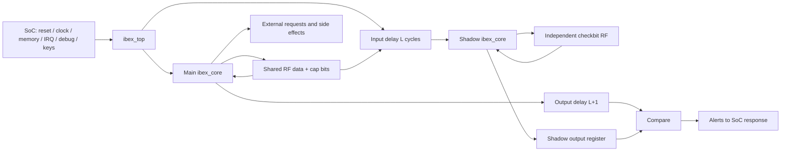

# S1 — Cấu hình, tài sản và phạm vi bảo vệ

Mức bằng chứng chương này: SOURCE; cấu hình đã build/run được đối chiếu tại
[06](06_experiments_findings.md). Source là fork CHERIoT trong checkout, không
mặc nhiên đồng nhất với Ibex upstream hoặc một cấu hình OpenTitan ngoài repo.

## Parameter propagation

[ibex_top](../../../rtl/ibex_top.sv#L212) tính các localparam sau:

| Cơ chế | Khi SecureIbex=1 ở top | Điều khiển bổ sung |
|---|---|---|
| Lockstep | Instantiates shadow core | LockstepOffset; RF implementation |
| ResetAll | 1 trong hai core | Không đồng nghĩa xóa mọi RF/RAM payload |
| DummyInstructions | 1, có generator + dummy state | cpuctrl bit2 và mask bits5:3; reset tắt |
| DataIndTiming | core localparam=SecureIbex | cpuctrl bit1; reset tắt |
| PCIncrCheck | core localparam=SecureIbex | Qualify theo luồng IF, không CSR runtime off |
| RF ECC trong main core | **0** | Main RF giữ32 bit data, cap metadata riêng |
| RF ECC trong shadow core | **1** qua RegFileLockstepECC | RF shadow giữ7 bit checkbits data và7 bit cap |
| ShadowCSR | **0** trong core | Không bật complemented CSR storage ở top này |
| MemECC | Parameter mặc định=SecureIbex | Có thể override; đừng suy ra từ tên SecureIbex |
| ICache ECC | Parameter riêng ICacheECC | Chỉ có tác dụng nếu ICache=1 |
| ICache scramble | Parameter riêng ICacheScramble | Key/nonce provider ngoài top |
| Tweak infection | Mặc định=SecureIbex | Parameter riêng ICacheTweakInfection |
| PMP | Parameter riêng PMPEnable | Runtime CHERIoT mode thay protection path |

Nguồn: [top parameters](../../../rtl/ibex_top.sv#L39),
[core localparams](../../../rtl/ibex_core.sv#L194),
[shadow parameters](../../../rtl/ibex_lockstep.sv#L471).
Câu “all features are runtime configurable” trong security.rst quá rộng nếu
áp dụng cho mọi cơ chế: CSR không thể loại bỏ lockstep hoặc tắt PC checker này.

Preset [opentitan](../../../ibex_configs.yaml#L41) của checkout bật dual ISA,
Zca/Zcb/Zcmp, BOTEarlGrey, WB/BTALU, cache/ECC/scramble, secure, PMP16 region,
debug trigger. Nó khác config thử nghiệm S1–S7: BFull, Zca, PMP0 trừ ca PMP,
cache riêng từng nhóm. Chưa chạy trọn preset và không gọi các test là OpenTitan DV.

## Block diagram và trust boundary

Các tài sản cần giữ: PC/control state, register data/cap metadata, instruction
stream, memory response/write data, cache data/tag/address association, trust
của fetch_enable/cheriot_enable và trạng thái trap. “Giữ” ở đây có thể là phát
hiện sai lệch để hệ thống xử lý, không nhất thiết ngăn mọi side effect trước alert.

| Fault model | Detector phù hợp | Giới hạn cần hiểu |
|---|---|---|
| Lỗi tạm thời riêng main hoặc shadow logic | Temporal lockstep, PC checker, RF ECC | Common-mode logic lỗi giống nhau có thể không mismatch |
| Bitflip RF data/metadata | Shadow ECC khi operand thực sự được đọc | Unread state có thể latent; ECC không xác thực provenance |
| Corrupt incoming data, ECC không tương ứng | Bus integrity decoder | Đối thủ đổi cả payload và checkbits hợp lệ không bị ECC phân biệt |
| Corrupt cache codeword/đọc sai địa chỉ | ECC + address tweak, scramble control checks | Không phải MAC/authentication; chưa chứng minh fault coverage vật lý |
| Sai MuBi input | Strict-On fetch, invalid-mode alert, compare !=Off | Các MuBi dùng predicate khác nhau, phải xét từng nơi |
| Timing observation | DIT giảm data-dependent latency tại execution; dummy thêm nhiễu | Memory/cache/path/interrupt/physical leakage còn phụ thuộc hệ thống |

## Assumptions nằm ngoài core

Memory phải trả response in-order, đúng association và protocol; không có bus ID
hay replay counter để làm freshness/authentication. Tags và bitmap phải do memory
subsystem đáng tin cung cấp; compiler/runtime quản lý revocation lifecycle.
Clock/reset/test control và debug authorization thuộc SoC; debug_req_i tự nó
không có cơ chế xác thực trong core. Alert receiver phải latch/escalate theo nhu
cầu hệ thống, vì output alert ở đây có thể chỉ là pulse.

Generic primitive RTL xác định chức năng mô phỏng. Placement separation,
size-only constraints, preservation của prim_buf/prim_flop, clock-tree và reset
implementation mới quyết định một phần fault independence sau synthesis/layout.
Không có evidence vật lý trong bộ tài liệu này.
