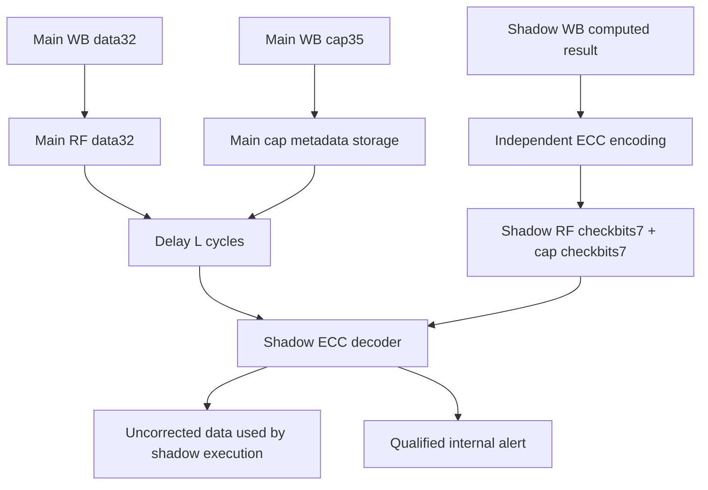

# S2 — Temporal lockstep và register file

SOURCE từ [ibex_lockstep](../../../rtl/ibex_lockstep.sv#L138),
[top wiring](../../../rtl/ibex_top.sv#L873); SIM tại [06](06_experiments_findings.md).

## Đường đi theo thời gian

Gọi L=LockstepOffset. Các tín hiệu động vào main được lưu trong shift register
`shadow_inputs_q[L-1:0]`; shadow dùng phần tử0. Tín hiệu gồm instruction/data
handshake + payload/ECC/error/tag, RF read data/cap, IRQ/debug, fetch_enable,
mcounteren_writable, cheriot_enable, icache key-valid. RAM cache read outputs có
arrays delay riêng. Các cấu hình/identity tĩnh nối trực tiếp; không phải từng
pin top đều có delay độc lập.

Main outputs lưu `core_outputs_q[L:0]` (L+1 entries). Shadow outputs có một flop
`shadow_outputs_q`. Sau khi pipeline/reset được căn chỉnh, comparator đối chiếu
hai mẫu của cùng bước execution:

```text
outputs_mismatch = (enable_cmp_q != IbexMuBiOff)
                   & (shadow_outputs_q != core_outputs_q[0])
lockstep.major_internal = outputs_mismatch | shadow.major_internal | reset_counter_error
```

L+1 là chiều sâu output shift, không phải “mọi fault được phát hiện sau L+1 cycle”.
Fault phải trước hết ảnh hưởng observable output hoặc operand được ECC check;
lỗi ở state chưa dùng có thể tồn tại lâu hơn. Comparator kiểm cả bundle, không
qualify riêng mỗi payload bằng request_valid ở câu assign cuối.

Bundle [delayed_outputs_t](../../../rtl/ibex_lockstep.sv#L368) gồm:
instruction request/address; data request/write/BE/address/data/tag; cache RAM
requests/write/address/write payload; key request; IRQ pending; crash dump;
double-fault state; core_busy; capability RF write metadata. **Không có tuple
RF scalar rd/we/wdata đầy đủ trong bundle compare.** Scalar register result
được bảo vệ thông qua ECC independently generated và các effects phát sinh sau.
Do đó lỗi scalar write có thể chỉ alert khi register được đọc lại, dù core vẫn
được gọi là dual-core lockstep.

## Reset, enable và sleep

| State / control | Reset / update | Hệ quả |
|---|---|---|
| shadow input arrays | Clear0 ở system reset, shift mỗi core clock | Shadow nhận lịch sử coherent thay vì external inputs mới |
| rst_shadow_set_q | MuBiOff→On sau delay | Bit0 tạo functional shadow reset |
| L=1 | Không instantiates reset counter; enable có flop delay riêng | Không áp logic counter của L>1 cho default |
| L>1 | prim_count + threshold L−1, enable nhận rst_shadow_set_q | Counter error OR vào internal alert |
| enable_cmp_q | ResetOff; mọi encoding khác Off đều bật compare | Invalid encoding không dễ vô hiệu detector |
| shadow_outputs_q | Flop không reset trong source | Startup mask cần tránh compare dữ liệu chưa căn chỉnh |
| scan reset mux | test_en chọn scan_rst_ni | Trust boundary test mode ở ngoài core |

Nguồn [reset logic](../../../rtl/ibex_lockstep.sv#L149),
[output capture/compare](../../../rtl/ibex_lockstep.sv#L623).
L=0 không thuộc cấu hình hợp lệ được phân tích; array dimensions và delay giả
định L≥1. Assertions dưới Verilator không thay thế parameter review.

Main và shadow dùng gated clock. Top lấy `core_busy_d` trực tiếp từ main core;
**không OR thêm shadow busy** vào clock enable. Shadow busy nằm trong bundle
compare. Shadow có thể tạm dừng với lịch sử delayed khi gate đóng, rồi chạy tiếp
khi wake; không suy ra shadow đã drain hoàn toàn chỉ từ core_sleep. Root-clock
core_busy flop điều khiển
clock gate; chỉ encoding Off chính xác mới có thể cho phép ngủ nếu không IRQ/debug.
[clock_en](../../../rtl/ibex_top.sv#L303) và
[busy generation](../../../rtl/ibex_core.sv#L498) dùng prim buffers/flops nhằm
preserve các copy. SIM WFI/reset/debug có no-fault controls để kiểm không báo
mismatch giả khi clock dừng, khởi động lại hoặc đổi execution mode.

## Shared RF, independent checkbits



Data code `prim_secded_inv_39_32` tạo7 checkbits cho32 data. Với dual ISA,
35 cap bits zero-pad22 thành57 rồi dùng `prim_secded_inv_64_57`; lưu riêng7 checkbits.
Read reconstruct `{ecc7,zero22,cap35}`. Đây là ECC riêng data và cap, không phải
code thống nhất ràng buộc address32 với metadata35.
[core RF ECC](../../../rtl/ibex_core.sv#L1214),
[shadow RF](../../../rtl/ibex_lockstep.sv#L635).

```text
rf_ecc_err_operand = (data_code_error | (CHERIoT_On & cap_code_error))
                    & rf_ren & !(WB_rd_match & WB_write)
rf_ecc_err_comb = instr_valid_id & (err_operand_a | err_operand_b)
```

ECC decoder corrected data output bỏ trống: raw data tiếp tục đi vào shadow;
ECC được dùng phát hiện, không sửa lỗi rồi tiếp tục tin tưởng kết quả. Qualify
bằng ren/valid tránh báo trên operand không dùng; WB forwarding mask tránh
kiểm RF stale khi operand thực sự lấy từ WB. Cap ECC chỉ tham gia khi runtime
CHERIoT On. X0/dummy register có giá trị ECC zero riêng để phù hợp inverted code.

Dummy instructions dùng storage cho dummy x0, có cờ dummy đi tới RF; architectural
x0 vẫn phải bằng0. FF/FPGA/latch là các generate khác nhau, directed simulation
ở đây dùng FF. ResetAll trong core không bảo đảm main RF payload đều được reset.

## Detection và containment

Lockstep là detector, không có majority vote hoặc rollback. Main requests/write
có thể ra bus trước khi shadow tạo output tương ứng. Fault injection ở RF/EX
được phân tích theo “alert đã xuất hiện?” và “architectural progress/state còn
đúng không?” riêng; alert PASS không đồng nghĩa chương trình sau fault đúng.
Không có bound phát hiện độc lập workload cho mọi internal state. Các fault
common-mode, collision của ECC, comparator/alert path bị tấn công đồng thời,
và faults trên input chung hợp lệ cần threat model hoặc countermeasure ngoài core.
