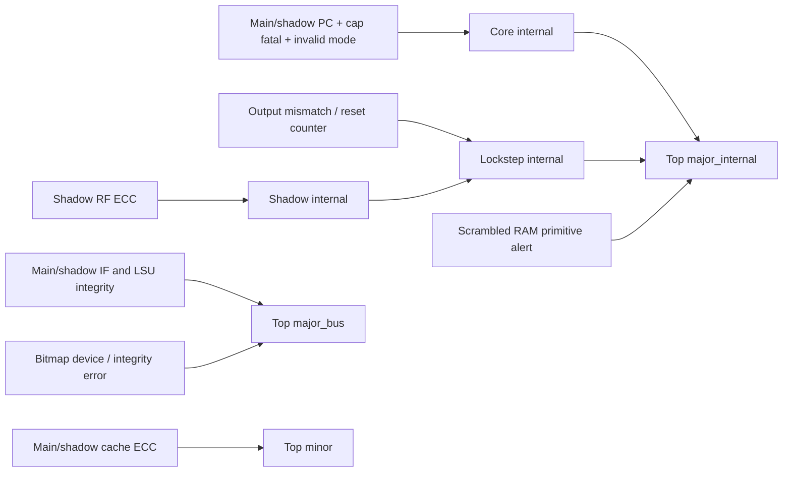

# S3 — Integrity, PC/MuBi và đường alert

SOURCE trong chương; số đo injection tại [06](06_experiments_findings.md).

## Incoming bus: error detection tách khỏi bus/device fault

[top](../../../rtl/ibex_top.sv#L360) ghép data32 + integrity7 thành codeword39.
LSU/IF sử dụng `prim_secded_inv_39_32_dec`, nhưng bỏ corrected-data output.
Payload và checkbits phải có trên **response store cũng như load** khi MemECC bật.
Write bus có encoder độc lập ở [top](../../../rtl/ibex_top.sv#L863); receiver bên
ngoài phải kiểm để bảo vệ write payload trên đường truyền.

```text
IF:  instr_err_to_fetch = ecc_error | instr_bus_error
     major_bus_IF = instr_rvalid & ecc_error
LSU: major_bus_load  = ecc_error & data_rvalid & !last_data_we
     major_bus_store = ecc_error & data_rvalid &  last_data_we
     load_RF_valid  = ordinary_load_completion & !ecc_error
```

[IF integrity](../../../rtl/ibex_if_stage.sv#L261),
[LSU decode](../../../rtl/ibex_load_store_unit.sv#L380),
[LSU write suppression](../../../rtl/ibex_load_store_unit.sv#L694),
[LSU alerts](../../../rtl/ibex_load_store_unit.sv#L746).
Không gộp data integrity vào `load_err_o`: đường load_err→request cần timing
ngắn; integrity decoder từ response data làm critical combinational path dài hơn.

| Sự kiện | Xử lý trong pipeline | Alert và trap |
|---|---|---|
| Bad instruction codeword | Fetch error theo instruction/word association | major_bus; instruction access fault nếu instruction được tiêu thụ |
| Bad load codeword | Suppress destination write; latch internal IRQ pending | major_bus + internal NMI ECC, mcause=ffffffe0 trong ca thử |
| Bad store response codeword | Store đã có thể được memory nhận | major_bus + internal NMI; không rollback store |
| Bus err/PMP fault thường | Precise synchronous load/store/fetch exception | Không tự đồng nhất với ECC major alert |
| Bad bitmap/device response | Revocation fail-closed, clear loaded cap tag | top major_bus; không tự tạo core data_err qua TRVK |

Internal integrity IRQ lưu địa chỉ LSU lần lỗi, không đè pending đầu tiên.
External NMI ưu tiên internal integrity NMI; nếu external NMI được xử lý thì chưa
clear integrity pending. Trong NMI mode không hỗ trợ nested NMI. Nguồn:
[controller pending](../../../rtl/ibex_controller.sv#L390),
[NMI arbitration](../../../rtl/ibex_controller.sv#L727).
Integrity NMI không có cùng “precise instruction PC” như synchronous access fault:
ca thử load lỗi tại84h nhưng MEPC90h; MTVAL208h giữ địa chỉ data. Software không
được mặc nhiên dùng MEPC để replay đúng offending load.

## Response ownership

Trong secure core:

```text
rf_we_lsu = lsu_rdata_valid & (outstanding_load_wb | expecting_load_resp_id)
lsu_load_err = raw_load_err & (outstanding_load_wb | expecting_load_resp_id)
lsu_store_err = raw_store_err & (outstanding_store_wb | expecting_store_resp_id)
```

[core response guard](../../../rtl/ibex_core.sv#L1181) giảm khả năng response giả
tự tạo RF write/exception khi không có instruction owner. Nó không xác thực
response đúng transaction nếu đã có request pending. Integrity alert từ raw
response vẫn là đường riêng, nên response unsolicited với ECC sai có thể alert.
Ca fault7 inject response với ECC hợp lệ khi không pending để kiểm architectural
state không đổi; không khái quát thành bus protocol checker đầy đủ.

## Hardened PC

[IF checker](../../../rtl/ibex_if_stage.sv#L659) giữ `prev_instr_seq_q`:

```text
seq_next = (seq_q | instr_new_id)
           & !branch_req & !if_instr_err & !stall_dummy
           & !(expanded or expanded_commit)
expected_pc = pc_id + (compressed ? 2 : 4)
pc_alert = seq_q & (pc_if != buffered_expected_pc)
```

Reset clear seq. Branch/jump/trap/debug redirects cùng đi qua branch_req nên
checker không ép target bằng sequential PC. Dummy không tiêu thụ real PC;
Zcmp internal expansion cũng được loại. Giới hạn: đây là sequential-consistency
check, không phải control-flow integrity theo CFG hay capability bounds checker.
Một corrupted branch target coherent với redirect không được kiểm theo +2/+4;
PCC/lockstep/khác phải gánh phần đó. prim_buf cần được preserve ở implementation.

## MuBi predicates khác nhau theo mục đích

| Tín hiệu | Predicate / action | Fault bias |
|---|---|---|
| fetch_enable secure | Chỉ On chính xác cho instr_req và instr_exec | Invalid encoding chặn fetch/execute enable |
| core_busy tại clock gate | Mọi encoding khác Off giữ clock | Invalid không dễ đưa core vào sleep |
| enable_cmp tại lockstep | Mọi encoding khác Off bật compare | Invalid không dễ mask detector |
| cheriot_enable với dual ISA | Nếu instr_exec và neither On nor Off → major_internal | Đường kiểm tồn tại cả khi SecureIbex=0 trong dual core |
| mcounteren_writable | Chỉ On cho phép ghi CSR | Không phải generic encoding alarm |

[fetch gating](../../../rtl/ibex_core.sv#L637),
[mode check](../../../rtl/ibex_core.sv#L1339),
[mcounteren](../../../rtl/ibex_cs_registers.sv#L844).
Invalid encoding không có một hành vi chung cho mọi MuBi input. On↔Off hợp lệ
nhưng bị tấn công cũng không bị encoding detector phân biệt; protocol runtime
mode switching cần thuộc trust boundary của SoC.

## Alert aggregation và containment



[core aggregation](../../../rtl/ibex_core.sv#L1337),
[top aggregation](../../../rtl/ibex_top.sv#L1359).
Major_internal và major_bus là nhiều nguồn OR, không có per-cause register đầy
đủ trong output. Alert pulse có thể mất nếu hệ thống không latch. Các paths như
PC mismatch/lockstep mismatch không tự động stop hoặc zeroize core. Cache ECC
minor recovery khác với major unrecoverable policy mà system nên áp dụng.

“SEC_CM” comments là mapping ý đồ thiết kế, không là chứng cứ fault coverage.
`ShadowCSR=0` làm complemented CSR error path inactive tại core top đang xét;
CSR logic/state vẫn chạy ở hai core và có thể bị phát hiện qua divergence sau đó.
Không có cơ sở từ RTL này để tuyên bố mọi bit CSR được so sánh mỗi cycle.
