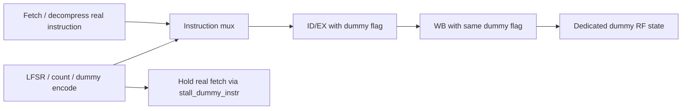

# S4 — Data-independent timing và dummy instructions

SOURCE: [CSR control](../../../rtl/ibex_cs_registers.sv#L1887),
[ID branch](../../../rtl/ibex_id_stage.sv#L790),
[fast division](../../../rtl/ibex_multdiv_fast.sv#L434),
[slow mult/div](../../../rtl/ibex_multdiv_slow.sv#L194),
[dummy generator](../../../rtl/ibex_dummy_instr.sv#L34).
SIM và số đo ở [06](06_experiments_findings.md).

## Runtime control và branch/multdiv

cpuctrlsts tại CSR7c0: bit0cache_enable, bit1data_ind_timing, bit2dummy_en,
bits5:3dummy_mask, bit6sync_exc_seen, bit7double_fault_seen; cache key-valid
được sample riêng ở phần trên. DataIndTiming parameter quyết định field DIT có
thể giữ giá trị; SecureIbex=1 chỉ instantiate cơ chế, reset chưa bật runtime.
CSR secureseed7c1 cấp input seed cho dummy generator.

| Unit | DIT=0 | DIT=1 | Giới hạn |
|---|---|---|---|
| Branch với BTALU | Có thể hoàn tất theo quyết định trong FIRST | Stall branch, chuyển MULTI cho cả taken và not-taken | Redirect/fetch/path bên ngoài execution vẫn ảnh hưởng thời gian |
| Fast/SingleCycle DIV | Divisor0 có early finish | Đi qua ABS_A/ABS_B và vòng chia bình thường | Stall từ WB/IF có thể cộng thêm |
| Slow MUL | Early terminate theo op_b_shift | Đi đủ vòng counter | Không dùng latency fast MUL để mô tả slow |
| Fast/SingleCycle MUL | Latency cố định của cấu hình | Giữ cấu trúc nhân tương ứng | Không có phép “làm phẳng mọi thuật toán” ngoài đường đã cài |
| LSU | Số beat phụ thuộc alignment, bus latency | DIT không biến misaligned thành một beat | Address/data memory subsystem có thể lộ timing |

ID lưu `branch_taken_q` để quyết định target khi kết thúc fixed branch sequence;
`branch_set_raw` đổi giữa combinational path và registered path theo BTALU/DIT.
Không đổi ý nghĩa chương trình: branch không taken vẫn chạy fallthrough.

Cách đo: đếm số C-record có PC instruction và valid=1 tới khi rời ID, và số
stall_multdiv. Đối với DIT branch chỉ đếm ID residence của branch, không so total
program có số instruction khác nhau. Marker cycle có cả fetch, không phải latency
functional unit. Các run dùng cùng memory contract, predictor tắt, dummy tắt khi
đo DIT. Arithmetic outputs kiểm trước khi so timing để không coi trap sớm là nhanh.

## Dummy generator state

```text
threshold = LFSR.cnt & {dummy_mask, 2'b11}
insert = dummy_enable & (dummy_count == threshold)
counter_enable = dummy_enable & id_ready & (fetch_valid | insert)
counter_next = insert ? 0 : counter + 1
LFSR_advance = insert & id_ready
seed_next = seed_accumulator ^ software_seed
```

| State | Reset | Update / hold |
|---|---|---|
| dummy_cnt_q, width5 | 0 | Count real accepted instructions khi enabled; clear khi insert |
| LFSR | Parameter DefaultSeed + permutation | Advance khi dummy được accept; không mỗi clock |
| seed accumulator32 | 0 | XOR input khi software reseed; giữ khi không ghi |
| dummy_instr_id / WB flag | 0 trong pipeline reset | Theo instruction handoff; stall giữ association |
| dummy RF storage | WordZeroVal/checkbit zero đặc thù | Dummy write đi vào storage riêng cho x0 |

[Dữ liệu instruction](../../../rtl/ibex_dummy_instr.sv#L119) chọn ADD/MUL/DIV/AND,
rs1/rs2 pseudo-random, rd=x0. Mask000→threshold0..3,001→0..7,011→0..15,
111→0..31; cách tài liệu reference gọi interval0..4/8/16/32 có thể tính cả
insertion slot, phải ghi convention thay vì equate threshold với period clock.
Các mask khác hợp lệ nhưng phân bố không đơn giản là một contiguous range.
LFSR entropy input nối0 trong module; fixed seed/permutation và cùng lịch thực
thi có thể tái lập. Không gọi nó là TRNG hoặc cryptographic unpredictability.

## IF handoff và architectural isolation



[IF injection](../../../rtl/ibex_if_stage.sv#L503) chọn dummy data, ép compressed=0,
expanded=not-expanded và fetch-error=0 cho dummy; real fetched instruction bị giữ
lại, không consume nhầm PC/error. Dummy PC bằng next real instruction PC nhưng
không tăng sequential PC. PC checker và retirement accounting phải xem flag.

Rd0 chưa đủ giải thích isolation: RF có dummy storage và counter/perf/RVFI phải
loại đúng dummy activity; dummy có thể dùng mult/div và stall thật. Lockstep phải
nhận cùng seed/config và advance theo cùng lịch input đã delay. Nhóm test kiểm
final architectural registers, không major/minor alert và dummy activity>0;
không suy ra toàn bộ kiến trúc/state đã được formal equivalence kiểm hết.

## DIT/dummy không phải chứng minh side-channel immunity

Không đưa ra power-consumption guarantee từ simulation functional. Switching
activity có thể phụ thuộc toán hạng dù latency bằng nhau; memory latency,
cache hit/miss, control-flow, alignment, IRQ/debug và bộ cung cấp random seed
nằm trong mô hình hệ thống. Dummy thêm nhiễu timing nhưng có thể bị averaging
hoặc đồng bộ lại; effectiveness chống EM/power/glitch cần phép đo riêng.
DIT và dummy có thể đồng thời bật, làm dummy DIV dài hơn; đây là trade-off
throughput/detection-obfuscation, chưa có đo PPA/energy trong checkout này.
