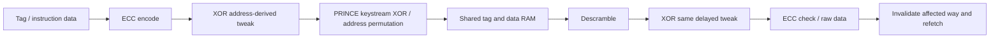

# S5–S6 — Cache hardening và tích hợp CHERIoT

SOURCE: [I-cache](../../../rtl/ibex_icache.sv#L317),
[top RAM wrappers](../../../rtl/ibex_top.sv#L625),
[scramble primitive](../../../vendor/lowrisc_ip/ip/prim/rtl/prim_ram_1p_scr.sv#L25),
[TRVK](../../../rtl/ibex_trvk.sv#L148).

## Cache storage, ECC và recovery

Cache geometry của checkout: 2 ways, 256 indices, line64 bit(8bytes), 4KiB payload.
Tag gồm22 bit (valid+address tag), ECC6→28 bit; mỗi data word32 dùng ECC7,
line2×39→78 bit. Tag/data RAM shared giữa main/shadow; shadow cache controller
nhận read outputs delay Lcycle và được đối chiếu control outputs với main.

Write/read pipeline:



[ECC logic](../../../rtl/ibex_icache.sv#L535):

```text
ecc_err = lookup_valid & ((data_err & tag_hit) | any_tag_err)
correction_ways = (any_tag_err ? all_ways : tag_match & data_err)
```

Tag ECC được kiểm cả invalid tags vì reset invalidation đã ghi invalid codeword
hợp lệ. Data RAM không init toàn bộ; data ECC chỉ được kiểm trên hit. `data_o`
của ECC decoder bỏ trống; “correction” trong cache là **invalidate/refetch**, không
sửa bit trên codeword rồi trả dữ liệu đã sửa. Error lưu index/ways vào register,
request arbitration ghi invalid tag ở cycle sau; fill-hit qualifier loại error.
Minor alert phát khi phát hiện lỗi; lỗi persistent có thể gây refetch lặp.

## Tweak infection

Tag tweak lấy index. Data tweak lấy full line address bỏ3LSB offset; ở ECC mode
replicate từng word với stride39 để khớp codeword layout. Tweak áp sau ECC encode,
được gỡ trước decode. Tag index và data tweak phải pipeline theo RAM request:
[data tweak](../../../rtl/ibex_icache.sv#L321),
[tag tweak](../../../rtl/ibex_icache.sv#L387).

Ý nghĩa: cùng codeword bị chuyển sang địa chỉ khác sẽ gỡ bằng tweak khác, làm
ECC có cơ hội phát hiện address/data association sai. Tweak không phải secret
MAC và ECC có hữu hạn syndrome; không tuyên bố mọi relocation đều bị phát hiện.
Invalidation/ECC correction chọn data-address tweak0 theo source. Khi không bật
ICacheECC, tweak không tự trở thành integrity checker độc lập.

## Scrambling và key lifecycle

Primitive dùng reduced-round PRINCE keystream XOR với data; address đi qua
bijection substitution/permutation theo nonce. `NumPrinceRoundsHalf` truyền từ
top; address rounds2 khi scramble bật. Data bank đặt ReplicateKeyStream=1,
EnableParity=0; tag bank cũng EnableParity=0. NumDiffRounds primitive mặc định0
để không làm hỏng tính chất end-to-end ECC; không đọc comment tổng quan rồi suy
ra diffusion đang bật. Kiểm parameter elaboration mới là bằng chứng active path.

| State / handshake | Hành vi nguồn | Điều tích hợp cần giữ |
|---|---|---|
| Reset | key/nonce=RndCnst parameters, key_valid_q=1 | Có initial key hợp lệ theo RTL, không đợi OTP vô điều kiện lúc boot |
| Cache yêu cầu key | top latch scramble_req_q, key_valid về0 | External provider giữ coherent key/nonce với valid |
| Provider trả valid | Capture key/nonce; request clear qua flop | Key update gate là external valid, không yêu cầu req trong write enable |
| Cache AWAIT_SCRAMBLE_KEY | Chờ key_valid rồi invalidate tags | Đừng cho workload dùng cache trước protocol hoàn tất |
| FENCE.I/invalidation | Yêu cầu đổi key rồi sweep tags theo FSM | Không giữ valid lines dưới key mapping cũ |
| No-scramble config | Key request0, valid1 | Không gán security property của scrambling cho nhánh này |

Nguồn [key state](../../../rtl/ibex_top.sv#L625),
[cache invalidation FSM](../../../rtl/ibex_icache.sv#L1212).
Memory wrapper có pipeline pending writes và read/write collision forwarding,
phải giữ latency contract nguyên bản. Primitive alert gồm invalid MuBi control,
write/read/collision state và underlying RAM alert theo
[aggregation](../../../vendor/lowrisc_ip/ip/prim/rtl/prim_ram_1p_scr.sv#L409).
Trong top input intg_error_i nối0 và byte parity tắt; ECC của cache mới kiểm
codeword payload. Scrambling không xác thực data chống đối thủ có thể thay cả
payload+checkbits hợp lệ; cũng không phải encryption service để software sử dụng.

## CHERIoT: security extensions không thay thế lẫn nhau

| Tài sản / đường | Capability semantics | Secure countermeasure |
|---|---|---|
| PCC + special caps | Bounds, permissions, sealedness và exception authority | Duplicate core state, PC consistency theo qualifier |
| RF address32/cap35 | Tag và metadata quyết định capability validity | Shadow ECC data32 và cap35 riêng; compare cap write metadata |
| Cap load hai words | Tag cả hai beat và permission/CTAG; bounds reconstruction | Payload ECC từng32 bit; không bảo vệ tag bằng chính codeword39 |
| Bitmap revocation | Bitmap theo base capability, fail-closed tag | Bitmap data32+ECC7; device/intg error OR major_bus |
| PMP | RV32I-mode region check | PMPEnable riêng; CHERIoT On mask PMP path theo fork |
| Mode switch | Dual storage x16..31/cap metadata và special state | Delayed mode input + invalid MuBi detector; valid wrong mode vẫn cần SoC policy |
| Debug | Dedicated entry/return, privileged state access | Lockstep follows delayed debug; quyền cho debug_req thuộc hệ thống |

Tags là sideband riêng [TRVK forwarding](../../../rtl/ibex_trvk.sv#L192), không
nằm trong data ECC39. Shared input tag sai nhưng consistent tới cả cores không
nhất thiết tạo lockstep mismatch. Cap RF ECC bảo vệ tag sau khi đã được ghi,
không chứng minh provenance của tag đầu vào. Cần tagged-memory integrity/authority
ở SoC nếu threat model cho phép fault trên tag channel.

TRVK nằm ngoài pair core tại top: NumOutstanding2, queue data responses và
metadata lookup, join bitmap response khi required. Request bitmap dựa trên
base, không cursor; revoked hoặc bitmap error clear tag. Bitmap data error
được OR trực tiếp top major_bus; upstream_err vẫn là downstream data error,
vì vậy không suy ra bitmap error đi vào internal ECC NMI như lỗi load payload.
[bitmap decode/error](../../../rtl/ibex_trvk.sv#L355).

Module `ibex_cheriot_ex` hiện gán `cheriot_ex_err_info_o=0` ở
[nguồn](../../../rtl/ibex_cheriot_ex.sv#L877); không mô tả tên error bus như một
countermeasure active khi producer tie-off. Normal permission/bounds violations
vẫn tạo architectural capability exceptions qua các đường dedicated; khác với
fatal hardware consistency alert.

## Tích hợp và các giới hạn thực nghiệm

Secure dual test dùng tagged memory + bitmap thật của harness; ca kết hợp
secure+dual+cache/ECC/scramble+PMP được build riêng để không chỉ suy từ từng feature
đơn lẻ. No-fault controls phải sạch alert trước khi tính fault-injection detection.
Cache fault inject ở decoded RAM read output, không ở physical SRAM cell hoặc
cipher key. Nó kiểm ECC/recovery downstream của điểm inject, không kiểm toàn
bộ hiệu quả scramble hoặc address relocation attack.

Debug/NMI/WFI no-fault chạy ở secure RV32I. Chưa làm exhaustive cross-product
CHERIoT mode transition, debug mode, all Zcmp sequences và mọi cache fill race.
Phân tích source chỉ ra ownership/protection boundary; simulation chỉ xác nhận
các testcase trong [results](evidence/results.json).
